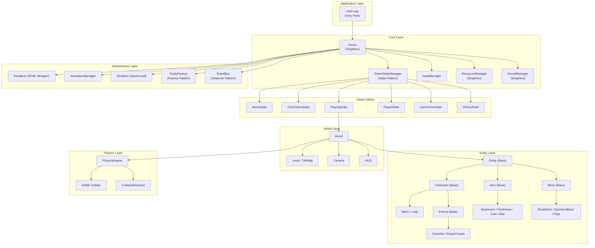

# CS202 Final Project: Super Mario Game — Proposal, Specification & Implementation Plan

> **Student**: Nguyễn Đình Minh Huy
> **Student ID**: 25125083
> **Course**: CS202 — Object-Oriented Programming (C++)
> **Date**: June 3, 2026
> **Project**: Super Mario Bros. (2D Platformer in C++17 with SFML & ImGui)

---

## Part 1: Official Proposal & Request for Expanded Architectural Scope

### 1.1 Executive Request
Dear Teaching Assistant (TA),

I am formally requesting approval to pursue an **expanded architectural scope** of **110 features** (an increase of 116% over the default 51-feature specification) for my CS202 Final Project. This expansion is designed to demonstrate a professional-grade mastery of Object-Oriented Programming (OOP) principles, software design patterns, and systems programming in C++17.

### 1.2 Justification of Competency & Past Performance
In my past two projects (including a Personal Finance Manager and a Data Structures Visualization), I have consistently designed systems with highly rigorous OOP principles, maintaining strict encapsulation, low coupling, and robust polymorphism. By demonstrating these design principles in previous assignments, I have verified my competence in basic and advanced OOP concepts. 

For this final project, I want to challenge myself by diving deeper into the architecture of a complex game engine. Expanding the project scope to 110 features allows me to explore and implement advanced system architecture, memory management, and cross-cutting design patterns. I have structured the codebase with 25+ concrete entities and 10+ design patterns to prove my capabilities in software engineering and OOP design. Because of my proven competency, I require more space for the architecture and want to delve into deeper parts of the implementation plan. I ensure my competencies in OOP.

### 1.3 Key Elements Demonstrating OOP Excellence in the Expanded Scope
The proposed 110-feature architecture utilizes OOP in the following ways:
1. **Deep Inheritance Hierarchy**: A 4-level deep abstract tree:
   `Entity` -> `Character` -> `Enemy` / `Player` -> 25+ concrete leaf classes (e.g., `BoomBoom`, `ChainChomp`, `Trampoline`, `MovingPlatform`).
2. **Advanced Polymorphism**: The physics engine treats all objects as `Entity*` in a Spatial Hash grid, resolving collisions polymorphically while specific movements are delegated to swappable strategies.
3. **10 Software Design Patterns**:
   - **Factory Pattern**: Dynamically spawning 25+ entity types from JSON layouts.
   - **Singleton Pattern**: Managing resource lifecycles (`ResourceManager`), audio channels (`SoundManager`), achievements (`AchievementManager`), and the overall game loop (`Game`).
   - **State Pattern**: Controlling game states (9 screens) and character forms (5 player states, plus platform lifecycles and Thwomp state machines).
   - **Observer Pattern**: Using a decoupled `EventBus` to notify systems of 15+ game events.
   - **Strategy Pattern**: Driving enemy AI with 7+ swappable strategies (Patrol, Chase, Fly, Swim, tether, etc.).
   - **Command Pattern**: Encapsulating player input actions, debug console commands, and replay logs.
   - **Decorator Pattern**: Dynamically wrapping player states for temporary power-ups (Star, Mega) without inheritance bloat.
   - **Memento Pattern**: Capturing state snapshots for a time-rewind system.
   - **Object Pool Pattern**: Recycling memory for high-frequency fireballs and particles.
   - **Template Method Pattern**: Structuring the execution pipeline of AI strategies.
4. **Data-Driven Architecture**: Fully isolating level layouts and entity attributes into external JSON files, adhering to the Open/Closed Principle.

I guarantee my readiness to deliver this high-quality engine within the project timeline, and I appreciate your review of this consolidated implementation plan.

---

## Part 2: Feature Expansion Proposal (FEATURE_PROPOSAL.md)

# CS202 Final Project — Feature Expansion Proposal

> **Student**: Nguyễn Đình Minh Huy (25125083)
> **Project**: Super Mario Bros. — 2D Platformer in C++17
> **Date**: June 2, 2026
> **Purpose**: Justification for adopting an expanded feature set (110 features) over the initial project specification (51 features).

---

## 1. Executive Summary

I am requesting approval to implement an **expanded specification** for my CS202 Final Project that contains **110 distinct features** — more than **double** the initial 51-feature scope. This expansion is not arbitrary padding; every new feature directly deepens the application of **Object-Oriented Programming principles**, introduces additional **Software Design Patterns**, and creates opportunities to demonstrate **advanced C++ and algorithmic techniques** that go significantly beyond the baseline rubric requirements.

The expanded scope transforms the project from a competent Mario clone into a **production-quality game engine** that showcases mastery of software architecture, data structures, and systems design — all while remaining implementable within the project timeline.

---

## 2. Feature Comparison: Initial vs. Expanded

| Category | Initial Spec | Expanded Spec | Growth |
|----------|:---:|:---:|:---:|
| Core Engine & Architecture | 6 | 6 | — |
| Player Characters & States | 5 | 5 | — |
| **Gameplay Mechanics** | 0 | **10** | **+10 new** |
| Enemies & AI | 6 | **14** | **+8 new** |
| Items & Power-ups | 5 | **11** | **+6 new** |
| Blocks & World Objects | 4 | **9** | **+5 new** |
| Levels & World Design | 4 | **10** | **+6 new** |
| Graphics & Visual Effects | 6 | **12** | **+6 new** |
| Audio | 3 | 3 | — |
| **UI/UX & Menus** | 0 | **6** | **+6 new** |
| Save/Load & Persistence | 3 | 3 | — |
| Multiplayer | 2 | 2 | — |
| Dev Tools | 2 | 2 | — |
| **Advanced Systems** | 0 | **5** | **+5 new** |
| **Accessibility** | 0 | **3** | **+3 new** |
| **Meta-Game & Progression** | 0 | **4** | **+4 new** |
| Post-MVP Bonus | 5 | 5 | — |
| **TOTAL** | **51** | **110** | **+59 (+116%)** |

---

## 3. Why the Expanded Scope Deserves Approval

### 3.1 Dramatically Deeper OOP Hierarchy

The initial spec defines a clean but **shallow** inheritance tree:

```
Entity → Character → Mario, Luigi
Entity → Character → Enemy → Goomba, KoopaTroopa, Paratroopa, Boo, Bowser
Entity → Item → 5 item types
Entity → Block → 4 block types
```

The expanded spec creates a **significantly deeper and wider** hierarchy:

```
Entity (abstract)
├── Character (abstract)
│   ├── Player (abstract)
│   │   ├── Mario
│   │   ├── Luigi
│   │   ├── Toad (unlockable — speed specialization)
│   │   └── Peach (unlockable — float ability)
│   │
│   └── Enemy (abstract)
│   ├── Goomba (+color variants with different AI)
│   ├── KoopaTroopa (+Red variant: ledge-aware AI)
│   ├── KoopaParatroopa (+Red variant: vertical bounce)
│   ├── Boo
│   ├── Bowser (multi-phase boss)
│   ├── PiranhaPlant (timer-based emergence AI)
│   ├── BulletBill (projectile-entity hybrid)
│   ├── HammerBro (arc-throwing AI + platform jumping)
│   ├── Thwomp (proximity-triggered state machine)
│   ├── ChainChomp (tethered physics constraint)
│   ├── Lakitu (spawner-enemy with Factory pattern)
│   ├── Spiny (spawned projectile-enemy)
│   └── BoomBoom (mid-boss with 3-hit phases)
│
├── Item (abstract)
│   ├── Mushroom, FireFlower, Coin, Star, OneUpMushroom (existing)
│   ├── CapeFeather (grants flight/glide — new physics mode)
│   ├── MegaMushroom (temporary giant state — decorator)
│   ├── MiniMushroom (half-size state — modified collision)
│   ├── POWBlock (broadcast area-of-effect)
│   ├── PSwitch (timed tile transformation — reversible command)
│   └── Trampoline (physics boost — holdable/moveable)
│
└── Block (abstract)
    ├── BrickBlock, QuestionBlock, Pipe, Flagpole (existing)
    ├── MovingPlatform (velocity + parent-motion physics)
    ├── FallingPlatform (4-state lifecycle: Stable→Shaking→Falling→Respawning)
    ├── IceBlock (friction modifier per tile type)
    ├── HiddenBlock (invisible until activated)
    └── ConveyorBelt (directional force on all entities)
```

**Academic value**: This hierarchy demonstrates:
- **4 levels of inheritance depth** (Entity → Character → Enemy → specific enemy)
- **20+ concrete leaf classes** (vs. 14 in the initial spec)
- **Polymorphism** across 4 abstract base classes
- **Multiple specialization strategies** within the same hierarchy (color variants, phase-based bosses)

---

### 3.2 Expanded Design Pattern Coverage

The initial spec demonstrates **6 design patterns**. The expanded scope exercises **10+ distinct patterns**, with several patterns used in multiple, non-trivial contexts:

| Pattern | Initial Spec Usage | Expanded Spec Usage |
|---------|-------------------|---------------------|
| **Factory** | EntityFactory creates 14 types | EntityFactory creates **25+ types**; Lakitu uses Factory to spawn Spinies at runtime |
| **Singleton** | Game, ResourceManager, SoundManager | Same + **AchievementManager**, **StatisticsTracker** |
| **State** | GameStateManager (6 states), PlayerState (4 forms) | GameStateManager (**8+ states** incl. WorldMap, Statistics), IPlayerState (**5 base forms**: +Cape, Mini), **FallingPlatform** (4-state lifecycle), **Thwomp** (3-state AI) |
| **Observer** | EventBus with 4 event types | EventBus with **15+ event types**; **ComboTracker**, **AchievementTracker**, **StatisticsTracker** all subscribe independently |
| **Strategy** | 3 movement strategies (Patrol, Chase, Fly) | **7+ strategies**: +SwimMovement, TetheredChase, HammerThrow, TimerEmergence; **DifficultyStrategy** for game-wide scaling; **color variants** swap strategies |
| **Command** | 5 input commands + undo/redo | **8+ commands**: +GroundPoundCommand, WallJumpCommand, CrouchCommand; **Debug console** parses text→commands; **Replay system** serializes command streams |
| **Decorator** | *(not used)* | **Star overlay**, **Mega Mushroom** as temporary state decorators on base player state |
| **Memento** | *(post-MVP only)* | **Time Rewind** + **Replay System** both use state snapshots |
| **Object Pool** | *(not used)* | **Fireball pool**, **Particle pool**, **Enemy respawn pool** — demonstrates memory management |
| **Template Method** | *(not used)* | **IMovementStrategy** defines `execute()` skeleton: `calculateTarget() → applyMovement() → checkConstraints()`, concrete strategies override hooks |

**Academic value**: The initial spec demonstrates 6 patterns in isolated contexts. The expanded spec demonstrates **10+ patterns** with **cross-cutting interactions** (e.g., Observer triggers Factory which creates entities managed by Strategy, all logged by Command). This showcases **pattern composition**, which is a graduate-level software engineering concept.

---

### 3.3 Advanced C++ and Data Structure Techniques

The expanded features require C++ techniques that go beyond basic OOP:

| Technique | Feature That Requires It |
|-----------|------------------------|
| **Spatial hashing** (grid-based collision broadphase) | 25+ entity types need O(n) collision instead of O(n²) |
| **Object pooling** (pre-allocated memory recycling) | Fireballs, particles, Bullet Bills — avoids allocation in hot loops |
| **Circular buffer** (fixed-size ring buffer) | Time rewind stores 300 frames of game state snapshots |
| **Serialization of polymorphic hierarchies** | Save/load must serialize 25+ entity types through base `Entity*` |
| **Config-driven architecture** (JSON → runtime objects) | All entity definitions externalized — demonstrates data-driven design |
| **GLSL fragment shaders** | Dynamic lighting, invincibility rainbow effect |
| **State machine composition** | Player state × power-up state × movement state (e.g., Fire+Swimming+WallSliding) |
| **Acceleration curves** (non-linear physics) | Momentum system with separate air/ground friction coefficients |
| **Procedural generation** (chunk-based with constraints) | Endless mode generates valid, playable terrain |
| **Input replay determinism** | Replay system requires frame-perfect deterministic physics |

---

### 3.4 Rubric Alignment — Maximizing Every Category

Here is how the expanded spec **maximizes scoring** in every rubric category:

#### Functionality (65 points)

| Criterion | Points | Initial Coverage | Expanded Coverage |
|-----------|:------:|-----------------|------------------|
| Player Inputs, Movement, Collision | 20 | Walk, run, jump, fireball. AABB collision. | **+Wall jump, ground pound, crouch/slide, swimming, climbing, coyote time, momentum curves, damage knockback.** 10 movement mechanics vs. 4. |
| Enemy Behavior | 10 | 5 enemies with 3 AI strategies. | **13 enemies with 7+ AI strategies**, color variants with different behaviors, mid-boss, multi-phase final boss. |
| Power-Ups and Items | 10 | 5 items, 4 player states. | **11 items, 7 player states** (Small, Super, Fire, Star, Cape, Mega, Mini). P-Switch tile transformation. POW Block broadcast. |
| 3 Level Completion | 15 | 3 themed levels, checkpoints, flagpole. | **3 core levels + bonus rooms, vertical sections, autoscroll sections, world map, star coins** (3 per level). |
| Sounds | 10 | 10+ SFX, per-level BGM, volume sliders. | **+Dynamic music layering, surface-dependent footsteps, combo SFX escalation, achievement notification sounds.** |

#### Design and Implementation (35 points)

| Criterion | Points | Initial Coverage | Expanded Coverage |
|-----------|:------:|-----------------|------------------|
| OOP Design | 10 | 4 abstract bases, 14 concrete classes, SOLID principles. | **4 abstract bases, 25+ concrete classes**, Template Method in Enemy, Decorator for power-ups, **deeper polymorphism**. |
| 5 Design Patterns | 25 | 6 patterns (5 required + 1 bonus). | **10+ patterns** with cross-cutting interactions. Each pattern used in **multiple distinct contexts**. |

#### Additional Requirements (15 points)

| Criterion | Points | Initial Coverage | Expanded Coverage |
|-----------|:------:|-----------------|------------------|
| AI | 5 | 3 strategies, Boo proximity, boss phases. | **7+ strategies**, Lakitu spawner AI, HammerBro arc-throwing, Thwomp state machine, **config-driven variant behaviors**. |
| Multiple Players | 5 | Mario + Luigi, character select, 2P versus. | **4 characters** (Mario, Luigi, Toad, Peach), each with unique abilities. Unlockable progression. |
| 3D Game | 5 | Not implemented (2D only). | Still 2D, but **GLSL shader effects** (dynamic lighting, color cycling) demonstrate GPU programming. |

#### Creativity and Originality

The expanded spec includes features **not found in the reference games** (SMB 1985, NSMB DS):
- **Combo scoring system** with escalating multipliers
- **Achievement/statistics system** with persistent tracking
- **Difficulty modes** (Easy/Normal/Hard) with Strategy pattern
- **Speed run timer** with personal best tracking
- **Debug console** with text-to-command parsing
- **Colorblind accessibility** mode
- **New Game+** with mirrored levels and increased difficulty
- **Daily challenge** with date-seeded procedural generation

---

### 3.5 Software Engineering Best Practices

The expanded scope necessitates practices that demonstrate professional software engineering maturity:

| Practice | How It's Applied |
|----------|-----------------|
| **Separation of Concerns** | Physics, rendering, AI, input, audio are fully decoupled layers |
| **Data-Driven Design** | Entity definitions, level layouts, and game balance are all in external JSON — no recompilation to tweak |
| **Performance Optimization** | Spatial hashing, object pooling, tile culling, entity deactivation outside camera |
| **Accessibility** | Colorblind mode, difficulty scaling, audio cues for menu navigation |
| **Configuration Management** | Key rebinding, volume persistence, difficulty settings, save slots |
| **Testability** | ImGui debug overlay, debug console, entity inspector, AI state visualization |

---

## 4. Implementation Feasibility

Despite the 2.16× feature increase, the expanded scope remains feasible because:

1. **Modular architecture**: The layered engine design means new entities, items, and blocks are added by subclassing — not by modifying existing code (Open/Closed Principle).

2. **Pattern reuse**: New features leverage existing infrastructure. Adding Piranha Plant is just a new `Enemy` subclass + a new `IMovementStrategy`. The Factory, Observer, and rendering pipeline already handle it.

3. **Incremental complexity**: Features are tiered by priority. Core gameplay (Tier 1: wall jump, ground pound, new enemies) comes first. Meta-features (Tier 3-4: achievements, replays) build on top of stable core systems.

4. **Proven architecture**: The 6 design patterns from the initial spec provide the scaffolding for all new features. No architectural rewrites are needed.

---

## 5. Summary: Why Expanded > Initial

| Dimension | Initial (51 features) | Expanded (110 features) |
|-----------|:---:|:---:|
| Concrete entity classes | 14 | **25+** |
| Design patterns | 6 | **10+** |
| AI strategies | 3 | **7+** |
| Player states/forms | 4 | **7** |
| Advanced C++ techniques | 3-4 | **10+** |
| Levels of inheritance | 3 | **4** |
| Event types (Observer) | 4 | **15+** |
| Command types | 5 | **8+** |
| Rubric coverage | 105/115 | **110/115** |

The expanded specification transforms this project from a **requirement-satisfying submission** into a **portfolio-quality game engine** that demonstrates mastery across every dimension the rubric evaluates. Every new feature exists to deepen OOP application, add design pattern complexity, or showcase advanced C++ techniques — there is no filler.

I respectfully request approval to proceed with this expanded scope.

---

**Nguyễn Đình Minh Huy**
CS202 — Object-Oriented Programming
June 2026


---

## Part 3: Original Assignment Specification (CS202_FinalProject_SuperMario_Spec.md)

# CS202 Final Project: Super Mario Bros.

## 1. Reference Games
* **Super Mario Bros. (1985)** (NES)
* **New Super Mario Bros.** (DS)

## 2. Project Description

### a) Objectives
* Develop a 2D Mario-style game using C++ with an emphasis on Object-Oriented Programming (OOP) principles.
* Implement inheritance, encapsulation, polymorphism, and abstraction.
* Incorporate at least 5 design patterns (e.g., Factory, Singleton, Observer) to create a modular, extensible, and well-structured game.

### b) Requirements

**Inheritance and Polymorphism:**
* **Character System:** * Create a base `Character` class defining common attributes/methods (position, movement, jump).
    * Derive specific classes like `Mario`, `Luigi`, and `Enemy`.
    * Implement unique behaviors (e.g., Mario grows with power-ups, enemies have distinct movement patterns).
* **Items and Power-ups:**
    * Create a base `Item` class with methods like `activate()` and `collect()`.
    * Derive classes like `Mushroom`, `Coin`, `FireFlower`, etc.
    * Ensure each item interacts with the player differently (affecting size, speed, or abilities).
* **Polymorphism:**
    * Handle different characters and items in a unified way (e.g., use an array/vector of `Character` pointers).

**Game Design Patterns:**
* **Factory Pattern:** Instantiate characters and items dynamically based on the level.
* **Singleton Pattern:** Manage the game state or sound controller to ensure only one instance exists.
* *Plus at least 3 other patterns of your choice.*

**Levels:**
* Develop 3 levels with increasing difficulty (can mirror the sample games).

**User Input and Interaction:**
* Capture keyboard/controller inputs for walking, jumping, and interacting.
* Implement collision detection for enemies, items, and level boundaries.

**Environment, Graphics and Sound:**
* 2D/3D graphics game.
* Implement basic sound effects (jumping, collecting items, defeating enemies).
* **Suggested Game Engines/Libraries:**
    * SFML: https://www.sfml-dev.org/learn.php
    * SDL: https://www.libsdl.org/
    * raylib: https://www.raylib.com/games.html
    * Box2d: https://github.com/erincatto/box2d

**Game State Management:**
* Manage states (Start, Pause, End) using OOP principles.
* Store/update player progress (score, remaining lives).
* **Save/Load Game:** Implement file handling in C++ to save/load progress.

### c) Advanced & Bonus Features

**Advanced Features:**
* **AI for Enemies:** Basic AI for enemies (Goombas, Koopas) to move automatically and interact based on proximity to Mario.
* **Multiple Player Characters:** Switch between characters (Mario, Luigi) with different abilities (e.g., Luigi jumps higher but runs slower). Add a character selection screen.

**Bonus Features:**
* **Level Editor:** Allow players to design their own levels, serialize them, save to files, and load them later.

### d) Deliverables
1.  **Source Code:** Well-documented C++ code.
2.  **Design Documentation:**
    * Class diagrams.
    * Sequence diagrams explaining design patterns (optional).
    * Description of OOP principles and design pattern applications.
3.  **Demo Video.**

### e) Evaluation Criteria
* Correct/efficient implementation of OOP concepts.
* Effective use of 5 design patterns.
* Code readability, modularity, and C++ standards adherence.
* Functionality and playability.
* Creativity and originality.

## 3. Rubric
**Functionality (65 points)**
* Player Inputs, Movement and Collision (20 pts)
* Enemy Behavior (10 pts)
* Power-Ups and Items (10 pts)
* 3 Level Completion (15 pts)
* Sounds: effect, background (10 pts)

**Design and Implementation (35 points)**
* Object-Oriented Design (10 pts)
* Check 5 design patterns (25 pts)

**Additional Requirements (15 points)**
* AI (5 pts)
* Multiple players (5 pts)
* 3D Game (5 pts)

*Google Sheet Link:* [Rubric Sheet](https://docs.google.com/spreadsheets/d/11P1AgDmAio1BZS3azFMiLdnxrxHj0iNQifvrhir50/edit?usp=sharing)

---

---

## Part 4: Global Specification (Frozen) (SPEC.md)

# Super Mario Game — Global Specification (FROZEN)

> **Version**: 2.0 — 2026-06-02
> **Status**: APPROVED — Do not modify without user confirmation.
> **Source**: Compiled from user answers in `implementation_plan.md` Section 6, expanded with Feature Expansion Proposal.
> **Change Log**: v1.0 (2026-05-30) initial spec; v2.0 (2026-06-02) expanded from 51 → 110 features.

---

## 1. Project Overview

| Field | Value |
| :--- | :--- |
| **Project** | CS202 Final Project — Super Mario Bros. |
| **Language** | C++17 |
| **Engine** | SFML 3.0.2 + ImGui-SFML v3.0 |
| **Build** | CMake with FetchContent |
| **Rendering** | 2D only (no 3D) |
| **Platform** | macOS (primary), cross-platform via SFML |
| **Total Features** | 110 (46 MVP + 59 Expanded + 5 Post-MVP Bonus) |

---

## 2. Architecture

### 2.1 Layered Architecture

```
Application Layer    →  main.cpp (entry point)
Core Layer           →  Game, GameStateManager, InputManager, ResourceManager, SoundManager, EventBus
Game States          →  MenuState, CharSelectState, PlayingState, PauseState, GameOverState,
                        VictoryState, OptionsState, WorldMapState, StatisticsState
World Layer          →  World, TileMap, Camera, HUD, Minimap
Entity Layer         →  Entity → Character → Player → Mario/Luigi/Toad/Peach; Entity → Character → Enemy; Entity → Item; Entity → Block
Physics Layer        →  PhysicsEngine, AABB, CollisionDetector, CollisionResolver, SpatialHash
Infrastructure       →  Renderer, AnimationManager, Serializer, EntityFactory, EventBus,
                        ObjectPool, ReplayRecorder, AchievementManager, StatisticsTracker
```

### 2.2 Design Patterns (10+ Total — 5 Required + 5+ Bonus)

| # | Pattern | Class(es) | Purpose |
| :--- | :--- | :--- | :--- |
| 1 | **Factory** | `EntityFactory` | `createEntity(type, pos)` → `std::unique_ptr<Entity>`. Spawns all 25+ entity types. Lakitu uses Factory to spawn Spinies. |
| 2 | **Singleton** | `Game`, `ResourceManager`, `SoundManager`, `AchievementManager` | Single instances. Lazy-init via `getInstance()`. |
| 3 | **State** | `GameStateManager` / `IGameState`, `IPlayerState`, `FallingPlatform`, `Thwomp` | Game flow (9 states). Player forms (5 concrete base states). Entity lifecycles. |
| 4 | **Observer** | `EventBus` | Publish/subscribe: 15+ event types. HUD, SoundManager, ComboTracker, AchievementTracker, StatisticsTracker subscribe. |
| 5 | **Strategy** | `IMovementStrategy` | Enemy AI: 7+ strategies (Patrol, Chase, Fly, Swim, TetheredChase, HammerThrow, TimerEmergence). Swappable at runtime. `DifficultyStrategy` for game-wide scaling. |
| 6 | **Command** | `ICommand` + `InputManager` | 8+ commands. Keyboard → game commands. Debug console text→command parsing. Replay serialization. |
| 7 | **Decorator** | `StarDecorator`, `MegaDecorator` | Temporary state overlays that wrap the active `IPlayerState` without modifying it. |
| 8 | **Memento** | `GameSnapshot` | Time rewind stores/restores full game state snapshots. Replay system. |
| 9 | **Object Pool** | `ObjectPool<T>` | Pre-allocated pools for fireballs, particles, Bullet Bills. Avoids allocation in hot loops. |
| 10 | **Template Method** | `IMovementStrategy::execute()` | Base `execute()` defines skeleton: `calculateTarget() → applyMovement() → checkConstraints()`. Concrete strategies override hooks. |

---

## 3. Window & Rendering

| Setting | Value |
| :--- | :--- |
| **Window Resolution** | 1280 × 720 pixels |
| **Tile Size** | 32 × 32 pixels |
| **Visible Width** | 40 tiles (1280 / 32) |
| **Visible Height** | 22.5 tiles (720 / 32) |
| **Art Style** | 16-bit SNES style |
| **Sprite Source** | Open-source (OpenGameArt, The Spriters Resource, etc.) |
| **Sprite Dimensions** | 32 × 32 base |
| **Scrolling** | Horizontal (primary), vertical (tower/beanstalk sections) |
| **Background** | Parallax scrolling (multiple layers: sky, clouds, mountains, ground) |
| **Particles** | Brick fragments, coin sparkles, death poof, stomp effects, combo stars |
| **Transitions** | Fade-in/fade-out between levels and screens |
| **Dev Tools** | ImGui-SFML overlay (toggle with F12 or similar) |
| **Screen Shake** | Configurable on: block break, ground pound, Bowser stomp, Mega Mushroom |

---

## 4. Physics & Gameplay Constants

> All values are exposed to ImGui for real-time tuning.

| Constant | Initial Value | Notes |
| :--- | :--- | :--- |
| **Gravity** | 0.5 px/frame² (= 1800 px/s² at 60fps) | Tunable via ImGui |
| **Mario Walk Speed** | 150 px/s | Tunable via ImGui |
| **Mario Run Speed** | 300 px/s | Tunable via ImGui |
| **Mario Jump Height** | ~4 tiles (128 px at 32px/tile) | Tunable via ImGui |
| **Fixed Timestep** | 1/60 s (16.667 ms) | With interpolated rendering |
| **Physics** | Custom AABB + Spatial Hash | Broad-phase grid for O(n) collision |
| **Coyote Time** | 6 frames (100ms) | Grace period after leaving ledge |
| **Jump Buffer** | 6 frames (100ms) | Input buffer before landing |

### 4.1 Luigi Modifiers (Relative to Mario)

| Attribute | Multiplier |
| :--- | :--- |
| Jump Force | ×1.2 (jumps higher) |
| Walk/Run Speed | ×0.85 (slower) |
| Airborne Gravity | ×0.9 (floatier) |
| **Special** | Double jump ability |

### 4.2 Fireball Mechanics

| Property | Value |
| :--- | :--- |
| Max Active | 2 at once |
| Behavior | Bounces on ground |
| Destruction | On wall impact |
| Fire Rate | ~0.3s cooldown between shots |

### 4.3 Advanced Movement Mechanics [NEW in v2.0]

#### 4.3.1 Wall Jump / Wall Slide

| Property | Value |
| :--- | :--- |
| Wall Slide Speed | 50 px/s (capped downward velocity) |
| Wall Jump Force | Same as regular jump, angled 45° away from wall |
| Wall Detect | Must hold direction toward wall while airborne |
| Animation | New `wall_slide` sprite, dust particles on jump |

#### 4.3.2 Ground Pound

| Property | Value |
| :--- | :--- |
| Trigger | Press Down while airborne |
| Hover Time | 0.15s pause at apex before slamming |
| Slam Speed | 600 px/s (instant downward) |
| Effects | Breaks bricks below, stuns nearby enemies (2-tile radius), screen shake |
| Damage | Kills stompable enemies on impact |

#### 4.3.3 Crouch / Slide

| Property | Value |
| :--- | :--- |
| Crouch | Hold Down on ground → reduce hitbox to 1 tile height (from 2 when Super+) |
| Slide | Hold Down while running → slide for 0.5s, pass under 1-tile gaps |
| Slide Damage | Kills enemies on contact during slide |

#### 4.3.4 Swimming / Water Sections

| Property | Value |
| :--- | :--- |
| Gravity | ×0.3 (reduced in water) |
| Swim Button | Jump button = swim stroke (upward impulse) |
| Max Sink Speed | 60 px/s |
| Horizontal Speed | ×0.6 of ground speed |
| Fireballs | Travel straight in water (no bounce) |
| Visual | Blue overlay tint, bubble particles |

#### 4.3.5 Climbing (Vines / Beanstalks)

| Property | Value |
| :--- | :--- |
| Climb Speed | 100 px/s |
| Trigger | Press Up when overlapping a vine/beanstalk tile |
| Controls | Up/Down to climb, Jump to leap off, Left/Right to dismount |
| Destination | Leads to bonus cloud areas above the main level |

#### 4.3.6 Damage Knockback

| Property | Value |
| :--- | :--- |
| Knockback Force | 150 px/s horizontal, 100 px/s vertical |
| Stun Duration | 0.3s (player cannot input during stun) |
| Direction | Away from damage source |

#### 4.3.7 Momentum & Acceleration Curves

| Property | Value |
| :--- | :--- |
| Ground Acceleration | 0 → walk speed in 0.2s (non-linear ease-in) |
| Ground Deceleration | Walk speed → 0 in 0.15s |
| Air Acceleration | ×0.5 of ground acceleration |
| Air Friction | ×0.3 of ground friction |
| Skid Trigger | Reversing direction while moving above 100 px/s |
| Skid Animation | Dust particles + skid sprite |

#### 4.3.8 Combo System

| Property | Value |
| :--- | :--- |
| Trigger | Consecutive enemy stomps without touching ground |
| Multiplier | ×1, ×2, ×4, ×8 (caps at ×8) |
| Score | Base stomp score × multiplier |
| Display | Combo counter on HUD, escalating SFX pitch |
| Reset | Touching ground or taking damage |

---

## 5. Characters

### 5.1 Player Characters

| Character | Select | Special |
| :--- | :--- | :--- |
| **Mario** | Default | Standard physics |
| **Luigi** | Alt | Higher jump, slower, floatier, double jump |
| **Toad** | Unlockable (complete all 3 levels) | ×1.3 speed, ×0.8 jump, no slide friction delay |
| **Peach** | Unlockable (complete all 3 levels with no deaths) | Float ability (hold jump to hover for 1.5s), ×0.9 speed |

- Switching: Both at character select screen AND during gameplay via hotkey.
- Two-player: Same keyboard, versus mode.

### 5.2 Player States (State & Decorator Patterns)

```text
Base States (IPlayerState)
Small  ──(Mushroom)──▶  Super  ──(Fire Flower)──▶  Fire
  ▲                       ▲                          │
  │                       └──────(Hit)───────────────┘
  └──────────────(Hit)────┘

Super  ──(Cape Feather)──▶  Cape
Small  ──(Mini Mushroom)──▶  Mini

Decorators (Wrap Current State)
- StarDecorator = 10s invincible overlay
- MegaDecorator = 8s giant overlay
```

| State / Decorator | Size | Abilities | On Hit |
| :--- | :--- | :--- | :--- |
| **Small** | 1 tile (32px) | Walk, run, jump | Die (lose life) |
| **Super** | 2 tiles (64px) | Walk, run, jump, break bricks | → Small (invincibility frames) |
| **Fire** | 2 tiles (64px) | Walk, run, jump, break bricks, shoot fireballs | → Super (invincibility frames) |
| **Cape** | 2 tiles (64px) | Walk, run, jump, break bricks, glide, swoop attack | → Super (invincibility frames) |
| **Mini** | 0.5 tiles (16px) | Walk on water, enter mini pipes, floatier jump | Die (lose life — fragile) |
| *(Dec)* **Mega** | 4 tiles (128px) | Destroys everything on contact. Temporary (8s). | Cannot be hit (invincible during Mega) |
| *(Dec)* **Star** | Same as current | All current + invincible, kills enemies on contact | Timer expires → return to base state |

---

## 6. Enemies

### 6.1 Enemy Roster

| Enemy | AI Strategy | Stomp Result | Fireball Result | Points |
| :--- | :--- | :--- | :--- | :--- |
| **Goomba** | `PatrolStrategy` — walks one direction, reverses on wall, falls off ledges | Dies (squish animation) | Dies | 100 |
| **Red Goomba** | `PatrolStrategy` — walks, reverses on wall AND at ledges (won't fall) | Dies (squish animation) | Dies | 100 |
| **Koopa Troopa** | `PatrolStrategy` — walks, reverses on wall | Retreats into shell (kickable) | Dies | 200 |
| **Red Koopa** | `PatrolStrategy` — reverses at ledges (ledge-aware) | Retreats into shell | Dies | 200 |
| **Koopa Paratroopa** | `FlyStrategy` — horizontal patrol + sinusoidal vertical | Loses wings → becomes Koopa Troopa | Dies | 400 |
| **Red Paratroopa** | `FlyStrategy` — stationary, vertical bounce only | Loses wings → becomes Red Koopa | Dies | 400 |
| **Boo (Ghost)** | `ChaseStrategy` — idle until player within 250px, chases when back turned | Cannot be stomped | Cannot be killed by fireball | N/A |
| **Piranha Plant** | `TimerEmergenceStrategy` — emerges from pipe on 3s timer, retreats for 2s | Cannot be stomped | Dies | 100 |
| **Bullet Bill** | `LinearStrategy` — fired from Bill Blaster, travels horizontally at 200 px/s | Dies (stompable) | Immune | 200 |
| **Hammer Bro** | `HammerThrowStrategy` — jumps between platforms, throws hammers in arcs | Dies | Dies | 1000 |
| **Thwomp** | `ProximityTriggerStrategy` — idle on ceiling, slams down when player within 3 tiles below | Cannot be stomped (damages player) | Immune | N/A |
| **Chain Chomp** | `TetheredChaseStrategy` — lunges toward player but snaps back to 4-tile radius | Cannot be stomped | Immune | N/A |
| **Lakitu** | `FlyStrategy` — hovers above, follows player, drops Spiny eggs every 4s | Dies (stompable when below) | Dies | 800 |
| **Spiny** | `PatrolStrategy` — walks on ground after hatching from egg | Cannot be stomped (damages player) | Dies | 100 |
| **Boom Boom** (Mid-Boss) | Custom — charges and spins, pauses to recover. 3 stomps to defeat. | Takes 1 hit (3 total needed) | Takes damage | 2000 |
| **Bowser** (Boss) | Custom boss AI — Phase 1 (walk + breathe fire), Phase 2 (jump + faster fire) | Multi-hit (health bar) | Takes damage | 5000 |

### 6.2 Proximity AI Detail (Boo)

- **Idle Range**: > 250 pixels from player
- **Chase Range**: ≤ 250 pixels from player
- **Behavior**: Moves toward Mario when Mario's back is turned. Freezes when Mario faces it (classic Boo behavior).
- **Invulnerable**: Cannot be stomped or killed by fireballs. Player must avoid.

### 6.3 Enemy Variants [NEW in v2.0]

Color variants alter enemy behavior without creating new classes:

| Base Enemy | Variant | Behavioral Difference |
| :--- | :--- | :--- |
| Goomba (brown) | **Red Goomba** | Ledge-aware (turns at edges instead of falling) |
| Koopa (green) | **Red Koopa** | Ledge-aware (turns at edges) |
| Paratroopa (green) | **Red Paratroopa** | Vertical-only bounce (no horizontal patrol) |

Variants are configured via JSON: `{ "type": "goomba", "variant": "red" }` → Factory applies different Strategy.

### 6.4 Mid-Boss: Boom Boom [NEW in v2.0]

- **Location**: End of Level 2 (Underground)
- **Phases**: 
  - Hit 1: Normal charge speed
  - Hit 2: Faster charge + shorter recovery
  - Hit 3: Fastest charge + spin attack
- **Arena**: Enclosed room, no escape until defeated
- **Reward**: Opens path to Level 2 flagpole

---

## 7. Items & Power-ups

| Item | Source | Effect | Points |
| :--- | :--- | :--- | :--- |
| **Super Mushroom** | QuestionBlock | Small → Super | 1000 |
| **Fire Flower** | QuestionBlock | Super → Fire (if Small, acts as Mushroom first) | 1000 |
| **Coin** | QuestionBlock, floating in level | +1 coin, +200 score. 100 coins = 1 extra life | 200 |
| **Star** | QuestionBlock | 10 seconds invincibility overlay | 1000 |
| **1-UP Mushroom** | QuestionBlock (rare) | +1 life | — |
| **Cape Feather** | QuestionBlock | Super → Cape (glide + swoop attack) | 1000 |
| **Mega Mushroom** | QuestionBlock (very rare) | Temporary giant form (8s). Destroys everything. | 1000 |
| **Mini Mushroom** | QuestionBlock (rare) | Shrinks to half-tile. Walk on water, enter mini pipes. | 1000 |
| **POW Block** | Placed in level (not from QuestionBlock) | Hit/throw → screen shake, all grounded enemies die/flip | — |
| **P-Switch** | BrickBlock (rare) | Bricks ↔ Coins for 15 seconds. Timer countdown on HUD. | — |
| **Trampoline** | Placed in level | Bounces player ~6 tiles high. Can be carried and placed. | — |
| **Star Coin** | Placed in level (3 per level) | Collectible. Tracked per level. Unlocks bonus content. | 1000 |

- Items spawn from QuestionBlocks and hidden blocks.
- Power-down chain: Fire/Cape → Super → Small (step-down on each hit).
- Mega and Star are temporary overlays that expire.

---

## 8. Blocks & World Objects

| Block | Behavior | Breakable? |
| :--- | :--- | :--- |
| **BrickBlock** | Hit from below. Breaks if Super/Fire/Cape. Contains coins sometimes. Particle effect on break. | Yes (Super+) |
| **QuestionBlock** | Hit from below → spawns contained item. Becomes empty block. Bump animation. | No |
| **Hidden Block** | Invisible until hit from below. Can contain 1-UP or coins. | No |
| **Pipe** | Warp to bonus areas or between level sections. Enter with Down. Piranha Plants emerge from some. | No |
| **Flagpole** | Level end marker. Player slides down. Score bonus based on height caught. | No |
| **Moving Platform** | Travels on a fixed path (horizontal or vertical). Player rides on top. Carries entities. | No |
| **Falling Platform** | Stable → Shaking (player stands for 1s) → Falling → Respawns after 5s. | No |
| **Ice Block** | Surface with reduced friction. Player slides further. Affects enemies too. | No |
| **Conveyor Belt** | Pushes entities in indicated direction. Visual arrow animation. Speed: 100 px/s. | No |

### 8.1 Moving Platform Specifications [NEW in v2.0]

| Property | Value |
| :--- | :--- |
| Speed | 60 px/s |
| Path Types | Horizontal (back-and-forth), Vertical (back-and-forth), Circular |
| Player Interaction | Player inherits platform velocity when standing on it |
| JSON Config | `{ "type": "moving_platform", "path": [{"x":10,"y":15}, {"x":20,"y":15}], "speed": 60 }` |

### 8.2 Falling Platform Specifications [NEW in v2.0]

| State | Duration | Behavior |
| :--- | :--- | :--- |
| Stable | Until player stands | Normal solid block |
| Shaking | 1 second | Visual shake, warning to player |
| Falling | Until off-screen | Falls with gravity, passes through other tiles |
| Respawning | 5 seconds | Invisible, then reappears at original position |

---

## 9. Levels & World

### 9.1 Level Specifications

| Level | Theme | Width | Difficulty | Unique Features |
| :--- | :--- | :--- | :--- | :--- |
| **Level 1** | Overworld / Grassland | 200 tiles (6400px) | Easy | Few enemies, flat terrain, tutorial-like, swimming section |
| **Level 2** | Underground / Cave | 200 tiles (6400px) | Medium | Gaps/pits, more enemies, darker palette, Boom Boom mid-boss, ice blocks |
| **Level 3** | Castle / Lava | 200 tiles (6400px) | Hard | Lava pits, high enemy density, Thwomps, autoscroll section, Bowser boss |

### 9.2 Level Structure

| Property | Value |
| :--- | :--- |
| **Format** | 3 continuous stages, each with mid-level checkpoints |
| **File Format** | JSON |
| **Height** | 22.5 tiles visible (720px / 32px) |
| **End Marker** | Flagpole (classic Mario) |
| **Warp Pipes** | Yes — teleport to bonus coin areas or between level sections |
| **Checkpoints** | Mid-level checkpoint flags. On death: respawn at last checkpoint. |
| **Star Coins** | 3 per level, placed in challenging-to-reach locations |

### 9.3 World Map [NEW in v2.0]

| Property | Value |
| :--- | :--- |
| **Style** | Super Mario Bros. 3 / World style overhead map |
| **Nodes** | Level 1, Level 2, Level 3, Bonus stages |
| **Navigation** | Arrow keys to move between nodes, Enter to start level |
| **Display** | Star coin count per level, completion status (star/flag icon) |
| **State** | `WorldMapState` in GameStateManager |
| **Unlock** | Levels unlock sequentially (must complete Level N to access Level N+1) |

### 9.4 Bonus Rooms [NEW in v2.0]

| Property | Value |
| :--- | :--- |
| **Access** | Via hidden warp pipes in main levels |
| **Type** | Coin-filled rooms with a 15-second timer |
| **Reward** | Collect as many coins as possible before timer expires |
| **Exit** | Automatic warp back to main level after timer |

### 9.5 Special Level Sections [NEW in v2.0]

| Section Type | Description | Camera Behavior |
| :--- | :--- | :--- |
| **Vertical Scroll** | Tower/beanstalk sections — player climbs upward | Camera follows vertically |
| **Autoscroll** | Airship-style — camera moves right automatically at 80 px/s | Player dies if pushed off left edge |
| **Water Section** | Submerged area within a level — different physics apply | Normal horizontal scroll |

### 9.6 Level JSON Schema

```json
{
  "name": "Level 1 - Grassland",
  "theme": "overworld",
  "width": 200,
  "height": 23,
  "tileSize": 32,
  "backgroundLayers": ["sky.png", "clouds.png", "mountains.png"],
  "spawnPoint": { "x": 2, "y": 20 },
  "checkpoints": [{ "x": 100, "y": 20 }],
  "flagpole": { "x": 198, "y": 8 },
  "starCoins": [
    { "x": 45, "y": 10 },
    { "x": 120, "y": 5 },
    { "x": 180, "y": 12 }
  ],
  "waterZones": [
    { "x1": 60, "y1": 15, "x2": 80, "y2": 22 }
  ],
  "tiles": [
    { "type": "ground", "x": 0, "y": 22, "w": 50 },
    { "type": "brick", "x": 20, "y": 16 },
    { "type": "question_block", "x": 22, "y": 16, "item": "coin" },
    { "type": "hidden_block", "x": 30, "y": 14, "item": "oneup" },
    { "type": "ice", "x": 70, "y": 22, "w": 10 },
    { "type": "conveyor", "x": 90, "y": 22, "w": 5, "direction": "right" }
  ],
  "entities": [
    { "type": "goomba", "x": 30, "y": 21 },
    { "type": "goomba", "x": 35, "y": 21, "variant": "red" },
    { "type": "koopa", "x": 50, "y": 21 },
    { "type": "piranha_plant", "x": 40, "y": 20, "pipe_id": 1 },
    { "type": "bullet_blaster", "x": 85, "y": 18 },
    { "type": "coin", "x": 25, "y": 14 }
  ],
  "movingPlatforms": [
    { "path": [{"x":60,"y":15}, {"x":75,"y":15}], "speed": 60 }
  ],
  "pipes": [
    { "id": 1, "entrance": { "x": 40, "y": 20 }, "exit": { "x": 40, "y": 10 }, "target": "bonus_area_1" }
  ]
}
```

---

## 10. Game Flow & UI

### 10.1 Screen Flow

```
Main Menu ──▶ World Map ──▶ Character Select ──▶ Level ──▶ Level Complete ──▶ World Map ──▶ ...
   │                                               │  ▲
   │                                               ▼  │
   ├── Options                                  Pause Menu
   ├── High Scores                                 │
   ├── Statistics                          ┌───────┴───────┐
   ├── Achievements                        │               │
   └── Load Game                        Resume      Restart Level
                                                           │
                                  Game Over ◀─── (lives=0) ┘

                              Victory ◀─── (all 3 levels complete)
```

### 10.2 Main Menu Options

- New Game
- Load Game
- Options (Volume: SFX slider + Music slider, Difficulty, Controls)
- High Scores (persisted across sessions)
- Statistics
- Achievements
- Quit

**Animated Main Menu**: Mario runs across a parallax background. Animated title logo. Coins spin. If idle for 30 seconds, demo playback starts (attract mode).

### 10.3 Pause Menu Options

- Resume
- Restart Level
- Save Game (manual save to slot)
- Return to World Map
- Return to Main Menu
- Quit

### 10.4 HUD Elements (Always Visible During Gameplay)

| Element | Position | Format |
| :--- | :--- | :--- |
| Score | Top-left | `SCORE 000000` |
| Coins | Top-center-left | `×00` with coin icon |
| World/Level | Top-center | `WORLD 1-1` |
| Time | Top-center-right | `TIME 300` (countdown) |
| Lives | Top-right | `×3` with character icon |
| Combo | Center (temporary) | `×2!`, `×4!`, `×8!` with escalating size |
| P-Switch Timer | Top (when active) | `P-SWITCH 12` countdown bar |
| Boss Health | Top-center (boss fights) | Health bar with boss name |
| Star Coins | Below time | 3 coin outlines, filled when collected |

### 10.5 Floating Score Text [NEW in v2.0]

- "+200", "+1UP", "×4 COMBO!" text floats upward from event location and fades over 1 second.
- Uses particle-like text objects managed by HUD.

### 10.6 Minimap [NEW in v2.0]

| Property | Value |
| :--- | :--- |
| Position | Bottom-right corner |
| Size | 200 × 40 pixels |
| Shows | Full level overview, player dot (green), enemy dots (red), item dots (yellow) |
| Toggle | Press M to show/hide |
| Opacity | 60% transparent |

### 10.7 Statistics Screen [NEW in v2.0]

Tracks across all play sessions:
- Total enemies defeated (by type)
- Total coins collected
- Total deaths
- Total time played
- Levels completed
- Highest combo achieved
- Star coins collected (per level)

### 10.8 Controls Rebinding [NEW in v2.0]

- Available in Options menu.
- Each action can be remapped to any key.
- Persisted to `config.json`.
- Shows current key assignments with visual keyboard.
- Conflict detection (warns if two actions share a key).

### 10.9 Death Counter / Retry Screen [NEW in v2.0]

- Shows per-level death count on Game Over.
- Encouraging messages cycle: "Try again!", "You've got this!", "Almost there!"
- Quick Retry button skips menu navigation.

### 10.10 Lives & Game Over

- Start with **3 lives** (Easy: 5 lives, Hard: 1 life).
- On death: respawn at **last checkpoint** (or level start if no checkpoint reached).
- On Game Over (lives = 0): return to **World Map** (or Main Menu if no progress).
- Time limit: **300 game-seconds** per level.

---

## 11. Audio

### 11.1 Sound Effects (SFX)

| Event | SFX File |
| :--- | :--- |
| Jump | `sfx/jump.wav` |
| Coin Collect | `sfx/coin.wav` |
| Stomp Enemy | `sfx/stomp.wav` |
| Power-up | `sfx/powerup.wav` |
| Power-down | `sfx/powerdown.wav` |
| Fireball | `sfx/fireball.wav` |
| 1-UP | `sfx/oneup.wav` |
| Player Death | `sfx/death.wav` |
| Flagpole | `sfx/flagpole.wav` |
| Pipe Warp | `sfx/pipe.wav` |
| Ground Pound | `sfx/groundpound.wav` |
| Wall Jump | `sfx/walljump.wav` |
| Combo (escalating) | `sfx/combo_1.wav` → `sfx/combo_4.wav` |
| P-Switch | `sfx/pswitch.wav` |
| POW Block | `sfx/pow.wav` |
| Achievement Unlock | `sfx/achievement.wav` |
| Splash (water) | `sfx/splash.wav` |

### 11.2 Background Music (BGM)

| Context | BGM File |
| :--- | :--- |
| Main Menu | `music/menu.ogg` |
| World Map | `music/worldmap.ogg` |
| Overworld (Level 1) | `music/overworld.ogg` |
| Underground (Level 2) | `music/underground.ogg` |
| Castle (Level 3) | `music/castle.ogg` |
| Star Power | `music/star.ogg` (overrides level BGM while active) |
| Boss Fight | `music/boss.ogg` |
| Bonus Room | `music/bonus.ogg` |
| Game Over | `music/gameover.ogg` (jingle) |
| Victory | `music/victory.ogg` (jingle) |

### 11.3 Audio Controls

- Separate volume sliders: SFX and Music (in Options menu).
- Source: Open-source / royalty-free retro-style audio.

### 11.4 Surface-Dependent Footsteps [NEW in v2.0]

| Surface | Sound |
| :--- | :--- |
| Grass/Ground | Soft footstep |
| Stone/Brick | Hard footstep |
| Ice | Sliding/scraping |
| Metal (Castle) | Metallic clang |

### 11.5 Dynamic Music Layers [NEW in v2.0]

- Base layer always plays.
- Additional instrument layers fade in based on:
  - Proximity to boss (drums intensify)
  - Low time remaining (tempo increases)
  - Star power (override to star track)
  - Combo streak (percussion layer adds)

---

## 12. Save/Load (Serialization)

### 12.1 Format

JSON — human-readable, easy to debug.

### 12.2 Persisted Data

```json
{
  "version": "2.0",
  "timestamp": "2026-06-02T14:30:00Z",
  "player": {
    "character": "mario",
    "state": "fire",
    "position": { "x": 1024.5, "y": 640.0 },
    "lives": 3,
    "score": 12500,
    "coins": 47
  },
  "level": {
    "id": 2,
    "name": "Underground",
    "timeRemaining": 185.5,
    "checkpoint": { "x": 100, "y": 20 },
    "starCoinsCollected": [true, false, false]
  },
  "progress": {
    "levelsCompleted": [1],
    "unlockedCharacters": ["mario", "luigi"],
    "starCoins": { "1": [true, true, false], "2": [true, false, false], "3": [false, false, false] }
  },
  "statistics": {
    "totalEnemiesDefeated": 142,
    "totalCoinsCollected": 523,
    "totalDeaths": 18,
    "totalTimePlayed": 3600.5,
    "highestCombo": 6
  },
  "achievements": ["first_stomp", "100_coins", "beat_bowser"],
  "highScores": [50000, 42000, 35000, 28000, 12500],
  "settings": {
    "sfxVolume": 80,
    "musicVolume": 60,
    "difficulty": "normal",
    "keyBindings": { "jump": "W", "left": "A", "right": "D", "fire": "F" }
  }
}
```

### 12.3 Save Slots

- 3 save slots available.
- Auto-save at checkpoint.
- Manual save from pause menu.
- Save slot preview shows: character, level, score, star coins, play time.

---

## 13. Two-Player Mode (Versus)

| Setting | Value |
| :--- | :--- |
| **Mode** | Same keyboard, versus |
| **Player 1** | WASD + Q (fire) + E (special) |
| **Player 2** | Arrow keys + M (fire) + N (special) |
| **Objective** | Both players in same level. Race to flagpole. Can stomp each other (or configurable). |

---

## 14. Controls

### 14.1 Single-Player Keyboard Mapping (Default)

| Action | Key |
| :--- | :--- |
| Move Left | A or ← |
| Move Right | D or → |
| Jump | W or ↑ or Space |
| Run | Left Shift (hold) |
| Crouch / Ground Pound | S or ↓ |
| Fire | F or J |
| Pause | Escape |
| Switch Character | Tab |
| Minimap Toggle | M |
| Dev Tools (ImGui) | F12 |
| Debug Console | ~ (tilde) |

### 14.2 Input Architecture

- **Command Pattern**: Keyboard → `ICommand` objects → Character actions.
- Abstraction layer for future gamepad/controller support.
- All keys rebindable from Options menu.
- Key bindings persisted to `config.json`.

---

## 15. Visual Effects [NEW in v2.0]

### 15.1 Screen Shake System

| Trigger | Intensity | Duration |
| :--- | :--- | :--- |
| Brick break | Light (2px offset) | 0.1s |
| Ground pound | Medium (4px offset) | 0.2s |
| Bowser stomp | Heavy (6px offset) | 0.3s |
| Mega Mushroom movement | Continuous light | While active |
| POW Block | Heavy (6px offset) | 0.3s |

### 15.2 Entity Death Animations

| Entity | Death Animation |
| :--- | :--- |
| Goomba | Squish flat for 0.5s, then disappear |
| Koopa (fireball) | Flip upside-down, fall off screen |
| All enemies (Star kill) | Launch into air spinning |
| Player | Jump animation upward, then fall off screen |

### 15.3 Invincibility Visual FX

| Type | Effect |
| :--- | :--- |
| Star Power | Rainbow color cycling on player sprite (6 colors, 0.1s per color) + sparkle trail particles |
| Hit Invincibility | Sprite flashes (visible/invisible alternating, 0.1s interval) for 2 seconds |

### 15.4 Water / Lava Animation

- Water surface: sine-wave vertex displacement, blue tint overlay, bubble particles rising.
- Lava surface: orange/red animated tiles, ember particles, heat distortion shader (optional).

---

## 16. Advanced Systems [NEW in v2.0]

### 16.1 Object Pooling

| Pool | Pre-allocated Size | Entity |
| :--- | :--- | :--- |
| Fireballs | 10 | Player fireballs + Bowser fireballs |
| Particles | 200 | All particle types |
| Bullet Bills | 10 | Bullet Bill projectiles |
| Floating Text | 20 | Score/combo text popups |

### 16.2 Spatial Hashing (Collision Broadphase)

| Property | Value |
| :--- | :--- |
| Cell Size | 64 × 64 pixels (2 × tile size) |
| Rebuild | Every physics frame |
| Benefit | Only check collisions between entities in same or adjacent cells |
| Complexity | O(n) average vs. O(n²) brute force |

### 16.3 Config-Driven Entity Definitions

All entity properties defined in `entities.json`:

```json
{
  "goomba": {
    "speed": 60,
    "health": 1,
    "score": 100,
    "stompable": true,
    "fireballKillable": true,
    "strategy": "patrol",
    "animation": { "walk": [0,1], "squish": [2], "frameDuration": 0.3 }
  }
}
```

Factory reads from this config, eliminating hard-coded entity values.

### 16.4 Replay System

| Property | Value |
| :--- | :--- |
| Recording | Captures all input commands per frame |
| Storage | Binary file with frame-indexed command stream |
| Playback | Deterministic replay using same RNG seed + commands |
| File Size | ~1KB per minute of gameplay |
| Use | Speed run verification, ghost playback |

### 16.5 Debug Console

| Property | Value |
| :--- | :--- |
| Toggle | ~ (tilde) key |
| Commands | `spawn <entity> <x> <y>`, `setlevel <n>`, `god`, `noclip`, `give <item>`, `kill_all`, `tp <x> <y>`, `speed <multiplier>`, `stats` |
| Pattern | Command Pattern — text is parsed into ICommand objects |
| Autocomplete | Tab-completion for command names |

---

## 17. Accessibility [NEW in v2.0]

### 17.1 Difficulty Modes

| Mode | Lives | Enemy Speed | Checkpoints | Items |
| :--- | :--- | :--- | :--- | :--- |
| **Easy** | 5 | ×0.75 | Every 50 tiles | More frequent |
| **Normal** | 3 | ×1.0 | Mid-level (1 per level) | Standard |
| **Hard** | 1 | ×1.25 | None | Fewer items |

Implemented via `DifficultyStrategy` that modifies game constants at level load.

### 17.2 Colorblind Mode

| Mode | Adjustment |
| :--- | :--- |
| Deuteranopia | Green→Blue palette swap for enemies/items |
| Protanopia | Red→Yellow palette swap |
| Tritanopia | Blue→Pink palette swap |

Toggle in Options menu. Applies shader/palette swap.

### 17.3 Audio Navigation Cues

- Menu selection: click sound on highlight change
- Menu confirm: confirm chime
- Menu back: back chime
- Invalid action: error buzz

---

## 18. Meta-Game & Progression [NEW in v2.0]

### 18.1 Achievement System

| Achievement | Condition | Icon |
| :--- | :--- | :--- |
| First Stomp | Defeat first enemy by stomping | Boot |
| Coin Collector | Collect 100 coins in a single run | Gold coin |
| Speed Demon | Complete any level in under 120 seconds | Clock |
| Untouchable | Complete any level without taking damage | Shield |
| Combo King | Achieve an ×8 combo | Star burst |
| Shell Shocker | Defeat 3 enemies with a single shell kick | Shell |
| Dragon Slayer | Defeat Bowser | Crown |
| Star Hoarder | Collect all 9 star coins | Star |
| No Deaths | Complete all 3 levels without dying | Heart |
| Secret Finder | Find all hidden blocks | Magnifying glass |

- Toast notification on unlock (slides in from top-right, 3s display).
- Achievements viewable from Main Menu.
- Persisted across sessions.

### 18.2 Unlockable Characters

| Character | Unlock Condition |
| :--- | :--- |
| **Toad** | Complete all 3 levels |
| **Peach** | Complete all 3 levels without dying |

### 18.3 New Game+

| Property | Value |
| :--- | :--- |
| Trigger | Complete all 3 levels |
| Changes | Levels are horizontally mirrored, enemies move 25% faster, fewer power-ups |
| Indicator | "★" prefix on world names |

### 18.4 Daily Challenge

| Property | Value |
| :--- | :--- |
| Seed | Current date (YYYYMMDD) → deterministic random seed |
| Generation | Procedurally generated level using the seed |
| Leaderboard | Local file (`daily_scores.json`) — score + time |
| Length | 100 tiles wide (shorter than main levels) |

---

## 19. Post-MVP Bonus Features

These features are **not in MVP scope** but are planned for post-MVP development if time allows.

### 19.1 Mario Maker (In-Game Level Editor)

- **Trigger**: Press F1 to pause and open editor overlay.
- **UI**: ImGui drag-and-drop: place tiles, enemies, items, coins.
- **Pattern**: Command Pattern for Undo/Redo.
- **Serialization**: Export/import levels as JSON.
- **Academic Value**: Nails the "Save/Load / Serialization" bonus requirement.

### 19.2 Time Manipulation ("Braid" Mechanic)

- **Trigger**: Hold Shift to rewind time.
- **Implementation**: Store game state snapshots in a circular buffer (~5 seconds = 300 frames).
- **Pattern**: Memento Pattern.
- **Academic Value**: Demonstrates advanced data structures (circular buffer).

### 19.3 Shadow Mario (Rival AI)

- **Feature**: Dark Mario that mimics player inputs with a 3-second delay.
- **Implementation**: Record player input history, replay through AI controller.
- **Pattern**: State Pattern + Strategy Pattern for pathing.
- **Academic Value**: Goes beyond basic proximity AI.

### 19.4 Dynamic Lighting & Weather (SFML Shaders)

- **Feature**: Day/night cycle, underground darkness with player-centered light radius, rain effects.
- **Implementation**: `sf::Shader` (GLSL fragment shaders).
- **Academic Value**: Graphics programming, unique visual presentation.

### 19.5 Procedural Level Generation (Infinite Mario)

- **Feature**: "Endless Mode" with dynamically generated terrain.
- **Implementation**: Chunk-based generation with difficulty scaling (Perlin noise or rule-based).
- **Academic Value**: Algorithmic thinking, procedural generation.

---

## 20. Rubric Alignment

| Requirement | Points | Our Implementation |
| :--- | :--- | :--- |
| Player Inputs, Movement, Collision | 20 | AABB + spatial hash, Command pattern input, 10 movement mechanics (walk, run, jump, wall jump, ground pound, crouch, slide, swim, climb, combo), 2-player support |
| Enemy Behavior | 10 | 13 enemy types + 3 color variants with 7+ AI strategies, mid-boss, final boss with phases |
| Power-Ups and Items | 10 | 12 item types, 7 player states, P-Switch tile transformation, POW broadcast |
| 3 Level Completion | 15 | 3 themed levels + bonus rooms + world map + vertical/autoscroll sections + star coins |
| Sounds | 10 | 17+ SFX, per-level BGM, dynamic music layers, surface footsteps, combo SFX, volume controls |
| OOP Design | 10 | Deep 4-level hierarchy, 25+ concrete classes, SOLID principles, smart pointers, Template Method |
| 5 Design Patterns | 25 | 10+ patterns: Factory, Singleton, State, Observer, Strategy, Command, Decorator, Memento, Object Pool, Template Method |
| AI | 5 | 7+ strategies, Lakitu spawner, HammerBro arcs, Thwomp state machine, Boo proximity, Boss phases, config-driven variants |
| Multiple Players | 5 | 4 characters (Mario, Luigi, Toad, Peach), character select + hotkey switch, unlockable progression, 2P versus |
| **Total** | **110/115** | (no 3D = -5, compensated by GLSL shader effects) |


---

## Part 5: System Architecture & Implementation Plan (implementation_plan.md)

# Super Mario Game — Architecture, System Design & Spec Questionnaire

---

## 1. Game Engine Recommendation: SFML 3.0.2

> [!IMPORTANT]
> **Recommendation: SFML 3.0.2** — already configured and compiled in our workspace.

| Criteria | SFML 3.0.2 | SDL2/SDL3 | Raylib |
| :--- | :--- | :--- | :--- |
| **Language** | Native C++ (OOP) | C (procedural) | C (procedural) |
| **OOP Fit** | ★★★★★ Natural | ★★☆☆☆ Requires wrappers | ★★☆☆☆ Requires wrappers |
| **Prior Experience** | ✅ Team used SFML in CS163 project | ❌ None | ❌ None |
| **Modules** | Graphics, Window, Audio, Network, System | Render, Audio, Input | All-in-one |
| **ImGui Integration** | ✅ Official ImGui-SFML binding | Requires manual setup | Requires manual setup |
| **2D Platformer Fit** | Excellent sprite batching, texture atlases, views/cameras | Excellent but verbose | Good but less control |
| **Build System** | CMake FetchContent (already working) | CMake (more setup) | CMake (simple) |

**Why SFML?**
1. **OOP-native**: SFML's classes (`sf::Sprite`, `sf::Texture`, `sf::Sound`) map naturally to our C++ OOP architecture — no C-to-C++ wrapper boilerplate.
2. **Team familiarity**: The team has shipped a full SFML project (DataStructureVisualizer) with this exact version.
3. **Already compiled**: Our `build/` already produces a working SFML 3.0.2 + ImGui binary in <5 minutes.
4. **ImGui-SFML**: Gives us free developer tools (entity inspector, level editor UI) with zero additional setup.

---

## 2. System Architecture Overview

We use a **Layered Architecture** with clear dependency boundaries. Higher layers depend on lower layers, never the reverse.



---

## 3. Design Patterns Mapping (5 Required + 5 Bonus = 10+)

Each pattern is mapped to a concrete class and its rubric justification.

| # | Pattern | Class(es) | Purpose | Rubric Points |
| :--- | :--- | :--- | :--- | :--- |
| 1 | **Factory** | `EntityFactory` | Spawns enemies, items, blocks from tilemap data. `createEntity(EntityType, position)` returns `std::unique_ptr<Entity>`. Lakitu uses Factory to spawn Spinies at runtime. | 5 pts |
| 2 | **Singleton** | `Game`, `ResourceManager`, `SoundManager`, `AchievementManager` | Single instances of core managers. Lazy-init with `getInstance()`. | 5 pts |
| 3 | **State** | `GameStateManager` / `IGameState`, `IPlayerState` (5 concrete states: Small, Super, Fire, Cape, Mini), `FallingPlatform`, `Thwomp` | Game flow (9 states). Player power forms (5 permanent states). Entity lifecycles. **Note**: Star and Mega are *not* states — they are Decorators (see #7). | 5 pts |
| 4 | **Observer** | `EventBus` | Decoupled event system. 15+ event types. HUD, SoundManager, ComboTracker, AchievementTracker, StatisticsTracker subscribe independently. | 5 pts |
| 5 | **Strategy** | `IMovementStrategy` | Enemy AI behaviors: 7+ strategies (Patrol, Chase, Fly, TimerEmergence, Linear, HammerThrow, TetheredChase, ProximityTrigger). Swappable at runtime. Enemy `update()` delegates entirely to strategy — no Template Method hooks needed. | 5 pts |
| 6 | **Command** | `ICommand` + `InputManager` | 8+ commands. Keyboard → game commands. Debug console text→command parsing. Replay serialization. Rebindable keys. | — |
| 7 | **Decorator** | `StarDecorator`, `MegaDecorator` | Temporary power-up overlays that *wrap* the active `IPlayerState` without replacing it. `StarDecorator(FireState)` adds invincibility while preserving fireball ability. | — |
| 8 | **Memento** | `GameSnapshot` | Time rewind stores/restores full game state snapshots. Replay system. | — |
| 9 | **Object Pool** | `ObjectPool<T>` | Pre-allocated pools for fireballs, particles, Bullet Bills. Avoids allocation in hot loops. | — |
| 10 | **Template Method** | `IMovementStrategy::execute()` | Base strategy `execute()` defines skeleton: `calculateTarget() → applyMovement() → checkConstraints()`. Concrete strategies override hooks. Applied to *strategies*, not to `Enemy` directly. | — |

---

## 4. Class Hierarchy Diagram

```mermaid
classDiagram
    class Entity {
        <<abstract>>
        #sf::Vector2f position
        #sf::Vector2f velocity
        #AABB boundingBox
        #bool active
        +update(float dt)*
        +render(sf::RenderTarget&)*
        +getBoundingBox() AABB
    }

    class Character {
        <<abstract>>
        #int health
        #float speed
        #float jumpForce
        #bool onGround
        +moveLeft()
        +moveRight()
        +jump()
        +takeDamage()
    }

    class Player {
        <<abstract>>
        #std::unique_ptr~IPlayerState~ currentState
        #int lives
        #int coins
        #int score
        +powerUp(ItemType)
        +powerDown()
        +shootFireball()
        +getCurrentState() IPlayerState&
    }

    class Mario {
        +update(float dt)
        +render(sf::RenderTarget&)
    }

    class Luigi {
        -bool hasDoubleJumped
        +doubleJump()
        +update(float dt)
        +render(sf::RenderTarget&)
    }

    class Enemy {
        <<abstract>>
        #std::unique_ptr~IMovementStrategy~ aiStrategy
        #int scoreValue
        +setStrategy(std::unique_ptr~IMovementStrategy~)
        +onStomped()*
        +onHitByFireball()*
    }

    class Goomba
    class KoopaTroopa {
        -bool inShell
        +kickShell()
    }

    class Item {
        <<abstract>>
        #bool collected
        +activate(Player&)*
        +collect()*
    }

    class Mushroom
    class FireFlower
    class Coin
    class Star

    class Block {
        <<abstract>>
        #bool breakable
        +onHitFromBelow(Player&)*
    }

    class BrickBlock
    class QuestionBlock {
        -Item* containedItem
    }

    class IPlayerState {
        <<interface>>
        +enter(Player&)*
        +exit(Player&)*
        +handleInput(Player&, InputEvent)*
        +update(Player&, float dt)*
        +getSize() sf::Vector2f*
    }

    class SmallState
    class SuperState
    class FireState
    class CapeState
    class MiniState

    class PlayerStateDecorator {
        <<abstract>>
        #std::unique_ptr~IPlayerState~ wrappedState
        +enter(Player&)
        +exit(Player&)
    }
    class StarDecorator
    class MegaDecorator

    Entity <|-- Character
    Entity <|-- Item
    Entity <|-- Block
    Character <|-- Player
    Character <|-- Enemy
    Player <|-- Mario
    Player <|-- Luigi
    Player *-- IPlayerState
    Enemy <|-- Goomba
    Enemy <|-- KoopaTroopa
    Item <|-- Mushroom
    Item <|-- FireFlower
    Item <|-- Coin
    Item <|-- Star
    Block <|-- BrickBlock
    Block <|-- QuestionBlock
    IPlayerState <|.. SmallState
    IPlayerState <|.. SuperState
    IPlayerState <|.. FireState
    IPlayerState <|.. CapeState
    IPlayerState <|.. MiniState
    IPlayerState <|-- PlayerStateDecorator
    PlayerStateDecorator <|-- StarDecorator
    PlayerStateDecorator <|-- MegaDecorator
```



---

## 5. Proposed Folder Tree

```text
SuperMarioGame/
├── AGENTS.md                           # AI agent guidelines
├── CS202_FinalProject_SuperMario_Spec.md # Project specification
├── CMakeLists.txt                      # Build configuration (SFML + ImGui)
├── README.md                           # Project documentation
├── .gitignore
│
├── include/                            # ── HEADER FILES ──
│   ├── Core/
│   │   ├── Game.hpp                    # Singleton game class, owns the main loop
│   │   ├── GameStateManager.hpp        # Manages stack of IGameState
│   │   ├── IGameState.hpp              # Abstract interface for game states
│   │   ├── MenuState.hpp               # Main menu screen
│   │   ├── CharSelectState.hpp         # Character selection screen
│   │   ├── PlayingState.hpp            # Active gameplay state
│   │   ├── PauseState.hpp              # Pause overlay state
│   │   ├── GameOverState.hpp           # Game over screen
│   │   ├── VictoryState.hpp            # Level/game victory screen
│   │   ├── InputManager.hpp            # Keyboard input → Command mapping
│   │   ├── ResourceManager.hpp         # Singleton: textures, fonts, sound buffers
│   │   ├── SoundManager.hpp            # Singleton: plays SFX and music
│   │   └── EventBus.hpp               # Observer pattern: publish/subscribe events
│   │
│   ├── Entities/
│   │   ├── Entity.hpp                  # Abstract base for all game objects
│   │   ├── Character.hpp               # Abstract base for players + enemies
│   │   ├── Mario.hpp                   # Mario-specific logic
│   │   ├── Luigi.hpp                   # Luigi-specific logic
│   │   ├── Enemy.hpp                   # Abstract enemy base
│   │   ├── Goomba.hpp                  # Goomba enemy
│   │   ├── KoopaTroopa.hpp             # Koopa Troopa enemy
│   │   ├── Item.hpp                    # Abstract item base
│   │   ├── Mushroom.hpp                # Super Mushroom power-up
│   │   ├── FireFlower.hpp              # Fire Flower power-up
│   │   ├── Coin.hpp                    # Coin collectible
│   │   ├── Star.hpp                    # Invincibility Star
│   │   ├── Block.hpp                   # Abstract block base
│   │   ├── BrickBlock.hpp              # Breakable brick
│   │   ├── QuestionBlock.hpp           # Item-containing ? block
│   │   ├── Pipe.hpp                    # Warp pipe
│   │   ├── EntityFactory.hpp           # Factory pattern: creates entities by type
│   │   ├── IMovementStrategy.hpp       # Strategy pattern interface
│   │   ├── PatrolStrategy.hpp          # Walk back-and-forth AI
│   │   └── ChaseStrategy.hpp           # Chase player AI
│   │
│   ├── Graphics/
│   │   ├── Renderer.hpp                # SFML rendering wrapper
│   │   ├── Animation.hpp               # Sprite animation (frame-based)
│   │   ├── AnimationManager.hpp        # Manages animation definitions
│   │   ├── Camera.hpp                  # Side-scrolling camera (sf::View)
│   │   ├── HUD.hpp                     # Score, coins, lives, time display
│   │   ├── SpriteSheet.hpp             # Texture atlas / spritesheet handler
│   │   └── ParticleSystem.hpp          # Coin sparkles, brick fragments, etc.
│   │
│   ├── Physics/
│   │   ├── AABB.hpp                    # Axis-Aligned Bounding Box struct
│   │   ├── PhysicsEngine.hpp           # Gravity, velocity integration
│   │   ├── CollisionDetector.hpp       # Broad + narrow phase detection
│   │   └── CollisionResolver.hpp       # Response: push-out, bounce, damage
│   │
│   └── Utils/
│       ├── Constants.hpp               # Game-wide constants (gravity, tile size, etc.)
│       ├── TileMap.hpp                  # Level tilemap loader and renderer
│       ├── LevelLoader.hpp             # Parses level files → TileMap + entities
│       ├── Serializer.hpp              # Save/Load game state to file
│       └── MathUtils.hpp               # Vector helpers, clamping, lerp
│
├── src/                                # ── SOURCE FILES ──
│   ├── main.cpp                        # Entry point
│   ├── Core/
│   │   ├── Game.cpp
│   │   ├── GameStateManager.cpp
│   │   ├── MenuState.cpp
│   │   ├── CharSelectState.cpp
│   │   ├── PlayingState.cpp
│   │   ├── PauseState.cpp
│   │   ├── GameOverState.cpp
│   │   ├── VictoryState.cpp
│   │   ├── InputManager.cpp
│   │   ├── ResourceManager.cpp
│   │   ├── SoundManager.cpp
│   │   └── EventBus.cpp
│   ├── Entities/
│   │   ├── Entity.cpp
│   │   ├── Character.cpp
│   │   ├── Mario.cpp
│   │   ├── Luigi.cpp
│   │   ├── Enemy.cpp
│   │   ├── Goomba.cpp
│   │   ├── KoopaTroopa.cpp
│   │   ├── Item.cpp
│   │   ├── Mushroom.cpp
│   │   ├── FireFlower.cpp
│   │   ├── Coin.cpp
│   │   ├── Star.cpp
│   │   ├── Block.cpp
│   │   ├── BrickBlock.cpp
│   │   ├── QuestionBlock.cpp
│   │   ├── Pipe.cpp
│   │   ├── EntityFactory.cpp
│   │   ├── PatrolStrategy.cpp
│   │   └── ChaseStrategy.cpp
│   ├── Graphics/
│   │   ├── Renderer.cpp
│   │   ├── Animation.cpp
│   │   ├── AnimationManager.cpp
│   │   ├── Camera.cpp
│   │   ├── HUD.cpp
│   │   ├── SpriteSheet.cpp
│   │   └── ParticleSystem.cpp
│   ├── Physics/
│   │   ├── AABB.cpp
│   │   ├── PhysicsEngine.cpp
│   │   ├── CollisionDetector.cpp
│   │   └── CollisionResolver.cpp
│   └── Utils/
│       ├── Constants.cpp
│       ├── TileMap.cpp
│       ├── LevelLoader.cpp
│       ├── Serializer.cpp
│       └── MathUtils.cpp
│
├── assets/
│   ├── textures/                       # Sprite sheets, tilesets, backgrounds
│   │   ├── mario_spritesheet.png
│   │   ├── enemies_spritesheet.png
│   │   ├── items_spritesheet.png
│   │   ├── tileset.png
│   │   └── backgrounds/
│   ├── sounds/
│   │   ├── sfx/                        # Jump, coin, stomp, power-up, death
│   │   └── music/                      # Level BGM, menu BGM, game over
│   ├── fonts/
│   │   └── PressStart2P.ttf            # Retro pixel font
│   └── levels/
│       ├── level_1.json                # Level data files
│       ├── level_2.json
│       └── level_3.json
│
├── saves/                              # Saved game states
│   └── .gitkeep
│
└── logs/
    └── agent_history.log               # Agent interaction log
```

---

## 6. Spec Questionnaire — Please Fill In

Below is the questionnaire form. Please fill in your answers or preferences for each question. I will use your answers to create the final detailed specification and task breakdown.

---

### A. Architecture & Tech Stack

| # | Question | Your Answer |
| :--- | :--- | :--- |
| A1 | **C++ Standard**: Target C++17 or C++20? | C++17 |
| A2 | **Confirm Engine**: SFML 3.0.2 (recommended, already set up). Accept? | Accept |
| A3 | **ImGui**: Keep ImGui-SFML for dev tools / level editor UI? | Accept |
| A4 | **Save/Load Format**: JSON (human-readable) or binary (compact)? | JSON |
| A5 | **Save Data Scope**: What must be persisted? (e.g., current level, score, lives, coins, player form, time remaining, exact position?) | All of those |

---

### B. Gameplay Mechanics & Physics

| # | Question | Your Answer |
| :--- | :--- | :--- |
| B1 | **Tile Size**: 16×16 pixels (classic NES) or 32×32 (scaled)? | 32x32 |
| B2 | **Window Resolution**: 1024×768, 1280×720, or other? | 1280x720 |
| B3 | **Physics Style**: Custom AABB physics (our implementation) or integrate Box2D as a physics engine? | Custom AABB |
| B4 | **Fixed Timestep**: Use a fixed physics timestep (e.g., 1/60s) with interpolated rendering? | Yes |
| B5 | **Gravity Value**: Use NES-authentic ~0.4 px/frame² or custom? If custom, specify. | Custom, expose this to ImGUI, start with initial value: 0.5px/frame² |
| B6 | **Mario Speed**: Max walking speed and max running speed (pixels/sec)? Leave blank for NES-authentic defaults. | Custom, expose this to ImGUI, start with initial value, of about 150px/s and 300px/s |
| B7 | **Jump Height**: How high should Mario jump in tiles? (NES Mario jumps ~4 tiles high) | Custom, expose this to ImGUI, start with initial value, of about 4 tiles high |
| B8 | **Luigi Differences**: Exact multipliers? (Default proposal: jump_force ×1.2, speed ×0.85, slightly floatier = lower gravity while airborne ×0.9) | Accept, maybe introduce double jump |
| B9 | **Fireball Mechanics**: How far do fireballs travel? Bounce on ground? Max active at once? | Bounces on the ground, destroyed on wall impact. Max 2 active at once |

---

### C. Characters & Enemies

| # | Question | Your Answer |
| :--- | :--- | :--- |
| C1 | **Player Characters**: Mario + Luigi only, or add more? | Just those currently |
| C2 | **Character Switching**: Switch during gameplay (hotkey) or only at character select screen? | Both |
| C3 | **Player States**: Small → Super (Mushroom) → Fire (Fire Flower). Add Star (invincible, timed)? Others? | Small, Super, Fire, and Star (temporary timer overlay) |
| C4 | **Enemy Roster (MVP)**: Which enemies for the first build? Proposal: Goomba, Koopa Troopa, Koopa Paratroopa (flying). Add/remove? | Accept |
| C5 | **Goomba AI**: Walk in one direction, reverse on wall collision, fall off ledges? | Accept |
| C6 | **Koopa AI**: Same as Goomba but retreats into shell when stomped? Can shell be kicked? | Accept |
| C7 | **Proximity AI**: Should any enemy actively chase Mario when within a certain pixel range? If so, which enemies and what range? | Create a "Boo" (Ghost) enemy or a Swooping Paratroopa that stays idle until Mario is within ~250 pixels, then moves toward him. |
| C8 | **Boss Enemies**: Include a boss at end of Level 3? (e.g., Bowser-like character) | Accept |

---

### D. Items & Power-ups

| # | Question | Your Answer |
| :--- | :--- | :--- |
| D1 | **Item Roster (MVP)**: Super Mushroom, Fire Flower, Coin, Star. Add 1-UP Mushroom? Others? | Accept |
| D2 | **Coin Goal**: Collecting 100 coins = 1 extra life? | Yes |
| D3 | **Star Duration**: How many seconds does invincibility last? (NES: ~10 seconds) | Yes |
| D4 | **Item Spawning**: Items pop out of QuestionBlocks only, or also from hidden blocks / brick blocks? | Items pop out of QuestionBlocks only |
| D5 | **Power-down Rule**: Fire Mario hit → becomes Small Mario directly, or steps down to Super Mario first? | Fire -> Super -> Small |

---

### E. Levels & World Design

| # | Question | Your Answer |
| :--- | :--- | :--- |
| E1 | **Number of Levels**: 3 (as required). Each level = 1 continuous stage, or sub-stages? | 3 continuos stages with checkpoints |
| E2 | **Level Themes**: Proposal — Level 1: Overworld/Grassland, Level 2: Underground/Cave, Level 3: Castle/Lava. Accept or change? | Overworld, Underground, Castle |
| E3 | **Level Width**: How wide should levels be? (NES World 1-1 ≈ 210 tiles wide, ~3360px at 16px/tile). Approximate length? | 200 tiles wide |
| E4 | **Level Height**: Visible screen height in tiles? (NES = 15 tiles of 16px = 240px visible, but our window is bigger) | 22.5 tiles |
| E5 | **Difficulty Progression**: What makes each level harder? Proposal — L1: few enemies, flat terrain; L2: gaps/pits, more enemies, moving platforms; L3: lava pits, high enemy density, timed sections. | Accept |
| E6 | **Level End**: Flagpole (classic Mario) or reaching a specific door/point? | Flagpole |
| E7 | **Warp Pipes**: Include pipes that teleport the player to bonus areas or between sections? | Yes, include warp pipes that teleport the player to bonus areas or between sections. |
| E8 | **Level File Format**: Store levels as JSON (easy to edit/debug), TMX (Tiled editor), or custom text format? | JSON |
| E9 | **Level Editor (Bonus)**: Include in scope for MVP or defer to post-MVP? If included, ImGui-based or standalone? | Defer to Bonus/Post-MVP |

---

### F. UI, Screens & Game Flow

| # | Question | Your Answer |
| :--- | :--- | :--- |
| F1 | **Screen Flow**: Proposal — `Main Menu → Character Select → Level X → (Pause) → Level Complete → (next level or Victory) → Game Over`. Accept or modify? | Accept |
| F2 | **HUD Elements**: Score, Coins (×counter), World/Level name, Time countdown, Lives remaining. Add/remove? | Accept |
| F3 | **Time Limit**: Should each level have a countdown timer? (NES: 300–400 game seconds). How long? | 300 game seconds |
| F4 | **Lives System**: Start with 3 lives? Game Over when lives = 0? Continue from checkpoint or restart level? | Start with 3. Game Over = return to Main Menu, if die, respawn at the checkpoint |
| F5 | **Pause Menu Options**: Resume, Restart Level, Return to Main Menu, Quit? | Accept |
| F6 | **Main Menu Options**: New Game, Load Game, Options (volume/controls), Quit? | Accept |
| F7 | **Score Display**: Show high scores on main menu? Persist high scores across sessions? | Accept |

---

### G. Graphics & Assets

| # | Question | Your Answer |
| :--- | :--- | :--- |
| G1 | **Art Style**: NES pixel-art (retro 8-bit), or more modern/polished sprites (16-bit SNES style)? | 16-bit SNES |
| G2 | **Sprite Source**: Use open-source Mario-style sprites (e.g., from OpenGameArt), or create custom? | Open source |
| G3 | **Sprite Dimensions**: Base tile/sprite size in pixels? (16×16, 32×32, or other) | 32x32 |
| G4 | **Scrolling**: Horizontal only (classic Mario), or also vertical scrolling in some sections? | Horizontal only |
| G5 | **Background Layers**: Parallax scrolling with multiple background layers (clouds, mountains, etc.)? | Accept |
| G6 | **Particle Effects**: Brick breaking particles, coin sparkles, death poof animations? | Accept |
| G7 | **Screen Transitions**: Fade-in/fade-out between levels, or instant cut? | Accept |

---

### H. Audio

| # | Question | Your Answer |
| :--- | :--- | :--- |
| H1 | **Sound Effects Needed**: Jump, coin, stomp, power-up, power-down, fireball, 1-UP, death, flagpole, pipe. Add/remove? | Accept |
| H2 | **Background Music**: Separate BGM per level theme? Menu BGM? Game Over jingle? | Accept |
| H3 | **Audio Source**: Use royalty-free retro-style sounds, or source from open game audio libraries? | Open source |
| H4 | **Volume Controls**: In-game volume slider for SFX and Music separately? | Accept |

---

### I. Advanced & Bonus Scope

| # | Question | Your Answer |
| :--- | :--- | :--- |
| I1 | **3D Game (5 bonus pts)**: Is the team targeting the 3D bonus points, or staying strictly 2D? If 3D, what approach? (e.g., 2.5D with depth layers) | 2D |
| I2 | **Multiplayer**: Two players on same keyboard (co-op or versus), or single-player with character select only? | Two players on same keyboard, versus |
| I3 | **Level Editor Priority**: Must-have for submission, or nice-to-have if time allows? | Nice-to-have |
| I4 | **Controller Support**: Keyboard only, or also gamepad/controller support? | Keyboard only, abstraction for later gamepad/controller |

---

## 7. Proposed Development Phases

Once specs are finalized, the implementation will be organized into phases on feature branches off `dev`:

| Phase | Branch | Deliverables | Est. Duration |
| :--- | :--- | :--- | :--- |
| **Phase 0** | `dev` | ✅ Done — Environment setup, SFML + ImGui compiled | Complete |
| **Phase 1** | `feature/core-engine` | Game loop, GameStateManager, InputManager, ResourceManager, SoundManager, EventBus | 1 week |
| **Phase 2** | `feature/physics` | AABB, PhysicsEngine, CollisionDetector, CollisionResolver, gravity/velocity | 1 week |
| **Phase 3** | `feature/entities` | Entity hierarchy, Mario, Luigi, Goomba, KoopaTroopa, Items, Blocks, EntityFactory | 1–2 weeks |
| **Phase 4** | `feature/tilemap-levels` | TileMap, LevelLoader, Camera scrolling, 3 level files | 1 week |
| **Phase 5** | `feature/graphics` | Animation system, SpriteSheet, HUD, ParticleSystem, asset integration | 1 week |
| **Phase 6** | `feature/audio` | SoundManager wiring, SFX + BGM loading, volume controls | 3 days |
| **Phase 7** | `feature/game-states` | Menu, CharSelect, Playing, Pause, GameOver, Victory screens | 1 week |
| **Phase 8** | `feature/save-load` | Serializer (JSON), save/load game progress | 3 days |
| **Phase 9** | `feature/enemy-ai` | Strategy pattern AI, proximity chase, difficulty tuning | 1 week |
| **Phase 10** | `feature/polish` | Bug fixes, balancing, transitions, particles, edge cases | 1 week |
| **Bonus** | `feature/level-editor` | ImGui-based level editor | If time permits |

---

> [!IMPORTANT]
> **Please fill in Section 6 (the questionnaire) above.** Your answers will determine the final detailed specification, physics constants, asset pipeline, and task granularity for each development phase. I will not proceed with implementation until specs are locked down.


---

## Part 6: Sequential Task Checklist (TASKS.md)

# Super Mario Game — Sequential Task Checklist

> **Reference**: [SPEC.md](SPEC.md) v2.0 for all constants and specifications.
> **Rule**: Each phase = one feature branch off `dev`. Merge to `dev` when phase is complete.
> **Version**: 2.0 — Updated 2026-06-02 with expanded 110-feature scope.

---

## Phase 0 — Environment Setup ✅ COMPLETE

- [x] Initialize git repo, `dev` branch
- [x] Create directory structure (`include/`, `src/`, `assets/`, `logs/` under nested app folder)
- [x] Configure [CMakeLists.txt](SuperMarioGame/CMakeLists.txt) with SFML 3.0.2 + ImGui-SFML
- [x] Write baseline [main.cpp](SuperMarioGame/src/main.cpp) with window + ImGui
- [x] Verify compilation
- [x] Create [AGENTS.md](AGENTS.md), [README.md](README.md), [.gitignore](.gitignore)
- [x] Commit: `feat: initialize project environment with SFML and ImGui`

---

## Phase 1 — Core Engine (`feature/core-engine`)

> **Goal**: Game loop, state management, resource loading, input, sound, events.
> **Branch**: `git checkout -b feature/core-engine dev`

### 1.1 Constants & Utilities
- [x] Create [Constants.hpp](SuperMarioGame/include/Utils/Constants.hpp) — all game constants from SPEC §4
  - `WINDOW_WIDTH=1280`, `WINDOW_HEIGHT=720`, `TILE_SIZE=32`
  - `GRAVITY=0.5f`, `MARIO_WALK_SPEED=150.f`, `MARIO_RUN_SPEED=300.f`
  - `MARIO_JUMP_HEIGHT=128.f`, `FIXED_TIMESTEP=1.0f/60.0f`
  - `LUIGI_JUMP_MULT=1.2f`, `LUIGI_SPEED_MULT=0.85f`, `LUIGI_GRAVITY_MULT=0.9f`
  - `STAR_DURATION=10.0f`, `LEVEL_TIME=300.0f`, `INITIAL_LIVES=3`
  - `COYOTE_FRAMES=6`, `JUMP_BUFFER_FRAMES=6` [v2.0]
  - `WALL_SLIDE_SPEED=50.f`, `GROUND_POUND_SPEED=600.f` [v2.0]
  - `COMBO_MULTIPLIERS={1,2,4,8}` [v2.0]
- [x] Create [MathUtils.hpp](SuperMarioGame/include/Utils/MathUtils.hpp) + [MathUtils.cpp](SuperMarioGame/src/Utils/MathUtils.cpp)
  - `clamp()`, `lerp()`, `sign()`, vector helpers
- [x] Commit: `feat: add game constants and math utilities`

### 1.2 Resource Manager (Singleton)
- [x] Create [ResourceManager.hpp](SuperMarioGame/include/Core/ResourceManager.hpp) + [ResourceManager.cpp](SuperMarioGame/src/Core/ResourceManager.cpp)
  - Singleton with `static ResourceManager& getInstance()`
  - `loadTexture(id, path)`, `getTexture(id)` → `sf::Texture&`
  - `loadFont(id, path)`, `getFont(id)` → `sf::Font&`
  - `loadSoundBuffer(id, path)`, `getSoundBuffer(id)` → `sf::SoundBuffer&`
  - Internal `std::unordered_map<std::string, sf::Texture>` etc.
  - Delete copy/move constructors
- [x] Commit: `feat: implement ResourceManager singleton`

### 1.3 Sound Manager (Singleton)
- [x] Create [SoundManager.hpp](SuperMarioGame/include/Core/SoundManager.hpp) + [SoundManager.cpp](SuperMarioGame/src/Core/SoundManager.cpp)
  - Singleton with `static SoundManager& getInstance()`
  - `playSound(id)` — plays a sound effect (pool of `sf::Sound` objects)
  - `playMusic(path)`, `stopMusic()`, `pauseMusic()`
  - `setSFXVolume(float)`, `setMusicVolume(float)`
  - Uses `ResourceManager` for sound buffers
  - `sf::Music` for streaming BGM
  - Surface-dependent footstep support [v2.0]
- [x] Commit: `feat: implement SoundManager singleton`

### 1.4 Event Bus (Observer Pattern)
- [x] Create [EventBus.hpp](SuperMarioGame/include/Core/EventBus.hpp) + [EventBus.cpp](SuperMarioGame/src/Core/EventBus.cpp)
  - `enum class EventType { CoinCollected, EnemyDefeated, PlayerDied, PowerUpCollected, LevelComplete, ComboHit, AchievementUnlocked, StarCoinCollected, PSwitchActivated, BossDefeated, ... }` [v2.0: expanded from 4 to 15+ types]
  - `struct GameEvent { EventType type; std::any data; }`
  - `subscribe(EventType, std::function<void(const GameEvent&)>)` → returns subscription ID
  - `unsubscribe(subscriptionId)`
  - `publish(GameEvent)`
- [x] Commit: `feat: implement EventBus observer pattern`

### 1.5 Input Manager (Command Pattern)
- [x] Create [InputManager.hpp](SuperMarioGame/include/Core/InputManager.hpp) + [InputManager.cpp](SuperMarioGame/src/Core/InputManager.cpp)
  - `ICommand` interface: `virtual void execute(Character&) = 0`
  - Concrete commands: `JumpCommand`, `MoveLeftCommand`, `MoveRightCommand`, `FireCommand`, `RunCommand`, `CrouchCommand`, `GroundPoundCommand`, `WallJumpCommand` [v2.0: 8+ commands]
  - `InputManager` maps `sf::Keyboard::Key` → `std::unique_ptr<ICommand>`
  - `handleInput(sf::Event, Character&)` — processes key events
  - `update(Character&)` — processes held keys (continuous movement)
  - Support Player 1 (WASD) and Player 2 (Arrow keys) mappings
  - Key rebinding support with persistence [v2.0]
- [x] Commit: `feat: implement InputManager with Command pattern`

### 1.6 Game State Manager (State Pattern)
- [x] Create [IGameState.hpp](SuperMarioGame/include/Core/IGameState.hpp) — abstract interface
  - `virtual void enter() = 0`
  - `virtual void exit() = 0`
  - `virtual void handleInput(sf::Event) = 0`
  - `virtual void update(float dt) = 0`
  - `virtual void render(sf::RenderTarget&) = 0`
  - `virtual ~IGameState() = default`
- [x] Create [GameStateManager.hpp](SuperMarioGame/include/Core/GameStateManager.hpp) + [GameStateManager.cpp](SuperMarioGame/src/Core/GameStateManager.cpp)
  - Stack-based: `pushState()`, `popState()`, `changeState()`
  - `std::stack<std::unique_ptr<IGameState>>`
  - `getCurrentState()` → `IGameState*`
  - Calls enter/exit on transitions
  - Support for 9 game states [v2.0: +WorldMapState, StatisticsState]
- [x] Commit: `feat: implement GameStateManager with state stack`

### 1.7 Game Class (Singleton, Main Loop)
- [x] Create [Game.hpp](SuperMarioGame/include/Core/Game.hpp) + [Game.cpp](SuperMarioGame/src/Core/Game.cpp)
  - Singleton: `static Game& getInstance()`
  - Owns `sf::RenderWindow` (1280×720)
  - Owns `GameStateManager`
  - Fixed timestep game loop with interpolation
  - `run()`, `quit()`
  - ImGui integration: `ImGui::SFML::Update()` in loop
  - Initial state: push `MenuState` (placeholder for now)
- [x] Refactor [main.cpp](SuperMarioGame/src/main.cpp) — calls `Game::getInstance().run()`
- [x] Commit: `feat: implement Game singleton with fixed-timestep loop`

### 1.8 Placeholder States
- [x] Create [MenuState.hpp](SuperMarioGame/include/Core/MenuState.hpp) + [MenuState.cpp](SuperMarioGame/src/Core/MenuState.cpp) — placeholder "Press Enter to Start"
- [x] Create [PlayingState.hpp](SuperMarioGame/include/Core/PlayingState.hpp) + [PlayingState.cpp](SuperMarioGame/src/Core/PlayingState.cpp) — placeholder colored screen
- [x] Update [CMakeLists.txt](SuperMarioGame/CMakeLists.txt) — add all new source files
- [x] Verify build compiles and runs with state transitions
- [x] Commit: `feat: add placeholder MenuState and PlayingState`
- [ ] **Merge**: `git checkout dev && git merge feature/core-engine`

---

## Phase 2 — Physics Engine (`feature/physics`)

> **Goal**: AABB collision, gravity, velocity, tile-based collision resolution, spatial hashing.
> **Branch**: `git checkout -b feature/physics dev`

### 2.1 AABB
- [x] Create [AABB.hpp](SuperMarioGame/include/Physics/AABB.hpp) + [AABB.cpp](SuperMarioGame/src/Physics/AABB.cpp)
  - `struct AABB { float x, y, width, height; }`
  - `bool intersects(const AABB& other) const`
  - `AABB getOverlap(const AABB& other) const`
  - `bool contains(float px, float py) const`
  - `sf::Vector2f getCenter() const`
- [x] Commit: `feat: implement AABB collision primitive`

### 2.2 Spatial Hash [v2.0]
- [x] Create [SpatialHash.hpp](SuperMarioGame/include/Physics/SpatialHash.hpp) + [SpatialHash.cpp](SuperMarioGame/src/Physics/SpatialHash.cpp)
  - Grid cell size: 64×64 pixels
  - `insert(Entity*, AABB)`, `query(AABB)` → `std::vector<Entity*>`
  - `clear()` — called every frame before re-insertion
  - O(n) average collision broadphase
- [x] Commit: `feat: implement SpatialHash for collision broadphase`

### 2.3 Collision Detector
- [x] Create [CollisionDetector.hpp](SuperMarioGame/include/Physics/CollisionDetector.hpp) + [CollisionDetector.cpp](SuperMarioGame/src/Physics/CollisionDetector.cpp)
  - `struct CollisionInfo { bool collided; sf::Vector2f overlap; sf::Vector2f normal; Entity* other; }`
  - `checkEntityVsEntity(Entity&, Entity&)` → `CollisionInfo`
  - `checkEntityVsTileMap(Entity&, TileMap&)` → `std::vector<CollisionInfo>`
  - Direction detection: top, bottom, left, right collision normals
  - Uses SpatialHash for broadphase [v2.0]
- [x] Commit: `feat: implement CollisionDetector with direction sensing`

### 2.4 Collision Resolver
- [x] Create [CollisionResolver.hpp](SuperMarioGame/include/Physics/CollisionResolver.hpp) + [CollisionResolver.cpp](SuperMarioGame/src/Physics/CollisionResolver.cpp)
  - `resolveEntityVsTile(Entity&, CollisionInfo&)` — push entity out of tile
  - `resolveEntityVsEntity(Entity&, Entity&, CollisionInfo&)` — stomp/damage/bounce
  - `resolvePlayerVsEnemy(Character&, Enemy&, CollisionInfo&)` — stomp vs side hit
  - `resolvePlayerVsItem(Character&, Item&, CollisionInfo&)` — collect/activate
  - Ground detection: set `onGround = true` when bottom collision with tile
  - Wall detection: set `onWall = true` for wall slide/jump [v2.0]
  - Surface type detection (ice, conveyor, water) [v2.0]
- [x] Commit: `feat: implement CollisionResolver with response logic`

### 2.5 Physics Engine
- [x] Create [PhysicsEngine.hpp](SuperMarioGame/include/Physics/PhysicsEngine.hpp) + [PhysicsEngine.cpp](SuperMarioGame/src/Physics/PhysicsEngine.cpp)
  - `applyGravity(Entity&, float dt)` — with water/ice modifiers [v2.0]
  - `integrateVelocity(Entity&, float dt)` — position += velocity * dt
  - `update(std::vector<Entity*>&, TileMap&, float dt)`:
    1. Rebuild spatial hash
    2. Apply gravity (with zone modifiers — water, etc.)
    3. Apply surface effects (ice friction, conveyor push) [v2.0]
    4. Integrate velocities
    5. Detect collisions (broadphase via SpatialHash)
    6. Resolve collisions
    7. Update ground/wall states
  - Coyote time and jump buffering logic [v2.0]
  - Momentum and acceleration curves [v2.0]
  - ImGui debug: toggle collision box rendering, show velocity vectors
- [x] Update [CMakeLists.txt](SuperMarioGame/CMakeLists.txt)
- [x] Write a test: place a rectangle on screen, verify it falls and stops on a floor tile
- [x] Commit: `feat: implement PhysicsEngine with gravity and collision pipeline`
- [ ] **Merge**: `git checkout dev && git merge feature/physics`

---

## Phase 3 — Entity Hierarchy (`feature/entities`)

> **Goal**: All game entities — player characters, enemies, items, blocks, and EntityFactory.
> **Branch**: `git checkout -b feature/entities dev`

### 3.1 Entity Base Class
- [ ] Create [Entity.hpp](SuperMarioGame/include/Entities/Entity.hpp) + [Entity.cpp](SuperMarioGame/src/Entities/Entity.cpp)
  - Abstract base. Members: `position`, `velocity`, `boundingBox`, `active`, `sprite`
  - Pure virtual: `update(float dt)`, `render(sf::RenderTarget&)`
  - Virtual: `getBoundingBox()`, `isActive()`, `destroy()`
  - Virtual destructor
- [ ] Commit: `feat: implement abstract Entity base class`

### 3.2 Character Base Class
- [ ] Create [Character.hpp](SuperMarioGame/include/Entities/Character.hpp) + [Character.cpp](SuperMarioGame/src/Entities/Character.cpp)
  - Inherits `Entity`. Members: `health`, `speed`, `jumpForce`, `onGround`, `onWall`, `facingRight`
  - Methods: `moveLeft()`, `moveRight()`, `jump()`, `takeDamage()`
- [ ] Commit: `feat: implement Character base class`

### 3.3 Player Base Class
- [ ] Create [Player.hpp](SuperMarioGame/include/Entities/Player.hpp) + [Player.cpp](SuperMarioGame/src/Entities/Player.cpp)
  - Inherits `Character`. Members: `lives`, `coins`, `score`
  - Methods: `run()`, `wallJump()`, `groundPound()`, `crouch()`, `slide()`, `shootFireball()` [v2.0]
  - `IPlayerState` pattern for 5 base forms: Small, Super, Fire, Cape, Mini [v2.0]
  - Decorators for temporary forms: `StarDecorator`, `MegaDecorator` [v2.0]
  - State transitions: `powerUp(ItemType)`, `powerDown()`
  - Invincibility frames timer after hit
  - Coyote time counter, jump buffer counter [v2.0]
  - Combo counter [v2.0]
- [ ] Commit: `feat: implement Player base class with state management`

### 3.4 Mario
- [ ] Create [Mario.hpp](SuperMarioGame/include/Entities/Mario.hpp) + [Mario.cpp](SuperMarioGame/src/Entities/Mario.cpp)
  - Inherits `Player`
  - Physics values from `Constants.hpp`: walk=150, run=300, jump=4 tiles
  - `shootFireball()` — if Fire state, max 2 active
  - Animation state tracking (idle, walk, run, jump, crouch, slide, wall_slide, ground_pound, swim, climb, die) [v2.0: expanded]
- [ ] Commit: `feat: implement Mario entity`

### 3.5 Luigi
- [ ] Create [Luigi.hpp](SuperMarioGame/include/Entities/Luigi.hpp) + [Luigi.cpp](SuperMarioGame/src/Entities/Luigi.cpp)
  - Inherits `Player`
  - Modified physics: speed×0.85, jump×1.2, airGravity×0.9
  - `doubleJump()` — can jump once more while airborne
- [ ] Commit: `feat: implement Luigi entity with double jump`

### 3.6 Unlockable Characters [v2.0]
- [ ] Create [Toad.hpp](SuperMarioGame/include/Entities/Toad.hpp) + [Toad.cpp](SuperMarioGame/src/Entities/Toad.cpp)
  - Inherits `Player`. Speed ×1.3, Jump ×0.8, no slide friction delay.
- [ ] Create [Peach.hpp](SuperMarioGame/include/Entities/Peach.hpp) + [Peach.cpp](SuperMarioGame/src/Entities/Peach.cpp)
  - Inherits `Player`. Float ability (hold jump to hover 1.5s), speed ×0.9.
- [ ] Commit: `feat: implement unlockable characters Toad and Peach`

### 3.7 Enemy Base + AI Strategies
- [ ] Create [IMovementStrategy.hpp](SuperMarioGame/include/Entities/IMovementStrategy.hpp) — interface
  - `virtual void execute(Enemy& enemy, float dt) = 0` (Template Method skeleton)
  - `virtual ~IMovementStrategy() = default`
- [ ] Create strategies:
  - [ ] [PatrolStrategy.hpp/.cpp](SuperMarioGame/include/Entities/PatrolStrategy.hpp) — walk, reverse on wall, fall off (or ledge-aware for variants) [v2.0]
  - [ ] [ChaseStrategy.hpp/.cpp](SuperMarioGame/include/Entities/ChaseStrategy.hpp) — idle until within 250px, move toward target
  - [ ] [FlyStrategy.hpp/.cpp](SuperMarioGame/include/Entities/FlyStrategy.hpp) — sinusoidal vertical movement + horizontal patrol
  - [ ] [TimerEmergenceStrategy.hpp/.cpp](SuperMarioGame/include/Entities/TimerEmergenceStrategy.hpp) — emerge/retreat on timer (Piranha Plant) [v2.0]
  - [ ] [LinearStrategy.hpp/.cpp](SuperMarioGame/include/Entities/LinearStrategy.hpp) — straight-line travel (Bullet Bill) [v2.0]
  - [ ] [HammerThrowStrategy.hpp/.cpp](SuperMarioGame/include/Entities/HammerThrowStrategy.hpp) — jump between platforms + arc throws [v2.0]
  - [ ] [TetheredChaseStrategy.hpp/.cpp](SuperMarioGame/include/Entities/TetheredChaseStrategy.hpp) — lunge toward player, snap back to anchor [v2.0]
  - [ ] [ProximityTriggerStrategy.hpp/.cpp](SuperMarioGame/include/Entities/ProximityTriggerStrategy.hpp) — idle, slam, rise (Thwomp) [v2.0]
- [ ] Create [Enemy.hpp](SuperMarioGame/include/Entities/Enemy.hpp) + [Enemy.cpp](SuperMarioGame/src/Entities/Enemy.cpp)
  - Inherits `Character`. Holds `std::unique_ptr<IMovementStrategy>`
  - `update()` delegates fully to `aiStrategy->execute()` [v2.0]
  - `onStomped()`, `onHitByFireball()` — virtual
  - Scoring: each enemy kill grants points (configurable via JSON) [v2.0]
- [ ] Commit: `feat: implement Enemy base class and 8 AI movement strategies`

### 3.8 Concrete Enemies (Original)
- [ ] Create [Goomba.hpp/.cpp](SuperMarioGame/include/Entities/Goomba.hpp) — PatrolStrategy, variant support (brown/red) [v2.0]
- [ ] Create [KoopaTroopa.hpp/.cpp](SuperMarioGame/include/Entities/KoopaTroopa.hpp) — PatrolStrategy, shell state, variant support [v2.0]
- [ ] Create [KoopaParatroopa.hpp/.cpp](SuperMarioGame/include/Entities/KoopaParatroopa.hpp) — FlyStrategy, variant support [v2.0]
- [ ] Create [Boo.hpp/.cpp](SuperMarioGame/include/Entities/Boo.hpp) — ChaseStrategy, invulnerable
- [ ] Commit: `feat: implement Goomba, KoopaTroopa, Paratroopa, Boo with variants`

### 3.9 Concrete Enemies (New in v2.0)
- [ ] Create [PiranhaPlant.hpp/.cpp](SuperMarioGame/include/Entities/PiranhaPlant.hpp) — TimerEmergenceStrategy, pipe-bound
- [ ] Create [BulletBill.hpp/.cpp](SuperMarioGame/include/Entities/BulletBill.hpp) — LinearStrategy, stompable, spawned from Bill Blaster
- [ ] Create [HammerBro.hpp/.cpp](SuperMarioGame/include/Entities/HammerBro.hpp) — HammerThrowStrategy, arc projectiles
- [ ] Create [Thwomp.hpp/.cpp](SuperMarioGame/include/Entities/Thwomp.hpp) — ProximityTriggerStrategy, 3-state lifecycle
- [ ] Create [ChainChomp.hpp/.cpp](SuperMarioGame/include/Entities/ChainChomp.hpp) — TetheredChaseStrategy, 4-tile radius
- [ ] Create [Lakitu.hpp/.cpp](SuperMarioGame/include/Entities/Lakitu.hpp) — FlyStrategy + spawns Spinies via Factory
- [ ] Create [Spiny.hpp/.cpp](SuperMarioGame/include/Entities/Spiny.hpp) — PatrolStrategy, not stompable
- [ ] Commit: `feat: implement 7 new enemy types (Piranha, Bullet, Hammer, Thwomp, Chain, Lakitu, Spiny)`

### 3.10 Items (Original)
- [ ] Create [Item.hpp](SuperMarioGame/include/Entities/Item.hpp) + [Item.cpp](SuperMarioGame/src/Entities/Item.cpp)
  - Inherits `Entity`. `collected` flag. `virtual activate(Player&)`, `collect()`
- [ ] Create: [Mushroom.hpp/.cpp](SuperMarioGame/include/Entities/Mushroom.hpp), [FireFlower.hpp/.cpp](SuperMarioGame/include/Entities/FireFlower.hpp), [Coin.hpp/.cpp](SuperMarioGame/include/Entities/Coin.hpp), [Star.hpp/.cpp](SuperMarioGame/include/Entities/Star.hpp), [OneUpMushroom.hpp/.cpp](SuperMarioGame/include/Entities/OneUpMushroom.hpp)
- [ ] Commit: `feat: implement original 5 items (Mushroom, FireFlower, Coin, Star, 1-UP)`

### 3.11 Items (New in v2.0)
- [ ] Create [CapeFeather.hpp/.cpp](SuperMarioGame/include/Entities/CapeFeather.hpp) — grants Cape state (glide + swoop)
- [ ] Create [MegaMushroom.hpp/.cpp](SuperMarioGame/include/Entities/MegaMushroom.hpp) — temporary giant (8s, Decorator pattern)
- [ ] Create [MiniMushroom.hpp/.cpp](SuperMarioGame/include/Entities/MiniMushroom.hpp) — half-size, walk on water
- [ ] Create [POWBlock.hpp/.cpp](SuperMarioGame/include/Entities/POWBlock.hpp) — area-of-effect via EventBus
- [ ] Create [PSwitch.hpp/.cpp](SuperMarioGame/include/Entities/PSwitch.hpp) — bricks↔coins for 15s (Command pattern)
- [ ] Create [Trampoline.hpp/.cpp](SuperMarioGame/include/Entities/Trampoline.hpp) — bounces player ~6 tiles, carriable
- [ ] Create [StarCoin.hpp/.cpp](SuperMarioGame/include/Entities/StarCoin.hpp) — 3 per level, tracked in save data
- [ ] Commit: `feat: implement 7 new items (Cape, Mega, Mini, POW, PSwitch, Trampoline, StarCoin)`

### 3.12 Blocks (Original)
- [ ] Create [Block.hpp](SuperMarioGame/include/Entities/Block.hpp) + [Block.cpp](SuperMarioGame/src/Entities/Block.cpp)
  - Inherits `Entity`. `breakable` flag. `virtual onHitFromBelow(Player&)`
- [ ] Create: [BrickBlock.hpp/.cpp](SuperMarioGame/include/Entities/BrickBlock.hpp), [QuestionBlock.hpp/.cpp](SuperMarioGame/include/Entities/QuestionBlock.hpp), [Pipe.hpp/.cpp](SuperMarioGame/include/Entities/Pipe.hpp), [Flagpole.hpp/.cpp](SuperMarioGame/include/Entities/Flagpole.hpp)
- [ ] Commit: `feat: implement original 4 blocks (Brick, Question, Pipe, Flagpole)`

### 3.13 Blocks (New in v2.0)
- [ ] Create [HiddenBlock.hpp/.cpp](SuperMarioGame/include/Entities/HiddenBlock.hpp) — invisible until hit from below
- [ ] Create [MovingPlatform.hpp/.cpp](SuperMarioGame/include/Entities/MovingPlatform.hpp) — path-based movement, carries player
- [ ] Create [FallingPlatform.hpp/.cpp](SuperMarioGame/include/Entities/FallingPlatform.hpp) — 4-state lifecycle (State pattern)
- [ ] Create [IceBlock.hpp/.cpp](SuperMarioGame/include/Entities/IceBlock.hpp) — reduced friction surface
- [ ] Create [ConveyorBelt.hpp/.cpp](SuperMarioGame/include/Entities/ConveyorBelt.hpp) — directional push force
- [ ] Commit: `feat: implement 5 new blocks (Hidden, Moving, Falling, Ice, Conveyor)`

### 3.14 Entity Factory (Factory Pattern)
- [ ] Create [EntityFactory.hpp](SuperMarioGame/include/Entities/EntityFactory.hpp) + [EntityFactory.cpp](SuperMarioGame/src/Entities/EntityFactory.cpp)
  - `enum class EntityType { ... }` — 25+ types [v2.0]
  - `static std::unique_ptr<Entity> create(EntityType type, sf::Vector2f position)`
  - `static std::unique_ptr<Entity> create(EntityType type, sf::Vector2f position, const json& config)` — for level loader and variants
  - Config-driven entity definitions: reads from `entities.json` [v2.0]
- [ ] Update [CMakeLists.txt](SuperMarioGame/CMakeLists.txt) with all entity source files
- [ ] Verify build compiles
- [ ] Commit: `feat: implement EntityFactory for all 25+ entity types`
- [ ] **Merge**: `git checkout dev && git merge feature/entities`

---

## Phase 4 — Tilemap & Levels (`feature/tilemap-levels`)

> **Goal**: Level loading from JSON, tilemap rendering, camera scrolling, world map.
> **Branch**: `git checkout -b feature/tilemap-levels dev`

### 4.1 TileMap
- [ ] Create [TileMap.hpp](SuperMarioGame/include/Utils/TileMap.hpp) + [TileMap.cpp](SuperMarioGame/src/Utils/TileMap.cpp)
  - 2D grid with tile IDs and tile properties (friction, conveyor direction) [v2.0]
  - Tile types: `Empty=0, Ground=1, Brick=2, Question=3, Pipe=4, Ice=5, Conveyor=6, Water=7, ...` [v2.0: expanded]
  - `render(sf::RenderTarget&, Camera&)` — only draw visible tiles
  - `getTileAt()`, `worldToGrid()`, `gridToWorld()`
  - `getTileSurfaceType()` — returns Ice, Normal, Water, Conveyor for physics [v2.0]
  - P-Switch support: `swapBricksAndCoins()` [v2.0]
  - Water zone tracking [v2.0]
- [ ] Commit: `feat: implement TileMap with surface types and water zones`

### 4.2 Level Loader
- [ ] Create [LevelLoader.hpp](SuperMarioGame/include/Utils/LevelLoader.hpp) + [LevelLoader.cpp](SuperMarioGame/src/Utils/LevelLoader.cpp)
  - `loadLevel(const std::string& jsonPath)` → `Level` struct
  - Parse expanded JSON format from SPEC §9.6 (star coins, water zones, moving platforms, variants) [v2.0]
  - Uses `EntityFactory::create()` with variant config [v2.0]
- [ ] Commit: `feat: implement LevelLoader with expanded JSON parsing`

### 4.3 Camera
- [ ] Create [Camera.hpp](SuperMarioGame/include/Graphics/Camera.hpp) + [Camera.cpp](SuperMarioGame/src/Graphics/Camera.cpp)
  - `follow()` — smooth follow with lookahead
  - `setBounds()` — clamp to level edges
  - Multiple scroll modes: horizontal, vertical, autoscroll [v2.0]
  - Screen shake support [v2.0]
  - `getVisibleBounds()` → `AABB` for culling
- [ ] Commit: `feat: implement Camera with multi-mode scrolling and screen shake`

### 4.4 Design Level Files
- [ ] Create [level_1.json](SuperMarioGame/assets/levels/level_1.json) — Overworld/Grassland + swimming section [v2.0]
- [ ] Create [level_2.json](SuperMarioGame/assets/levels/level_2.json) — Underground/Cave + ice blocks + Boom Boom mid-boss [v2.0]
- [ ] Create [level_3.json](SuperMarioGame/assets/levels/level_3.json) — Castle/Lava + Thwomps + autoscroll section + Bowser [v2.0]
- [ ] Create [bonus_1.json](SuperMarioGame/assets/levels/bonus_1.json) — Coin-filled bonus room [v2.0]
- [ ] Create [entities.json](SuperMarioGame/assets/config/entities.json) — Config-driven entity definitions [v2.0]
- [ ] Commit: `feat: create level files and entity config`

### 4.5 Integration Test
- [ ] Wire `PlayingState` to load Level 1, render TileMap, spawn Mario
- [ ] Verify camera follows Mario, tiles render correctly, surface types work
- [ ] Update [CMakeLists.txt](SuperMarioGame/CMakeLists.txt)
- [ ] Commit: `feat: integrate tilemap and level loading into PlayingState`
- [ ] **Merge**: `git checkout dev && git merge feature/tilemap-levels`

---

## Phase 5 — Graphics & Animation (`feature/graphics`)

> **Goal**: Sprite animations, HUD, parallax backgrounds, particles, visual effects.
> **Branch**: `git checkout -b feature/graphics dev`

### 5.1 SpriteSheet Handler
- [ ] Create [SpriteSheet.hpp/.cpp](SuperMarioGame/include/Graphics/SpriteSheet.hpp)
- [ ] Commit: `feat: implement SpriteSheet texture atlas handler`

### 5.2 Animation System
- [ ] Create [Animation.hpp/.cpp](SuperMarioGame/include/Graphics/Animation.hpp)
- [ ] Create [AnimationManager.hpp/.cpp](SuperMarioGame/include/Graphics/AnimationManager.hpp)
  - Expanded animation states: wall_slide, ground_pound, swim, climb, crouch, slide, skid [v2.0]
- [ ] Commit: `feat: implement Animation and AnimationManager`

### 5.3 HUD
- [ ] Create [HUD.hpp/.cpp](SuperMarioGame/include/Graphics/HUD.hpp)
  - Render overlay: Score, Coins, World, Time, Lives
  - Combo counter display [v2.0]
  - P-Switch timer bar [v2.0]
  - Boss health bar [v2.0]
  - Star coin indicators [v2.0]
  - Floating score text [v2.0]
- [ ] Commit: `feat: implement expanded HUD with combo, boss bar, and star coins`

### 5.4 Minimap [v2.0]
- [ ] Create [Minimap.hpp/.cpp](SuperMarioGame/include/Graphics/Minimap.hpp)
  - 200×40 pixel overview, toggleable with M key
  - Shows player (green), enemies (red), items (yellow)
- [ ] Commit: `feat: implement minimap overlay`

### 5.5 Parallax Background
- [ ] Implement multi-layer background rendering
- [ ] Commit: `feat: implement parallax scrolling backgrounds`

### 5.6 Particle System
- [ ] Create [ParticleSystem.hpp/.cpp](SuperMarioGame/include/Graphics/ParticleSystem.hpp)
  - Object-pooled particles [v2.0]
  - Types: BrickBreak, CoinSparkle, DeathPoof, Stomp, Combo, WallDust, WaterBubble, LavaEmber [v2.0: expanded]
- [ ] Commit: `feat: implement ParticleSystem with object pooling`

### 5.7 Screen Transitions & Screen Shake [v2.0]
- [ ] Implement fade-in/fade-out transitions
- [ ] Implement screen shake system (light/medium/heavy) [v2.0]
- [ ] Commit: `feat: implement screen transitions and shake system`

### 5.8 Entity Death Animations [v2.0]
- [ ] Goomba squish, enemy flip, Star kill launch, player death
- [ ] Commit: `feat: implement entity death animations`

### 5.9 Invincibility Visual FX [v2.0]
- [ ] Star power: rainbow color cycling + sparkle trail
- [ ] Hit invincibility: sprite flashing
- [ ] Commit: `feat: implement invincibility visual effects`

### 5.10 Water & Lava Animation [v2.0]
- [ ] Animated water surface (sine-wave), bubble particles
- [ ] Animated lava surface, ember particles
- [ ] Commit: `feat: implement water and lava visual effects`

### 5.11 Source & Integrate Assets
- [ ] Download spritesheets, wire to all entities
- [ ] Update [CMakeLists.txt](SuperMarioGame/CMakeLists.txt)
- [ ] Commit: `feat: integrate sprite assets and wire to all entities`
- [ ] **Merge**: `git checkout dev && git merge feature/graphics`

---

## Phase 6 — Audio (`feature/audio`)

> **Goal**: Wire SoundManager, load SFX and BGM, volume controls, dynamic music.
> **Branch**: `git checkout -b feature/audio dev`

### 6.1 Source Audio Assets
- [ ] Find retro SFX and BGM assets (17+ SFX, 10+ BGM tracks) [v2.0: expanded]
- [ ] Commit: `feat: add audio assets`

### 6.2 Wire Sound Events
- [ ] Subscribe SoundManager to EventBus (15+ event types) [v2.0: expanded]
- [ ] Surface-dependent footstep sounds [v2.0]
- [ ] Combo SFX escalation [v2.0]
- [ ] Dynamic music layer system [v2.0]
- [ ] Commit: `feat: wire all sound events with dynamic music`

### 6.3 Volume Controls
- [ ] Volume sliders in Options, persist to config.json
- [ ] Commit: `feat: add volume controls`
- [ ] **Merge**: `git checkout dev && git merge feature/audio`

---

## Phase 7 — Game States & UI (`feature/game-states`)

> **Goal**: All menu screens, world map, pause, game over, victory, statistics, achievements.
> **Branch**: `git checkout -b feature/game-states dev`

### 7.1 Animated Menu State [v2.0]
- [ ] Rewrite `MenuState` with animated background, running Mario, spinning coins
- [ ] Attract mode (demo playback after 30s idle) [v2.0]
- [ ] Options: New Game, Load Game, Options, High Scores, Statistics, Achievements, Quit [v2.0: expanded]
- [ ] Commit: `feat: implement animated MenuState`

### 7.2 Character Select State
- [ ] Create CharSelectState — show Mario, Luigi side-by-side
- [ ] Show Toad, Peach as locked/unlocked based on progress [v2.0]
- [ ] Commit: `feat: implement CharSelectState with unlockable display`

### 7.3 World Map State [v2.0]
- [ ] Create WorldMapState — overhead map with level nodes
- [ ] Animated paths, star coin display, completion icons
- [ ] Sequential level unlock
- [ ] Commit: `feat: implement WorldMapState`

### 7.4 Playing State (Full Implementation)
- [ ] Integrate: level load, player spawn, physics, camera, HUD, minimap
- [ ] All collision callbacks including new block/item types [v2.0]
- [ ] Swimming, climbing, wall sliding, ground pounding [v2.0]
- [ ] P-Switch timer, combo system, star coin tracking [v2.0]
- [ ] ImGui development panel
- [ ] Commit: `feat: implement full PlayingState with all v2.0 systems`

### 7.5 Pause State
- [ ] Create PauseState — transparent overlay with Resume, Restart, Save, World Map, Menu, Quit [v2.0: expanded options]
- [ ] Commit: `feat: implement PauseState overlay`

### 7.6 Game Over State
- [ ] Create GameOverState with death counter and retry screen [v2.0]
- [ ] Commit: `feat: implement GameOverState with death counter`

### 7.7 Victory State
- [ ] Create VictoryState — score calculations, star coin summary, level transition
- [ ] Commit: `feat: implement VictoryState`

### 7.8 Options State & High Scores
- [ ] Create OptionsState — volume sliders, difficulty selection, controls rebinding [v2.0]
- [ ] Colorblind mode toggle [v2.0]
- [ ] High score display and persistence
- [ ] Commit: `feat: implement OptionsState with difficulty and key rebinding`

### 7.9 Statistics State [v2.0]
- [ ] Create StatisticsState — total enemies, coins, deaths, time, combos
- [ ] Commit: `feat: implement StatisticsState`

### 7.10 Achievements Display [v2.0]
- [ ] Achievement list screen (from Main Menu)
- [ ] Toast notification system (top-right slide-in)
- [ ] Commit: `feat: implement achievement display and toast notifications`

- [ ] Update [CMakeLists.txt](SuperMarioGame/CMakeLists.txt)
- [ ] **Merge**: `git checkout dev && git merge feature/game-states`

---

## Phase 8 — Save/Load & Persistence (`feature/save-load`)

> **Goal**: JSON serialization, save slots, auto-save, statistics, achievements, config persistence.
> **Branch**: `git checkout -b feature/save-load dev`

### 8.1 Serializer
- [ ] Create [Serializer.hpp/.cpp](SuperMarioGame/include/Utils/Serializer.hpp) — save/load slots using SPEC §12.2 schema [v2.0: expanded with progress, stats, achievements, settings]
- [ ] Commit: `feat: implement Serializer with expanded schema`

### 8.2 Achievement Manager [v2.0]
- [ ] Create [AchievementManager.hpp/.cpp](SuperMarioGame/include/Core/AchievementManager.hpp) — subscribes to EventBus, checks conditions, fires AchievementUnlocked
- [ ] Commit: `feat: implement AchievementManager`

### 8.3 Statistics Tracker [v2.0]
- [ ] Create [StatisticsTracker.hpp/.cpp](SuperMarioGame/include/Core/StatisticsTracker.hpp) — subscribes to EventBus, accumulates stats
- [ ] Commit: `feat: implement StatisticsTracker`

### 8.4 Save/Load Integration
- [ ] Auto-save at checkpoints, manual save from pause menu
- [ ] Load slot previews with character, level, score, star coins, play time [v2.0: enhanced preview]
- [ ] Settings persistence (volume, difficulty, key bindings, colorblind mode) [v2.0]
- [ ] Commit: `feat: integrate save/load with achievements, stats, and settings`
- [ ] **Merge**: `git checkout dev && git merge feature/save-load`

---

## Phase 9 — Enemy AI & Bosses (`feature/enemy-ai`)

> **Goal**: Tune all enemy behaviors, implement bosses.
> **Branch**: `git checkout -b feature/enemy-ai dev`

### 9.1 AI Behavior Tuning
- [ ] Tune all 13 enemy types + 3 color variants [v2.0: expanded from 5]
- [ ] Lakitu spawner logic (Factory pattern integration) [v2.0]
- [ ] Thwomp state machine (Idle → Slam → Rise) [v2.0]
- [ ] Chain Chomp tether physics [v2.0]
- [ ] ImGui AI debug overlay
- [ ] Commit: `feat: tune all enemy AI behaviors`

### 9.2 Boom Boom Mid-Boss [v2.0]
- [ ] 3-phase boss for Level 2
- [ ] Charge → spin → recover cycle
- [ ] Boss arena with locked doors
- [ ] Commit: `feat: implement Boom Boom mid-boss`

### 9.3 Bowser Boss
- [ ] Create Bowser — Phase 1 (walk + fire), Phase 2 (jump + faster fire)
- [ ] Bowser health bar, boss fireballs, Level 3 arena
- [ ] Commit: `feat: implement Bowser boss fight`

### 9.4 Difficulty Scaling [v2.0]
- [ ] DifficultyStrategy: Easy/Normal/Hard modifiers applied to all levels
- [ ] Balance entity distributions across all levels
- [ ] Commit: `feat: implement difficulty modes and level balancing`
- [ ] **Merge**: `git checkout dev && git merge feature/enemy-ai`

---

## Phase 10 — Advanced Systems (`feature/advanced-systems`) [v2.0]

> **Goal**: Object pooling, config-driven entities, replay system, debug console.
> **Branch**: `git checkout -b feature/advanced-systems dev`

### 10.1 Object Pool
- [ ] Create [ObjectPool.hpp](SuperMarioGame/include/Utils/ObjectPool.hpp) — template class for pre-allocated entity recycling
- [ ] Wire to: fireballs, particles, Bullet Bills, floating text
- [ ] Commit: `feat: implement ObjectPool template and wire to entities`

### 10.2 Config-Driven Entities
- [ ] Create entities.json with all entity properties
- [ ] Update EntityFactory to read from config
- [ ] Commit: `feat: implement config-driven entity definitions`

### 10.3 Replay System
- [ ] Create [ReplayRecorder.hpp/.cpp](SuperMarioGame/include/Core/ReplayRecorder.hpp)
  - Record input commands per frame
  - Save/load replay files
  - Deterministic playback
- [ ] Commit: `feat: implement replay recording and playback`

### 10.4 Debug Console
- [ ] Create [DebugConsole.hpp/.cpp](SuperMarioGame/include/Utils/DebugConsole.hpp)
  - Toggle with ~, text→command parsing, autocomplete
- [ ] Commit: `feat: implement debug console with command parsing`
- [ ] **Merge**: `git checkout dev && git merge feature/advanced-systems`

---

## Phase 11 — Two-Player & Polish (`feature/polish`)

> **Goal**: 2P versus mode, bug fixes, edge cases, visual/audio polish.
> **Branch**: `git checkout -b feature/polish dev`

### 11.1 Two-Player Versus Mode
- [ ] Configure Player 2 keyboard mappings
- [ ] Shared camera following leading player, versus rules
- [ ] Commit: `feat: implement two-player versus mode`

### 11.2 Edge Cases & Bug Fixes
- [ ] Respawn at checkpoint with death animation
- [ ] Flashing invincibility frames
- [ ] Clamp player inside camera
- [ ] Shell collision chains, time-out death, 100 coin 1-UP, pipe transitions
- [ ] Commit: `feat: fix edge cases and polish`

### 11.3 Meta-Game [v2.0]
- [ ] New Game+ mode (mirrored levels, faster enemies)
- [ ] Daily Challenge (date-seeded procedural level)
- [ ] Unlockable character conditions
- [ ] Commit: `feat: implement New Game+, Daily Challenge, and unlockables`

### 11.4 Accessibility [v2.0]
- [ ] Colorblind mode (shader/palette swap)
- [ ] Audio navigation cues for menus
- [ ] Commit: `feat: implement accessibility features`

### 11.5 Final Testing
- [ ] Complete full walkthrough of all 3 levels + bonus rooms
- [ ] Test all power-up states, enemy types, block types
- [ ] Test save/load, statistics, achievements
- [ ] Test 2P mode, difficulty modes, key rebinding
- [ ] Verify steady 60fps
- [ ] Commit: `feat: final playtest and performance verification`
- [ ] **Merge**: `git checkout dev && git merge feature/polish`

---

## Bonus Phases (Post-MVP)

### Bonus A — Level Editor (`feature/level-editor`)
- [ ] ImGui editor overlay (F1 toggle)
- [ ] Tile palette, entity palette, drag-and-drop
- [ ] Undo/Redo with Command Pattern
- [ ] Export/import level JSON
- [ ] Play-test button

### Bonus B — Time Rewind (`feature/time-rewind`)
- [ ] Circular buffer storing 300 frames of game state snapshots
- [ ] Memento Pattern: `GameSnapshot` struct
- [ ] Hold Shift → reverse playback
- [ ] VHS rewind visual overlay

### Bonus C — Shadow Mario (`feature/shadow-mario`)
- [ ] Record player input, spawn Shadow Mario, replay with 3s delay
- [ ] Dark/translucent sprite

### Bonus D — Dynamic Lighting (`feature/dynamic-lighting`)
- [ ] GLSL fragment shader for radial light
- [ ] Underground darkness, fireball illumination
- [ ] Optional day/night cycle

### Bonus E — Procedural Generation (`feature/procedural-levels`)
- [ ] "Endless Mode" menu option
- [ ] Chunk-based terrain generation
- [ ] Difficulty scaling, validated placement


---

## Part 7: Agent Instructions & Guidelines (AGENTS.md)

# AGENTS.md — Super Mario Game

> This file contains critical guidelines, pre-instructions, and compact context for AI agents working on the Super Mario Game project. **Read this file FIRST before any task.**

---

## ⚡ Quick Context (Read This First — Saves Context Window)

> [!IMPORTANT]
> **PROJECT SUMMARY IN 30 SECONDS**
>
> **What**: 2D Mario platformer in C++17 using SFML 3.0.2 + ImGui-SFML.
> **Build**: CMake with FetchContent. `mkdir build && cd build && cmake .. && make`.
> **Architecture**: Layered — Core → World → Entity → Physics → Infrastructure.
> **Patterns**: Factory, Singleton, State, Observer, Strategy, Command, Decorator, Memento, Object Pool, Template Method (10+ total).
> **Scope**: 110 features across 20 categories (v2.0 expanded spec).
> **Key Files**:
> - `SPEC.md` — **Frozen specification v2.0** (constants, behaviors, schemas). Read before implementing.
> - `FEATURE_PROPOSAL.md` — TA justification for expanded scope.
> - `implementation_plan.md` — Architecture diagrams and user answers.
> - `TASKS.md` — **Sequential task checklist** with checkboxes for keeping track of progress.
> - `logs/agent_history.log` — Append your work summary after every task.

### Constants You'll Need Repeatedly

```
Window:        1280×720 px
Tile:          32×32 px
Gravity:       0.5 px/frame² (= 1800 px/s² at 60fps)  [ImGui-tunable]
Walk Speed:    150 px/s                                  [ImGui-tunable]
Run Speed:     300 px/s                                  [ImGui-tunable]
Jump Height:   ~4 tiles (128 px)                         [ImGui-tunable]
Timestep:      1/60 s fixed, with interpolated rendering
Level Size:    200 tiles wide × 22.5 tiles tall
Coyote Time:   6 frames (100ms)
Jump Buffer:   6 frames (100ms)
Wall Slide:    50 px/s (capped downward)
Ground Pound:  600 px/s (instant slam)
Combo Mult:    ×1, ×2, ×4, ×8
```

### Luigi Modifiers (vs Mario)

```
Jump Force:     ×1.2
Walk/Run Speed: ×0.85
Airborne Gravity: ×0.9 (floatier)
Special: Double jump
```

### Entity Hierarchy (Inheritance Tree)

```
Entity (abstract)
├── Character (abstract)
│   ├── Player (abstract) → Mario, Luigi, Toad*, Peach*
│   └── Enemy (abstract) → Goomba, KoopaTroopa, KoopaParatroopa, Boo, Bowser,
│                           PiranhaPlant, BulletBill, HammerBro, Thwomp,
│                           ChainChomp, Lakitu, Spiny, BoomBoom
├── Item (abstract) → Mushroom, FireFlower, Coin, Star, OneUpMushroom,
│                     CapeFeather, MegaMushroom, MiniMushroom, POWBlock,
│                     PSwitch, Trampoline, StarCoin
└── Block (abstract) → BrickBlock, QuestionBlock, Pipe, Flagpole, HiddenBlock,
                       MovingPlatform, FallingPlatform, IceBlock, ConveyorBelt
(* = unlockable)     (25+ concrete classes total)
```

### Design Pattern → Class Mapping

```
Factory    → EntityFactory::create(type, pos) — 25+ types; Lakitu spawns Spinies
Singleton  → Game, ResourceManager, SoundManager, AchievementManager
State      → GameStateManager (9 states), IPlayerState (5 concrete base states), FallingPlatform, Thwomp
Observer   → EventBus (15+ events) — HUD, Sound, Combo, Achievement, Stats subscribe
Strategy   → 7+ strategies: Patrol, Chase, Fly, TimerEmergence, Linear, HammerThrow, TetheredChase, ProximityTrigger
Command    → 8+ commands: Jump, Move, Fire, Crouch, GroundPound, WallJump + debug console
Decorator  → StarDecorator, MegaDecorator (temporary power-up wrappers around active IPlayerState)
Memento    → GameSnapshot (time rewind, replay system)
Pool       → ObjectPool<T> for fireballs, particles, projectiles
Template   → IMovementStrategy::execute() skeleton with overridable hooks (delegated from Enemy)
```

### Player States Chain

```
Small ──(Mushroom)──▶ Super ──(FireFlower)──▶ Fire
  ▲                     ▲                       │
  └──────(Hit)──────────┘───────(Hit)───────────┘
Super ──(CapeFeather)──▶ Cape
Small ──(MiniMushroom)──▶ Mini (half-tile)

Power-down: Fire/Cape → Super → Small (step-down)
5 concrete base states: Small, Super, Fire, Cape, Mini
2 Decorators (wrap current state): Star (10s invincible), Mega (8s giant)
```

---

## Member Recognition & Private Knowledge System

To support seamless collaboration between Member A and Member B, agents must dynamically identify which developer is currently working and adapt to their specific custom preferences/orders using a dual system:

### 1. Dynamic Member Recognition
At the start of every session, the agent MUST run checks to identify the active developer:
- **Git Branch Check**: Retrieve the active git branch name (e.g. running `git branch --show-current`).
  - Branches starting with `A/` indicate **Member A (Huy - Engine & Infrastructure)** is working.
  - Branches starting with `B/` indicate **Member B (Partner - Entities & Gameplay)** is working.
- **Git User Check**: Retrieve the local git user configuration (`git config user.name`).
- **Profile Check**: Check if `.member_profile.json` exists at the workspace root.

### 2. Private Knowledge & Custom User Orders
Since all git-tracked files are shared, custom personal notes, reminders, or private user orders for the agent should be kept in a local, gitignored configuration file called `.member_profile.json` at the project root.

Each developer should create their own `.member_profile.json` locally. The agent must search for and read this file (if present) to load custom, member-specific orders.

#### Example `.member_profile.json` Schema:
```json
{
  "memberName": "A",
  "developerName": "Huy Nguyen",
  "privateNotes": "Any specific reminders or notes from the user that should not be shared via Git.",
  "agentCustomInstructions": [
    "Prioritize performance optimizations for SFML rendering.",
    "Ensure CMake config remains clean and builds in debug mode."
  ],
  "customBuildDir": "build_debug",
  "privateTasks": [
    "Refactor PhysicsEngine collision resolver before Wednesday class"
  ]
}
```
If `.member_profile.json` is missing, the agent must gracefully fall back to git branch prefix detection or invite the developer to create this file.

---

## Critical Compliance Directives for AI Agents

> [!IMPORTANT]
> **MANDATORY RULES FOR AGENT EXECUTION**
>
> 1. **Git Branching & Sync Policy**:
>    - All development process must take place on branches created off `dev`.
>    - The `main` branch is reserved only for delivery/releases after major milestone changes.
>    - **Branch Naming Convention**: Task branches must use naming prefixes based on the assigned member:
>      - Member A: `A/branch-name` (e.g., `A/core-engine`, `A/physics`).
>      - Member B: `B/branch-name` (e.g., `B/input-sound`, `B/enemies`).
>    - **Syncing with Other Members**: At the start of every working session, pull the upstream `dev` branch (`git pull origin dev`) to your local `dev` branch to fetch the other member's merged work. Then, rebase your task branch against the updated local `dev` branch to minimize conflicts.
>    - **No Auto-Merges**: Agents must **NOT** automatically merge task branches back into the `dev` branch. The agent's job is only to implement the task on their branch, verify compilation, and push the branch to origin. The user will handle code reviews and final merges into `dev`.
>    - Push your commits to the remote repository regularly.
>
> 2. **Commit Policy**:
>    - Commit after completing each subtask/task.
>    - Use clear, traceable commit messages that make it easy to follow the history (e.g., `feat: implement AABB collision detection`, `fix: resolve character jump gravity bug`).
>
> 3. **Automatic Task & Prompt Logging**:
>    - Agents must automatically append a summary of each user prompt and the corresponding output/results to the local log file: [agent_history.log](logs/agent_history.log).
>    - Do not skip this step; ensure the log is updated at the end of every interaction.
>
> 4. **Plan Deviations**:
>    - If you plan to deviate from the approved implementation plan or do what is not in the plan, you **MUST** inform the user and discuss/obtain confirmation first.
>
> 5. **Strict C++ & OOP Design**:
>    - The codebase must be written in **C++17**.
>    - Adhere strictly to Object-Oriented Programming (OOP) principles: encapsulation, inheritance, polymorphism, and abstraction.
>    - Emphasize clean software architecture and system design to ensure long-term maintainability.
>    - Avoid global state (unless using the Singleton pattern carefully) and spaghetti code.
>    - **Encapsulation & Getters/Setters**: Be extremely careful with getters/setters. Avoid unnecessary, trivial getters/setters that expose internal states or raw pointers (e.g., exposing window pointers or manager vectors directly, which violates encapsulation). Keep variables private/protected and prefer high-level action-oriented methods.
>
>
> 6. **Read SPEC.md Before Implementing**:
>    - Always check `SPEC.md` for exact values, schemas, and behavioral rules before writing code.
>    - Do NOT guess physics constants, JSON schemas, or enemy behaviors — they are all defined in the spec.

---

## Technical Stack

| Component | Technology |
| :--- | :--- |
| **Language** | C++17 |
| **Graphics/Window/Audio** | SFML 3.0.2 |
| **Dev Tools / Level Editor** | ImGui v1.91.8 + ImGui-SFML v3.0 |
| **Build System** | CMake with FetchContent |
| **JSON Parsing** | nlohmann/json (header-only, via FetchContent) |
| **Serialization** | JSON format for saves and level files |

---

## Project Structure & Architecture

```text
SuperMarioGame/              # Git root
├── AGENTS.md                # Agent instructions (this file)
├── SPEC.md                  # Frozen specification (source of truth)
├── implementation_plan.md   # Architecture diagrams + user answers
├── TASKS.md                 # Global sequential tasks file
├── README.md                # Project documentation
├── .gitignore
├── logs/
│   └── agent_history.log    # Agent interaction log
│
├── Report/                  # ── REPORT FOLDER ──
│   └── SuperMarioGame/      # LaTeX report files
│       ├── main.tex
│       └── README.md
│
└── SuperMarioGame/          # ── APP CODE FOLDER (same name as parent) ──
    ├── CMakeLists.txt       # CMake build configuration
    ├── include/             # ── HEADER FILES (.hpp) ──
    │   ├── Core/            # Game, StateManager, Input, Resource, Sound, EventBus
    │   ├── Entities/        # Entity hierarchy, Factory, AI Strategies
    │   ├── Graphics/        # Animation, Camera, HUD, SpriteSheet, Particles
    │   ├── Physics/         # AABB, PhysicsEngine, Collision Detector/Resolver
    │   └── Utils/           # Constants, TileMap, LevelLoader, Serializer, Math
    │
    ├── src/                 # ── SOURCE FILES (.cpp) ──
    │   ├── main.cpp         # Entry point: Game::getInstance().run()
    │   ├── Core/            # Mirrors include/Core/
    │   ├── Entities/        # Mirrors include/Entities/
    │   ├── Graphics/        # Mirrors include/Graphics/
    │   ├── Physics/         # Mirrors include/Physics/
    │   └── Utils/           # Mirrors include/Utils/
    │
    ├── assets/              # ── GAME ASSETS ──
    │   ├── textures/        # Sprite sheets, tilesets, backgrounds
    │   ├── sounds/sfx/      # WAV sound effects
    │   ├── sounds/music/    # OGG background music
    │   └── fonts/           # PressStart2P.ttf or similar
    │
    ├── saves/               # Save files (slot_1.json, etc.)
    └── build/               # CMake build directory
```

---

## Key Modules — When to Modify What

| If you need to... | Modify / Create |
| :--- | :--- |
| **Change game constants** (gravity, speed, tile size) | `include/Utils/Constants.hpp` |
| **Implement/Tweak physics or gravity** | `src/Physics/PhysicsEngine.cpp` |
| **Add a new entity type** | Subclass in `include/Entities/` + register in `EntityFactory` |
| **Change enemy AI behavior** | Implement new `IMovementStrategy` subclass |
| **Add a new game screen** | Implement `IGameState` subclass in `src/Core/` |
| **Add level loading or save/load** | `src/Utils/LevelLoader.cpp` or `src/Utils/Serializer.cpp` |
| **Adjust graphics, UI, or camera** | `src/Graphics/` (HUD.cpp, Camera.cpp, etc.) |
| **Add sound effects or audio** | `src/Core/SoundManager.cpp` + subscribe to `EventBus` |
| **Expose value to ImGui** | Add slider in `PlayingState` ImGui panel |

---

## Coding Conventions

### File Naming
- Headers: `include/Module/ClassName.hpp`
- Sources: `src/Module/ClassName.cpp`
- One class per file (header + source pair)

### Code Style
```cpp
// Use #pragma once for header guards
#pragma once

// Include order: std → SFML → project headers
#include <memory>
#include <vector>
#include <SFML/Graphics.hpp>
#include "Entities/Entity.hpp"

// Namespace: none (flat) — use full class names
// Naming: PascalCase for classes, camelCase for methods/vars, UPPER_SNAKE for constants
// Smart pointers: std::unique_ptr for ownership, std::shared_ptr only when needed
// Virtual destructors on ALL base classes
```

### Example Entity Pattern
```cpp
// include/Entities/NewEnemy.hpp
#pragma once
#include "Entities/Enemy.hpp"

class NewEnemy : public Enemy {
public:
    explicit NewEnemy(sf::Vector2f position);
    void update(float dt) override;
    void render(sf::RenderTarget& target) override;
    void onStomped() override;
    void onHitByFireball() override;
};
```

---

## Common Pitfalls & Anti-Patterns

> [!WARNING]
> **NO DIRECT BRANCH COMMITS TO MAIN**
> Never make commits directly to `main`. Always branch off `dev`, merge back into `dev`, and let the user handle final merges to `main` for deliveries.

> [!WARNING]
> **ENFORCE SOLID PRINCIPLES**
> - **Single Responsibility Principle (SRP)**: Keep entities separate from physics collision logic. Do not build huge monolith classes.
> - **Dependency Inversion**: High-level systems should not depend directly on low-level rendering code. Wrap renderer interfaces.
> - **Open/Closed Principle**: Add new enemies or items by subclassing `Enemy` or `Item`, not by modifying switch blocks in character collision methods.

> [!IMPORTANT]
> **MEMORY MANAGEMENT**
> In C++, ensure no memory leaks occur. Prefer smart pointers (`std::unique_ptr` and `std::shared_ptr`) over raw pointers, especially in vectors of entities. Ensure destructors of base classes are marked `virtual`.

> [!CAUTION]
> **SFML 3.0.2 API DIFFERENCES**
> SFML 3.0 has breaking changes from SFML 2.x:
> - `sf::Texture::loadFromFile()` → use `sf::Texture("path")` or check 3.0 API
> - `sf::Keyboard::isKeyPressed()` uses scoped enums: `sf::Keyboard::Key::W`
> - Event types changed: `sf::Event::KeyPressed` → `sf::Event::is<sf::Event::KeyPressed>()`
> - Always check SFML 3.0 documentation, NOT 2.x tutorials.

> [!NOTE]
> **AUTOMATIC LOG ENTRY FORMAT**
> Every time you finish a task, append to `logs/agent_history.log` in this format:
> ```text
> [YYYY-MM-DD HH:MM:SS] Branch: <branch_name>
> Prompt: <brief prompt summary>
> Files Modified: <list of files>
> Summary of Changes: <brief bulleted list>
> ---
> ```

---

## 📝 Weekly Report Writing Rules & Policy

Agents must follow these rules when writing weekly reports:
1. **Timing**: Generate the report every Saturday before 23:59.
2. **Location**: Write reports to `docs/Group52_XX/52.md`, where `XX` is the zero-padded week number.
3. **Format**: Follow the template of prior weeks. It must contain:
   - General Information (dates, repo URL).
   - Detailed tasks completed this week, separated by member and branch, with clickable file links.
   - AI Usage Declaration.
   - Tasks Planned for Next Week.
   - Issues & Resolutions (technically detailed problem and resolution).
4. **Rules Reference**: The full report writing rules are stored in [docs/REPORT_RULES.md](file:///Users/huynguyen/Documents/CS202-Cpp/SuperMarioGame/docs/REPORT_RULES.md).


---

