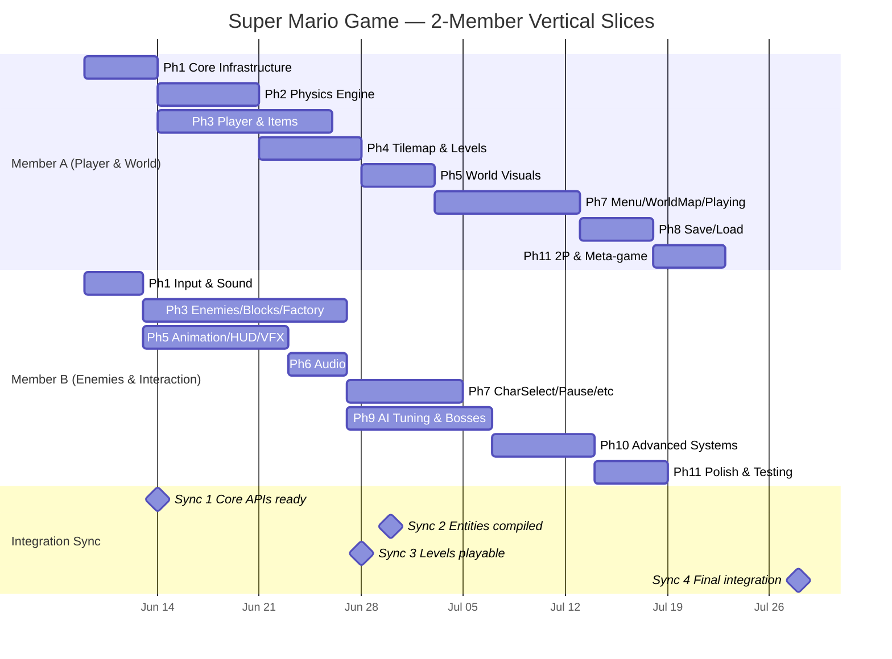

# Super Mario Game — 2-Member Task Division (Vertical Slices)

> **Project**: 110-feature Super Mario Bros (C++17, SFML 3.0.2)
> **Reference**: [TASKS.md](TASKS.md), [SPEC.md](SPEC.md)
> **Phase 0** (Environment Setup) is already complete and shared.
>
> **Audit reconciliation (2026-08-31)**: unchecked boxes were triaged against the
> code on `main`; verified-done items were ticked. `Commit:` boxes are moot (work
> landed via the real `A/*`/`B/*` branches). See
> [docs/issues/spec_feature_audit_2026-08-31.md](docs/issues/spec_feature_audit_2026-08-31.md)
> for the full triage and the remaining-work plan.

---

## Division Philosophy

Instead of splitting by horizontal layer (one person does all systems, the other does all UI), we split into **two vertical domain slices**. Each member builds **both engine/systems code AND graphics/UI/presentation code** for their domain:

| Domain Slice | Member | Systems Work | Presentation Work |
| :--- | :--- | :--- | :--- |
| 🌍 **Player & World** | **Member A** | Core engine, Physics, Player entities, Items, Player states, TileMap, Levels, Camera, Save/Load | Parallax, Water/Lava VFX, Screen transitions, MenuState, WorldMapState, PlayingState, OptionsState, 2P mode |
| ⚔️ **Enemies & Interaction** | **Member B** | InputManager/Commands, SoundManager, Enemies, AI strategies, Blocks, EntityFactory, Object Pool, Replay, Debug Console | SpriteSheet, Animation system, HUD, Minimap, Particles, Death/Invincibility FX, Audio wiring, CharSelect, Pause, GameOver, Victory, Statistics, Achievements, Boss fights, Polish |

> [!IMPORTANT]
> **Both members write C++ systems code AND visual/UI code.** Neither member is pigeonholed into one layer. Both gain full-stack experience across the entire architecture.

---

## Member A — Player & World Domain

### Systems & Engine Work

#### Phase 1 — Core Infrastructure (partial)
- [x] **1.1** Constants & Utilities — `Constants.hpp`, `MathUtils.hpp/.cpp`
- [x] **1.2** Resource Manager (Singleton) — `ResourceManager.hpp/.cpp`
- [x] **1.4** Event Bus (Observer Pattern) — `EventBus.hpp/.cpp` (15+ event types)
- [x] **1.6** Game State Manager (State Pattern) — `IGameState.hpp`, `GameStateManager.hpp/.cpp`
- [x] **1.7** Game Class (Singleton) — `Game.hpp/.cpp`, fixed-timestep loop, ImGui integration
- [ ] Commit: `feat: implement core infrastructure (Game, GSM, ResourceManager, EventBus)`

#### Phase 2 — Physics Engine (full)
- [x] **2.1** AABB — `AABB.hpp/.cpp`
- [x] **2.2** Spatial Hash — `SpatialHash.hpp/.cpp`
- [x] **2.3** Collision Detector — `CollisionDetector.hpp/.cpp`
- [x] **2.4** Collision Resolver — `CollisionResolver.hpp/.cpp` (stomp/damage/bounce/collect, surface types)
- [x] **2.5** Physics Engine — `PhysicsEngine.hpp/.cpp` (gravity, velocity, coyote time, jump buffer, water/ice/conveyor, ImGui debug)
- [ ] Commit: `feat: implement physics engine with collision pipeline`

#### Phase 3 — Player Entities & Items (partial)
- [x] **3.1** Entity base class (abstract)
- [x] **3.2** Character base class (abstract)
- [x] **3.3** Player base class — IPlayerState pattern, 5 base states (Small, Super, Fire, Cape, Mini), 2 decorators (Star, Mega)
- [x] **3.4** Mario — standard physics, fireball shooting, animation state tracking
- [x] **3.5** Luigi — modified physics, double jump
- [x] **3.6** Toad & Peach (unlockable characters)
- [x] **3.10** Item base + original items — Mushroom, FireFlower, Coin, Star, OneUpMushroom
- [x] **3.11** New items (v2.0) — CapeFeather, MegaMushroom, MiniMushroom, POWBlock, PSwitch, Trampoline, StarCoin
- [ ] Commit: `feat: implement player characters, player states, and all items`

#### Phase 4 — Tilemap & Levels (full)
- [x] **4.1** TileMap — 2D grid, tile properties, surface types, P-Switch swap, water zones
- [x] **4.2** Level Loader — JSON parsing per SPEC §9.6, entity spawning via Factory
- [x] **4.4** Level files — `level_1.json`, `level_2.json`, `level_3.json`, `bonus_1.json`, `entities.json`
- [x] **4.5** Integration test — PlayingState loads Level 1, renders tilemap, spawns Mario
- [ ] Commit: `feat: implement tilemap, level loader, and level JSON files`

#### Phase 8 — Save/Load & Persistence (full)
- [x] **8.1** Serializer — save/load slots using SPEC §12.2 expanded schema
- [x] **8.2** Achievement Manager — subscribes to EventBus, checks conditions
- [x] **8.3** Statistics Tracker — subscribes to EventBus, accumulates stats
- [x] **8.4** Save/Load Integration — auto-save, manual save, settings persistence
- [ ] Commit: `feat: implement save/load, achievements, and statistics`

---

### Presentation & Gameplay Work

#### Phase 4 — Camera (from Phase 4)
- [x] **4.3** Camera — smooth follow, lookahead, bounds clamping, multi-mode scroll, screen shake
- [ ] Commit: `feat: implement camera with multi-mode scrolling`

#### Phase 5 — World Visuals (partial)
- [x] **5.5** Parallax Background — multi-layer scrolling
- [x] **5.7** Screen Transitions & Screen Shake — fade-in/out, light/medium/heavy shake
- [ ] **5.10** Water & Lava Animation — sine-wave water surface, bubble/ember particles
- [ ] Commit: `feat: implement parallax, screen transitions, water/lava VFX`

#### Phase 7 — Player-Facing Game States (partial)
- [ ] **7.1** Animated Menu State — animated background, running Mario, spinning coins, attract mode after 30s idle
- [x] **7.3** World Map State — overhead map with level nodes, animated paths, star coin display, sequential level unlock
- [ ] **7.4** Playing State (Full Implementation) — integrate level load, player spawn, physics, camera, HUD, minimap, all collision callbacks, swimming/climbing/wall sliding/ground pounding, P-Switch timer, combo system, star coin tracking, ImGui dev panel
- [x] **7.8** Options State & High Scores — volume sliders, difficulty selection, controls rebinding, colorblind mode toggle, high score persistence
- [ ] Commit: `feat: implement Menu, WorldMap, Playing, Options states`

#### Phase 11 — Two-Player & Meta-Game (partial)
- [x] **11.1** Two-Player Versus Mode — Player 2 keyboard mappings, shared camera following leading player, versus rules
- [ ] **11.3** Meta-Game — New Game+ (mirrored levels, faster enemies), Daily Challenge (date-seeded procedural level), unlockable character conditions
- [ ] Commit: `feat: implement 2P mode, NG+, daily challenge, unlockables`

---

### Member A Summary Table

| Category | Files/Tasks | Examples |
| :--- | :--- | :--- |
| **🔧 Systems** | ~50 files | Game, Physics, Player, Items, TileMap, LevelLoader, Serializer, AchievementManager |
| **🎨 Presentation** | ~25 files | Camera, Parallax, Water/Lava VFX, MenuState, WorldMapState, PlayingState, OptionsState, Screen transitions |
| **Design Patterns** | 8 patterns | Factory (shared), Singleton, State (IPlayerState + IGameState), Observer (EventBus), Decorator (Star/Mega), Memento (via Save) |

---

## Member B — Enemies & Interaction Domain

### Systems & Engine Work

#### Phase 1 — Input & Sound (partial)
- [x] **1.3** Sound Manager (Singleton) — `SoundManager.hpp/.cpp` (play SFX, stream BGM, volume controls, footstep support)
- [x] **1.5** Input Manager (Command Pattern) — `InputManager.hpp/.cpp`, 8+ ICommand classes (Jump, Move, Fire, Crouch, GroundPound, WallJump, Run, Debug), Player 1/2 key mappings, key rebinding
- [x] **1.8** Placeholder States — barebones `MenuState` and `PlayingState` stubs (for early testing)
- [ ] Commit: `feat: implement InputManager with commands and SoundManager`

#### Phase 3 — Enemies, Blocks & Factory (partial)
- [x] **3.7** Enemy base class + IMovementStrategy interface + 8 concrete strategies (Patrol, Chase, Fly, TimerEmergence, Linear, HammerThrow, TetheredChase, ProximityTrigger)
- [x] **3.8** Original enemies — Goomba, KoopaTroopa, KoopaParatroopa, Boo (with variants)
- [x] **3.9** New enemies (v2.0) — PiranhaPlant, BulletBill, HammerBro, Thwomp, ChainChomp, Lakitu, Spiny
- [x] **3.12** Block base + original blocks — BrickBlock, QuestionBlock, Pipe, Flagpole
- [x] **3.13** New blocks (v2.0) — HiddenBlock, MovingPlatform, FallingPlatform, IceBlock, ConveyorBelt
- [x] **3.14** Entity Factory — `EntityFactory.hpp/.cpp`, 25+ entity types, config-driven
- [ ] Commit: `feat: implement enemies, strategies, blocks, and EntityFactory`

#### Phase 10 — Advanced Systems (full)
- [ ] **10.1** Object Pool — `ObjectPool<T>` template, wire to fireballs/particles/BulletBills
- [ ] **10.2** Config-Driven Entities — `entities.json` parsing, update EntityFactory
- [ ] **10.3** Replay System — `ReplayRecorder.hpp/.cpp`, record/playback input commands
- [ ] **10.4** Debug Console — `DebugConsole.hpp/.cpp`, toggle with ~, text→command, autocomplete
- [ ] Commit: `feat: implement ObjectPool, config entities, replay, debug console`

---

### Presentation & Gameplay Work

#### Phase 5 — Visual Systems (partial)
- [x] **5.1** SpriteSheet Handler — `SpriteSheet.hpp/.cpp`
- [x] **5.2** Animation System — `Animation.hpp/.cpp`, `AnimationManager.hpp/.cpp` (11+ animation states)
- [x] **5.3** HUD — Score, Coins, World, Time, Lives, Combo counter, P-Switch timer bar, Boss health bar, Star coin indicators, floating score text
- [x] **5.4** Minimap — 200×40 pixel overview, toggleable with M key
- [x] **5.6** Particle System — `ParticleSystem.hpp/.cpp`, object-pooled, 8+ particle types (BrickBreak, CoinSparkle, DeathPoof, Stomp, Combo, WallDust, WaterBubble, LavaEmber)
- [x] **5.8** Entity Death Animations — Goomba squish, enemy flip, Star kill launch, player death
- [x] **5.9** Invincibility Visual FX — Star rainbow cycling + sparkle trail, hit sprite flashing
- [x] **5.11** Source & Integrate Assets — download spritesheets, wire to all entities
- [ ] Commit: `feat: implement animation system, HUD, minimap, particles, VFX`

#### Phase 6 — Audio (full)
- [x] **6.1** Source Audio Assets — find 17+ SFX, 10+ BGM tracks
- [x] **6.2** Wire Sound Events — subscribe SoundManager to EventBus (15+ events), footstep sounds, combo SFX escalation, dynamic music layers
- [x] **6.3** Volume Controls — sliders in Options, persist to config.json
- [ ] Commit: `feat: wire all audio events with dynamic music`

#### Phase 7 — Interaction Game States (partial)
- [x] **7.2** Character Select State — Mario/Luigi side-by-side, locked/unlocked Toad/Peach display
- [ ] **7.5** Pause State — transparent overlay with Resume, Restart, Save, World Map, Menu, Quit
- [x] **7.6** Game Over State — death counter, retry screen
- [x] **7.7** Victory State — score calculations, star coin summary, level transition
- [x] **7.9** Statistics State — total enemies, coins, deaths, time, combos
- [x] **7.10** Achievements Display — list screen from Main Menu, toast notification system (top-right slide-in)
- [ ] Commit: `feat: implement CharSelect, Pause, GameOver, Victory, Stats, Achievements`

#### Phase 9 — Enemy AI & Bosses (full)
- [x] **9.1** AI Behavior Tuning — tune all 13 enemy types + 3 variants, Lakitu spawner, Thwomp state machine, ChainChomp tether, ImGui AI debug overlay
- [x] **9.2** Boom Boom Mid-Boss — 3-phase boss for Level 2, charge→spin→recover, boss arena
- [x] **9.3** Bowser Boss — Phase 1 (walk + fire), Phase 2 (jump + faster fire), health bar, boss arena
- [ ] **9.4** Difficulty Scaling — Easy/Normal/Hard DifficultyStrategy, entity distribution balancing
- [ ] Commit: `feat: tune AI, implement bosses, add difficulty modes`

#### Phase 11 — Polish & Accessibility (partial)
- [ ] **11.2** Edge Cases & Bug Fixes — respawn at checkpoint, flashing invincibility, shell chains, time-out death, 100-coin 1-UP, pipe transitions
- [ ] **11.4** Accessibility — colorblind mode (palette swap), audio navigation cues
- [ ] **11.5** Final Testing — full walkthrough all levels, all power-ups/enemies/blocks, save/load, 2P, difficulty, 60fps verification
- [ ] Commit: `feat: fix edge cases, add accessibility, final testing`

---

### Member B Summary Table

| Category | Files/Tasks | Examples |
| :--- | :--- | :--- |
| **🔧 Systems** | ~45 files | InputManager, 8 Commands, SoundManager, Enemy base, 8 Strategies, 13 Enemies, Block base, 9 Blocks, EntityFactory, ObjectPool, Replay, DebugConsole |
| **🎨 Presentation** | ~30 files | SpriteSheet, Animation, HUD, Minimap, ParticleSystem, Death/Invincibility FX, Audio wiring, CharSelectState, PauseState, GameOverState, VictoryState, StatisticsState, AchievementsDisplay, Boss fights |
| **Design Patterns** | 7 patterns | Factory (EntityFactory), Strategy (8 AI strategies), Command (8 input commands), Template Method (strategy hooks), Object Pool, State (enemy/block lifecycles) |

---

## Per-Member Balance: Systems vs. Presentation

| | Member A | Member B |
| :--- | :--- | :--- |
| **Systems work** | ~50 files (~65%) | ~45 files (~60%) |
| **Presentation work** | ~25 files (~35%) | ~30 files (~40%) |
| **Total files** | ~75 | ~75 |
| **Design patterns** | 8 | 7 |
| **Est. duration** | ~6–7 weeks | ~6–7 weeks |
| **Key systems** | Physics, Player states, Level pipeline, Save/Load | Input/Commands, Enemy AI, Blocks, EntityFactory, Advanced Systems |
| **Key presentation** | Camera, Menu, WorldMap, Playing, Options, Parallax, Water/Lava | Animation, HUD, Particles, Audio, CharSelect, Pause, GameOver, Victory, Bosses |

---

## Dependency Timeline

---

## Integration Sync Points

| Sync | When | Member A provides | Member B provides |
| :--- | :--- | :--- | :--- |
| **Sync 1** | Week 1 end | `Game`, `GameStateManager`, `IGameState`, `EventBus`, `ResourceManager` APIs | `InputManager`, `SoundManager`, `ICommand` interface |
| **Sync 2** | Week 3 end | Entity/Character/Player base classes, Item classes | Enemy/Block classes, EntityFactory, AI strategies |
| **Sync 3** | Week 4 end | TileMap, LevelLoader, Camera, Level JSON files | Animation system, SpriteSheet, HUD (ready to wire) |
| **Sync 4** | Final week | Save/Load, 2P mode, Meta-game features | Object Pool, Replay, Bosses, polish, final testing |

> [!WARNING]
> **Key dependency**: Member B's EntityFactory (3.14) needs Member A's Entity/Character/Player/Item base classes and Member B's own Enemy/Block classes. Coordinate on Phase 3 — Member A should commit base classes first, then both work in parallel on their concrete entities.

---

## File Ownership Map

| Directory / File | Member A | Member B | Notes |
| :--- | :---: | :---: | :--- |
| `Core/Game.*`, `Core/GameStateManager.*`, `Core/IGameState.*` | ✅ | ❌ | A owns engine infrastructure |
| `Core/ResourceManager.*`, `Core/EventBus.*` | ✅ | ❌ | A owns resource and event systems |
| `Core/InputManager.*`, `Core/SoundManager.*` | ❌ | ✅ | B owns input and sound |
| `Core/AchievementManager.*`, `Core/StatisticsTracker.*` | ✅ | ❌ | A owns persistence-related managers |
| `Core/MenuState.*`, `Core/WorldMapState.*` | ✅ | ❌ | A owns player-facing flow states |
| `Core/PlayingState.*` | ✅ primary | ✅ contributes | Both contribute — A writes skeleton, B adds HUD/audio hooks |
| `Core/OptionsState.*` | ✅ | ❌ | A owns options/settings |
| `Core/CharSelectState.*`, `Core/PauseState.*` | ❌ | ✅ | B owns interaction states |
| `Core/GameOverState.*`, `Core/VictoryState.*` | ❌ | ✅ | B owns outcome states |
| `Core/StatisticsState.*`, `Core/ReplayRecorder.*` | ❌ | ✅ | B owns stats display and replay |
| `Entities/Entity.*`, `Character.*`, `Player.*` | ✅ | ❌ | A owns base hierarchy |
| `Entities/Mario.*`, `Luigi.*`, `Toad.*`, `Peach.*` | ✅ | ❌ | A owns player characters |
| `Entities/IPlayerState.*`, `Small/Super/Fire/Cape/MiniState.*` | ✅ | ❌ | A owns player state pattern |
| `Entities/StarDecorator.*`, `MegaDecorator.*` | ✅ | ❌ | A owns decorator pattern |
| `Entities/Item.*` + all 12 item subclasses | ✅ | ❌ | A owns all items |
| `Entities/Enemy.*`, `IMovementStrategy.*` + 8 strategies | ❌ | ✅ | B owns enemy hierarchy |
| All 13 enemy subclasses | ❌ | ✅ | B owns all enemies |
| `Entities/Block.*` + all 9 block subclasses | ❌ | ✅ | B owns all blocks |
| `Entities/EntityFactory.*` | ❌ | ✅ | B owns the factory (registers all types) |
| `Physics/*` | ✅ | ❌ | A owns all physics code |
| `Graphics/Camera.*` | ✅ | ❌ | A owns camera |
| `Graphics/Animation.*`, `AnimationManager.*`, `SpriteSheet.*` | ❌ | ✅ | B owns animation pipeline |
| `Graphics/HUD.*`, `Minimap.*` | ❌ | ✅ | B owns HUD and minimap |
| `Graphics/ParticleSystem.*` | ❌ | ✅ | B owns particles |
| `Utils/Constants.*`, `MathUtils.*` | ✅ | ❌ | A owns utilities |
| `Utils/TileMap.*`, `LevelLoader.*` | ✅ | ❌ | A owns level data |
| `Utils/Serializer.*` | ✅ | ❌ | A owns save/load |
| `Utils/ObjectPool.*`, `DebugConsole.*` | ❌ | ✅ | B owns advanced systems |
| `assets/levels/`, `assets/config/` | ✅ | ❌ | A designs level and config JSON |
| `assets/textures/`, `assets/sounds/` | ❌ | ✅ | B sources media assets |

---

## Shared Responsibilities

1. **`PlayingState`** (Phase 7.4) — The most complex file. Member A writes the update/physics loop skeleton. Member B adds HUD rendering, audio hooks, and animation wiring. **Both contribute.**

2. **`CMakeLists.txt`** — Both add source files. Coordinate each merge to avoid conflicts.

3. **Animation State Names** — Agree early on enum values (idle, walk, run, jump, crouch, slide, swim, climb, wall_slide, ground_pound, die) so Member A's entities and Member B's animation system use the same vocabulary.

4. **EventBus Events** — Member A defines the `EventType` enum and publishes events from entities/physics. Member B subscribes from HUD/Sound/Achievement. Both must agree on event data payloads.

---

## Bonus Phase Ownership

| Bonus | Owner | Rationale |
| :--- | :--- | :--- |
| **A — Level Editor** | Member A | ImGui-based, builds on TileMap/LevelLoader, level JSON pipeline |
| **B — Time Rewind** | Member A | Memento pattern, state snapshots, extends Save/Load systems |
| **C — Shadow Mario** | Member B | Input recording/replay, extends Replay system |
| **D — Dynamic Lighting** | Member B | GLSL shaders, visual effects, extends graphics pipeline |
| **E — Procedural Generation** | Member A | Chunk generation, extends level data pipeline |
