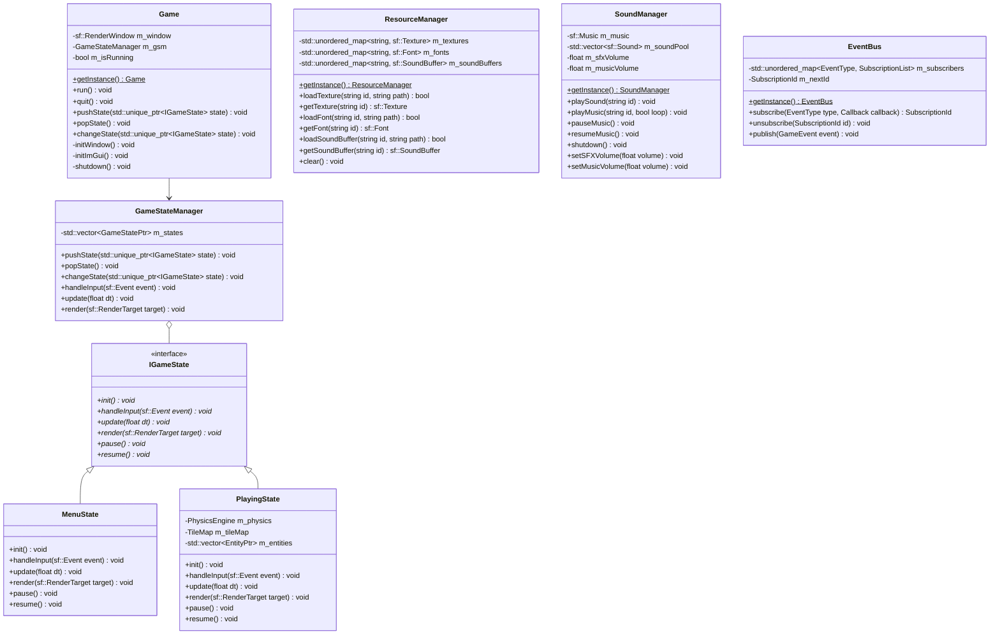
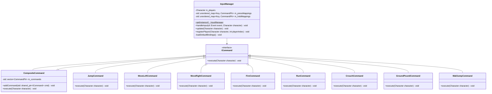
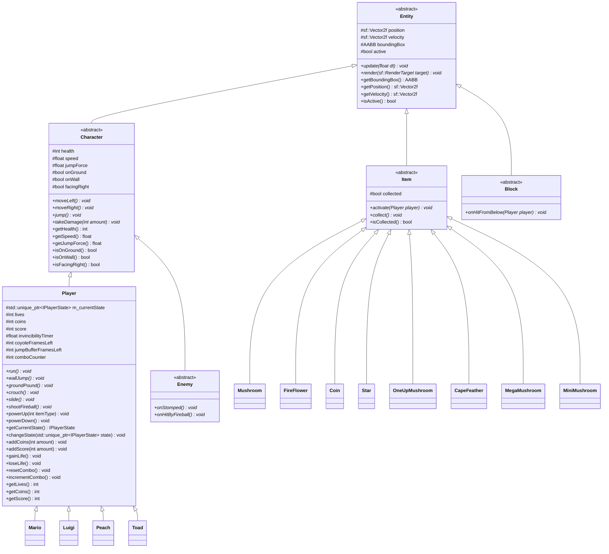
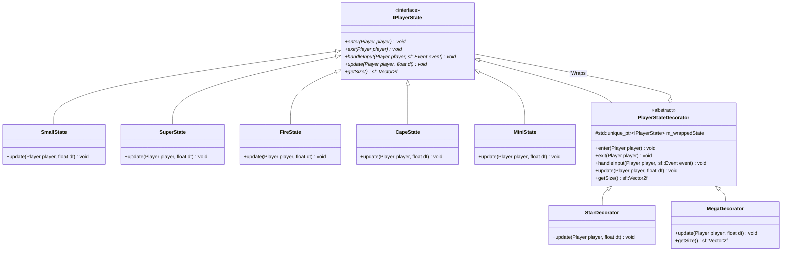
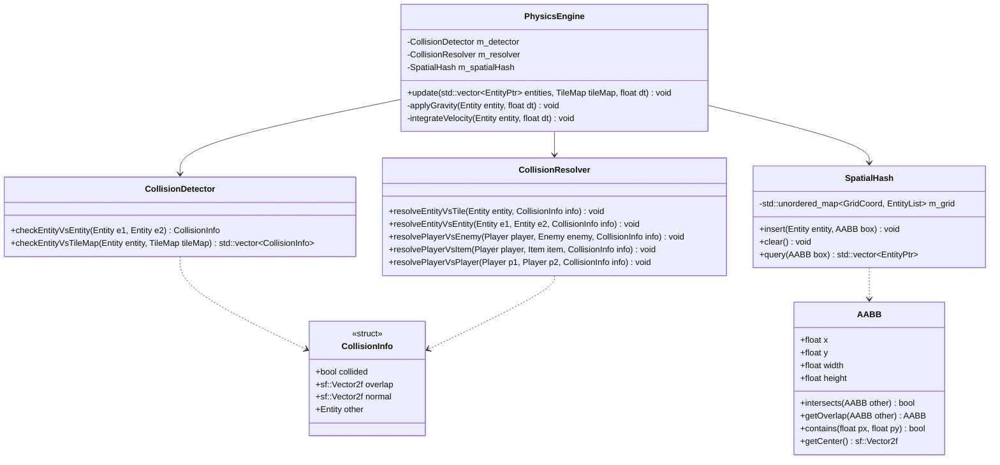
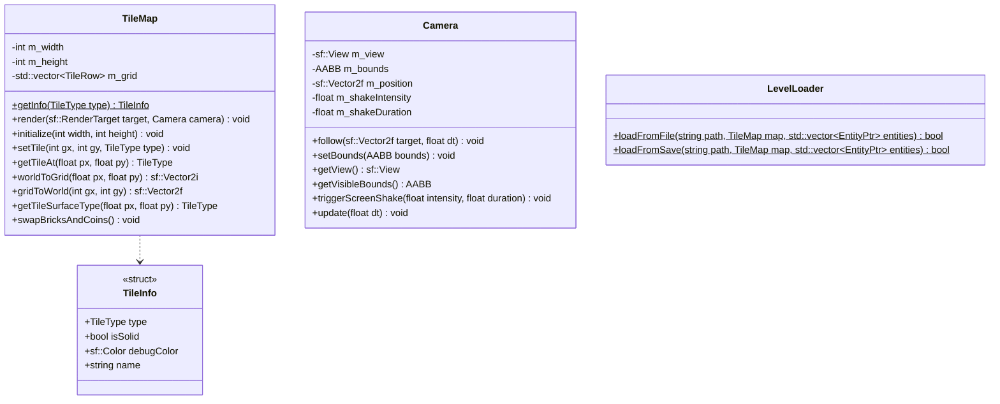

# Super Mario Game - Full Codebase Class Diagrams

This document contains the complete class structure of the `SuperMarioGame` codebase, separated into logical subdiagrams for easy reading and printing. 

## 1. Core Infrastructure & Managers
This diagram covers the Singleton managers, the game loop, and the state machine.

---

## 2. Input & Command System
This diagram covers the `InputManager` and the Command pattern implementation.

---

## 3. Entity Hierarchy
This diagram maps the core `Entity` tree, showing abstract bases and specific concrete classes.

---

## 4. Player State Machine (State + Decorator Patterns)
This diagram maps the complex state behaviors of the player.

---

## 5. Physics Engine
This diagram covers the collision detection and resolution modules.

---

## 6. Utilities & Graphics
This diagram covers level data, tiles, and rendering abstractions.

