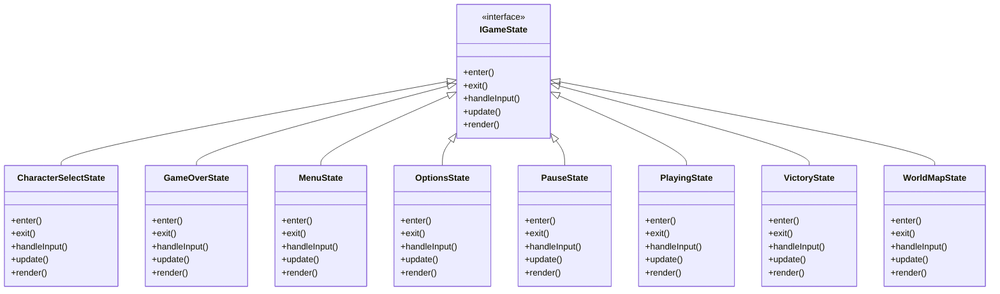
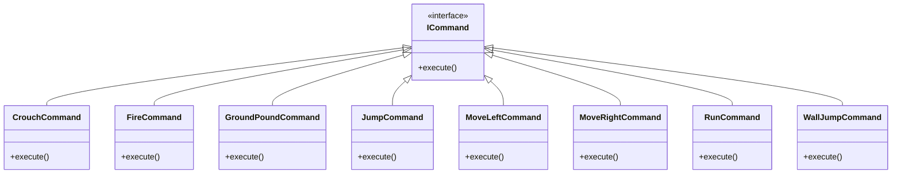
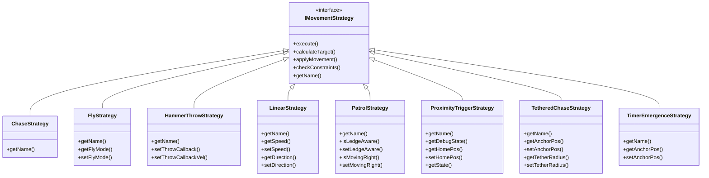
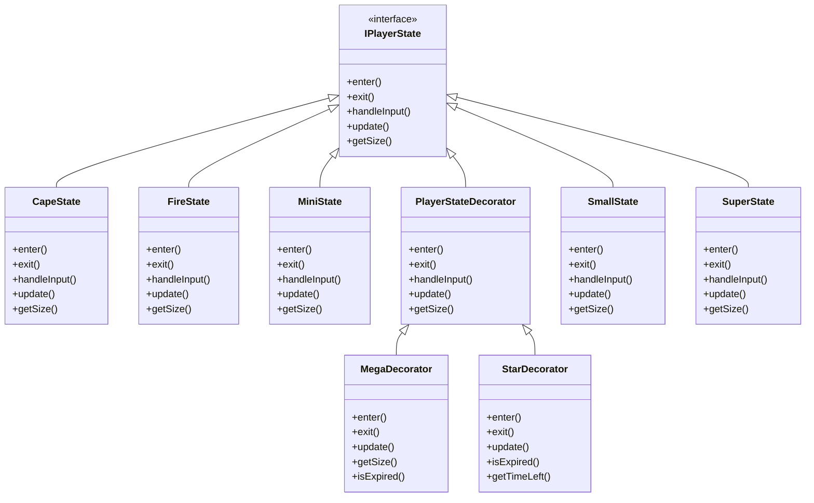
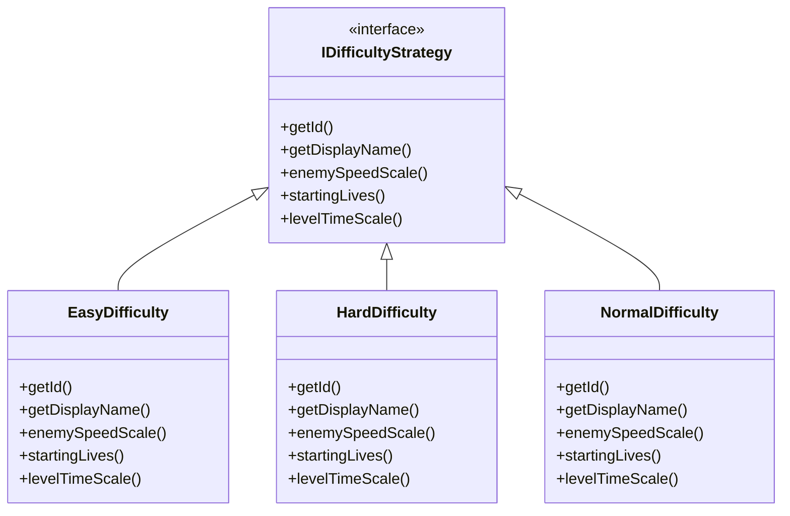

# Super Mario Game — UML class diagrams

> **GENERATED — do not edit by hand.** Produced by
> `SuperMarioGame/tools/gen_class_diagram.py` from `include/**/*.hpp`.
> Regenerate with:
> ```bash
> cd SuperMarioGame && python3 tools/gen_class_diagram.py --mermaid > ../class_diagram.md
> ```
> The previous hand-written version of this file had gone stale: it was
> missing `Boss`, `Bowser`, `BoomBoom`, `Spiny`, `Lakitu`, `ShadowMario`,
> `AIController`, `ObjectPool` and `TimeRewindManager` while still reading
> as the authoritative picture of the codebase (g-rule-22).

## Entity hierarchy

```mermaid
classDiagram
    class Entity {
        <<abstract>>
        +update()
        +render()
        +getBoundingBox()
        +isActive()
        +destroy()
    }
    class Block {
        <<abstract>>
        +hasArtwork()
        +artworkSize()
        +onHitFromBelow()
        +getGravityMultiplier()
        +getCategory()
    }
    class BrickBlock {
        +getTypeName()
        +onHitFromBelow()
        +render()
        +setupAnimations()
        +getCoinsLeft()
    }
    class Castle {
        +getTypeName()
        +onHitFromBelow()
        +getGravityMultiplier()
        +collidesWithTiles()
        +update()
    }
    class ConveyorBelt {
        +getTypeName()
        +onHitFromBelow()
        +update()
        +render()
        +setupAnimations()
    }
    class FallingPlatform {
        +getTypeName()
        +onHitFromBelow()
        +update()
        +render()
        +setupAnimations()
    }
    class Flagpole {
        +getTypeName()
        +update()
        +onHitFromBelow()
        +render()
        +setupAnimations()
    }
    class HiddenBlock {
        +getTypeName()
        +onHitFromBelow()
        +update()
        +render()
        +setupAnimations()
    }
    class IceBlock {
        +getTypeName()
        +onHitFromBelow()
        +update()
        +render()
        +setupAnimations()
    }
    class MovingPlatform {
        +getTypeName()
        +onHitFromBelow()
        +update()
        +render()
        +setupAnimations()
    }
    class Pipe {
        +getTypeName()
        +onHitFromBelow()
        +render()
        +setupAnimations()
        +checkWarp()
    }
    class QuestionBlock {
        +getTypeName()
        +onHitFromBelow()
        +render()
        +setupAnimations()
        +getItemType()
    }
    class Character {
        +moveLeft()
        +moveRight()
        +jump()
        +takeDamage()
        +getHealth()
    }
    class Enemy {
        <<abstract>>
        +hasArtwork()
        +artworkSize()
        +update()
        +render()
        +setupAnimations()
    }
    class Boo {
        +getTypeName()
        +update()
        +render()
        +setupAnimations()
        +onStomped()
    }
    class Boss {
        <<abstract>>
        +update()
        +onStomped()
        +onHitByFireball()
        +getHealth()
        +getMaxHealth()
    }
    class BoomBoom {
        +getTypeName()
        +setupAnimations()
    }
    class Bowser {
        +getTypeName()
        +setupAnimations()
        +onHitByFireball()
        +getFireHitsToStagger()
    }
    class BulletBill {
        +getTypeName()
        +setupAnimations()
        +onStomped()
        +onHitByFireball()
        +getGravityMultiplier()
    }
    class ChainChomp {
        +getTypeName()
        +setupAnimations()
        +onStomped()
        +onHitByFireball()
    }
    class Goomba {
        +getTypeName()
        +update()
        +render()
        +setupAnimations()
        +onStomped()
    }
    class HammerBro {
        +getTypeName()
        +setupAnimations()
        +onStomped()
        +onHitByFireball()
    }
    class KoopaTroopa {
        +getTypeName()
        +update()
        +render()
        +setupAnimations()
        +onStomped()
    }
    class KoopaParatroopa {
        +getTypeName()
        +update()
        +setupAnimations()
        +render()
        +onStomped()
    }
    class Lakitu {
        +getTypeName()
        +onStomped()
        +onHitByFireball()
        +update()
        +setupAnimations()
    }
    class PiranhaPlant {
        +getTypeName()
        +setupAnimations()
        +onStomped()
        +onHitByFireball()
        +render()
    }
    class Spiny {
        +getTypeName()
        +onStomped()
        +onHitByFireball()
        +update()
        +setupAnimations()
    }
    class Thwomp {
        +getTypeName()
        +update()
        +setupAnimations()
        +onStomped()
        +onHitByFireball()
    }
    class Player {
        <<abstract>>
        +hasArtwork()
        +artworkSize()
        +jump()
        +run()
        +wallJump()
    }
    class Luigi {
        +getTypeName()
        +update()
        +render()
        +setupAnimations()
        +jump()
    }
    class Mario {
        +getTypeName()
        +update()
        +render()
        +setupAnimations()
        +getCharacterName()
    }
    class Peach {
        +getTypeName()
        +update()
        +render()
        +setupAnimations()
        +floatHover()
    }
    class ShadowMario {
        +getTypeName()
        +getCharacterName()
        +update()
        +render()
        +setupAnimations()
    }
    class Toad {
        +getTypeName()
        +update()
        +render()
        +setupAnimations()
        +getCharacterName()
    }
    class Item {
        +hasArtwork()
        +artworkSize()
        +activate()
        +collect()
        +setupAnimations()
    }
    class BridgeAxe {
        +getTypeName()
        +update()
        +activate()
        +setupAnimations()
        +isSwung()
    }
    class CapeFeather {
        +getTypeName()
        +update()
        +render()
        +activate()
        +setupAnimations()
    }
    class Coin {
        +getTypeName()
        +update()
        +render()
        +activate()
        +setupAnimations()
    }
    class FireFlower {
        +getTypeName()
        +update()
        +render()
        +activate()
        +setupAnimations()
    }
    class MegaMushroom {
        +getTypeName()
        +update()
        +render()
        +activate()
        +setupAnimations()
    }
    class MiniMushroom {
        +getTypeName()
        +update()
        +render()
        +activate()
        +setupAnimations()
    }
    class Mushroom {
        +getTypeName()
        +update()
        +render()
        +activate()
        +setupAnimations()
    }
    class OneUpMushroom {
        +getTypeName()
        +update()
        +render()
        +activate()
        +setupAnimations()
    }
    class POWBlock {
        +getTypeName()
        +update()
        +render()
        +activate()
        +setupAnimations()
    }
    class PSwitch {
        +getTypeName()
        +update()
        +render()
        +activate()
        +collect()
    }
    class Star {
        +getTypeName()
        +update()
        +render()
        +activate()
        +setupAnimations()
    }
    class StarCoin {
        +getTypeName()
        +update()
        +render()
        +activate()
        +setupAnimations()
    }
    class Trampoline {
        +getTypeName()
        +update()
        +render()
        +activate()
        +collect()
    }
    class Projectile {
        +getCategory()
        +damagesEnemies()
        +damagesPlayer()
        +onHitEnemy()
        +onHitPlayer()
    }
    class BossFireball {
        +hasArtwork()
        +artworkSize()
        +getTypeName()
        +update()
        +render()
    }
    class Fireball {
        +hasArtwork()
        +artworkSize()
        +getTypeName()
        +update()
        +render()
    }
    class Hammer {
        +hasArtwork()
        +artworkSize()
        +getTypeName()
        +damagesPlayer()
        +onHitPlayer()
    }
    Entity <|-- Block
    Block <|-- BrickBlock
    Block <|-- Castle
    Block <|-- ConveyorBelt
    Block <|-- FallingPlatform
    Block <|-- Flagpole
    Block <|-- HiddenBlock
    Block <|-- IceBlock
    Block <|-- MovingPlatform
    Block <|-- Pipe
    Block <|-- QuestionBlock
    Entity <|-- Character
    Character <|-- Enemy
    Enemy <|-- Boo
    Enemy <|-- Boss
    Boss <|-- BoomBoom
    Boss <|-- Bowser
    Enemy <|-- BulletBill
    Enemy <|-- ChainChomp
    Enemy <|-- Goomba
    Enemy <|-- HammerBro
    Enemy <|-- KoopaTroopa
    KoopaTroopa <|-- KoopaParatroopa
    Enemy <|-- Lakitu
    Enemy <|-- PiranhaPlant
    Enemy <|-- Spiny
    Enemy <|-- Thwomp
    Character <|-- Player
    Player <|-- Luigi
    Player <|-- Mario
    Player <|-- Peach
    Player <|-- ShadowMario
    Player <|-- Toad
    Entity <|-- Item
    Item <|-- BridgeAxe
    Item <|-- CapeFeather
    Item <|-- Coin
    Item <|-- FireFlower
    Item <|-- MegaMushroom
    Item <|-- MiniMushroom
    Item <|-- Mushroom
    Item <|-- OneUpMushroom
    Item <|-- POWBlock
    Item <|-- PSwitch
    Item <|-- Star
    Item <|-- StarCoin
    Item <|-- Trampoline
    Entity <|-- Projectile
    Projectile <|-- BossFireball
    Projectile <|-- Fireball
    Projectile <|-- Hammer
```



## Game states (State)



## Input commands (Command)



## Movement strategies (Strategy)



## Player forms (State + Decorator)



## Difficulty (Strategy)



