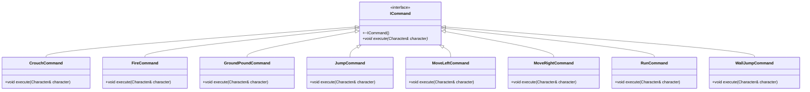
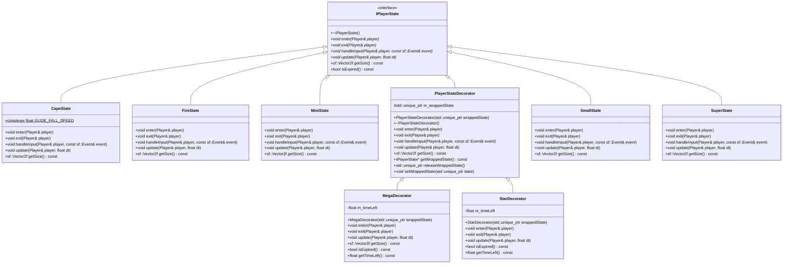
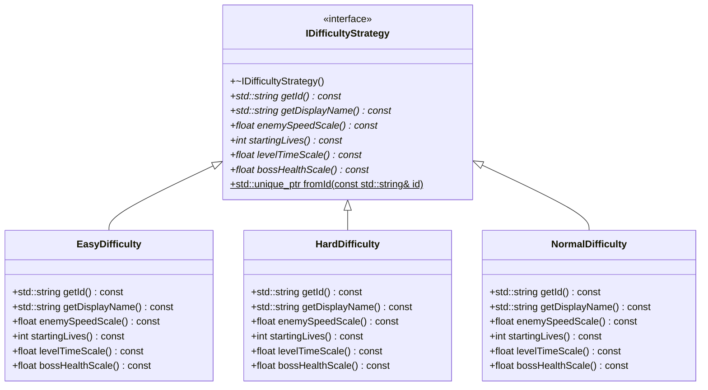

# Super Mario Game — UML class diagrams

> **GENERATED — do not edit by hand.** Produced by
> `SuperMarioGame/tools/gen_class_diagram.py` from `include/**/*.hpp`.
> Regenerate with:
> ```bash
> cd SuperMarioGame && python3 tools/gen_class_diagram.py --mermaid > ../class_diagram.md
> ```
> The previous hand-written version of this file had gone stale: it was
> missing `Boss`, `Bowser`, `BoomBoom`, `Spiny`, `Lakitu`, `ShadowMario`,
> `AIController`, `ObjectPool` and `TimeRewindManager` while still reading
> as the authoritative picture of the codebase (g-rule-22).

## Entity hierarchy

```mermaid
classDiagram
    class Entity {
        <<abstract>>
        #sf::Vector2f position
        #sf::Vector2f velocity
        #bool active
        #AABB boundingBox
        #sf::Vector2f m_targetSize
        -std::uint32_t m_id
        -std::uint32_t s_nextId$
        +Entity(sf::Vector2f pos = (0.0f, 0.0f), sf::Vector2f targetSize = (32.0f, 32.0f))
        +~Entity()
        +void update(float dt)*
        +void render(sf::RenderTarget& target)*
        +const AABB& getBoundingBox() const
        +bool isActive() const
        +void destroy()
        +void revive()
        +float getGravityMultiplier() const
        +EntityCategory getCategory() const
        +std::string getTypeName() const
        +bool collidesWithTiles() const
        +bool isCollidable() const
        +bool isContactHazard() const
        +void onContactWithPlayer()
        +sf::Vector2f getPosition() const
        +sf::Vector2f getVelocity() const
        +sf::Vector2f getTargetSize() const
        +std::uint32_t getId() const
        +void setPosition(sf::Vector2f pos)
        +void setVelocity(sf::Vector2f vel)
        +void setTargetSize(sf::Vector2f size)
        +bool hasArtwork() const
        +sf::Vector2f artworkSize() const
        #void drawSprite(sf::RenderTarget& target, sf::Sprite sprite, SpriteAnchor anchor, bool flipX = false, bool flipY = false, float overrideScale = 0.0f) const
        #void drawPlaceholder(sf::RenderTarget& target, sf::Color fill) const
    }
    class Block {
        <<abstract>>
        #bool m_breakable
        #bool m_isHit
        #float m_bumpTimer
        #sf::Vector2f m_originalPosition
        #std::unique_ptr<Animator> m_animator
        #Animation m_animation
        #bool m_hasAnimation
        +bool hasArtwork() const
        +sf::Vector2f artworkSize() const
        +Block(sf::Vector2f position, sf::Vector2f targetSize = (32.0f, 32.0f))
        +~Block()
        +void onHitFromBelow(Player& player)*
        +float getGravityMultiplier() const
        +EntityCategory getCategory() const
        +void update(float dt)
        +void render(sf::RenderTarget& target)
        +void setupAnimations(const SpriteSheet* spriteSheet)
        +bool isBreakable() const
    }
    class BrickBlock {
        -int m_coinsLeft
        -bool m_isEmpty
        +BrickBlock(sf::Vector2f position, int coins = 0)
        +~BrickBlock()
        +std::string getTypeName() const
        +void onHitFromBelow(Player& player)
        +void render(sf::RenderTarget& target)
        +void setupAnimations(const SpriteSheet* spriteSheet)
        +int getCoinsLeft() const
        +bool isEmpty() const
    }
    class Castle {
        +constexpr float WIDTH_TILES$
        +constexpr float HEIGHT_TILES$
        -float m_flagRise
        -bool m_flagRaised
        -const SpriteSheet* m_sheet
        +Castle(sf::Vector2f position)
        +~Castle()
        +std::string getTypeName() const
        +void onHitFromBelow(Player& player)
        +float getGravityMultiplier() const
        +bool collidesWithTiles() const
        +void update(float dt)
        +void render(sf::RenderTarget& target)
        +void setupAnimations(const SpriteSheet* spriteSheet)
        +void raiseFlag()
        +bool isFlagRaised() const
    }
    class ConveyorBelt {
        -bool m_pushRight
        -float m_pushSpeed
        +ConveyorBelt(sf::Vector2f position, bool pushRight = true, float pushSpeed = 100.0f)
        +~ConveyorBelt()
        +std::string getTypeName() const
        +void onHitFromBelow(Player& player)
        +void update(float dt)
        +void render(sf::RenderTarget& target)
        +void setupAnimations(const SpriteSheet* spriteSheet)
        +bool isPushingRight() const
        +float getPushSpeed() const
    }
    class FallingPlatform {
        -FallingPlatformState m_state
        -float m_shakeTimer
        -float m_respawnTimer
        -sf::Vector2f m_shakeOffset
        +FallingPlatform(sf::Vector2f position)
        +~FallingPlatform()
        +std::string getTypeName() const
        +void onHitFromBelow(Player& player)
        +void update(float dt)
        +void render(sf::RenderTarget& target)
        +void setupAnimations(const SpriteSheet* spriteSheet)
        +bool isCollidable() const
        +FallingPlatformState getState() const
        -bool isPlayerStandingOnTop() const
    }
    class Flagpole {
        -Animation m_raisedAnimation
        -Animation m_descentAnimation
        -float m_poleHeight
        -bool m_triggered
        -float m_flagY
        -float m_targetFlagY
        -float m_animTimer
        +Flagpole(sf::Vector2f position, float poleHeight = 168.0f)
        +~Flagpole()
        +std::string getTypeName() const
        +void update(float dt)
        +void onHitFromBelow(Player& player)
        +void render(sf::RenderTarget& target)
        +void setupAnimations(const SpriteSheet* spriteSheet)
        +void onPlayerCollision(Player& player, float collisionY)
        +float getPoleHeight() const
        +bool isTriggered() const
        +float getFlagY() const
    }
    class HiddenBlock {
        -bool m_isRevealed
        -int m_containedItemType
        +HiddenBlock(sf::Vector2f position, int itemType = 0)
        +~HiddenBlock()
        +std::string getTypeName() const
        +void onHitFromBelow(Player& player)
        +void update(float dt)
        +void render(sf::RenderTarget& target)
        +void setupAnimations(const SpriteSheet* spriteSheet)
        +bool isCollidable() const
        +bool isRevealed() const
    }
    class IceBlock {
        -float m_friction
        +IceBlock(sf::Vector2f position)
        +~IceBlock()
        +std::string getTypeName() const
        +void onHitFromBelow(Player& player)
        +void update(float dt)
        +void render(sf::RenderTarget& target)
        +void setupAnimations(const SpriteSheet* spriteSheet)
        +float getFriction() const
    }
    class MovingPlatform {
        -sf::Vector2f m_startPos
        -sf::Vector2f m_travelRange
        -const float m_rangeLen
        -float m_speed
        -float m_progress
        -bool m_movingForward
        +MovingPlatform(sf::Vector2f position, sf::Vector2f travelRange, float speed = 50.0f)
        +~MovingPlatform()
        +std::string getTypeName() const
        +void onHitFromBelow(Player& player)
        +void update(float dt)
        +void render(sf::RenderTarget& target)
        +void setupAnimations(const SpriteSheet* spriteSheet)
    }
    class Pipe {
        -int m_pipeId
        -sf::Vector2f m_exitPosition
        -std::string m_targetLevel
        -bool m_isEntrance
        -float m_rotationDegrees
        -const SpriteSheet* m_spriteSheet
        +Pipe(sf::Vector2f position, int pipeId = 0, sf::Vector2f exitPosition = (0.0f, 0.0f), std::string targetLevel = "", bool isEntrance = false, float rotationDegrees = 0.0f)
        +~Pipe()
        +std::string getTypeName() const
        +void onHitFromBelow(Player& player)
        +void render(sf::RenderTarget& target)
        +void setupAnimations(const SpriteSheet* spriteSheet)
        +bool checkWarp(const Player& player) const
        +bool hasArtwork() const
        +sf::Vector2f artworkSize() const
        +int getPipeId() const
        +sf::Vector2f getExitPosition() const
        +std::string getTargetLevel() const
        +bool isEntrance() const
        +float getRotationDegrees() const
        +void setRotationDegrees(float deg)
    }
    class QuestionBlock {
        -int m_containedItemType
        -bool m_isEmpty
        +QuestionBlock(sf::Vector2f position, int itemType = Content::Coin)
        +~QuestionBlock()
        +std::string getTypeName() const
        +void onHitFromBelow(Player& player)
        +void render(sf::RenderTarget& target)
        +void setupAnimations(const SpriteSheet* spriteSheet)
        +int getItemType() const
        +int getContainedItemType() const
        +bool isEmpty() const
    }
    class Character {
        #int health
        #float speed
        #float jumpForce
        #bool onGround
        #bool wasOnGround
        #bool onWall
        #bool facingRight
        #bool m_moveLeftRequested
        #bool m_moveRightRequested
        +Character(sf::Vector2f pos = (0.0f, 0.0f), sf::Vector2f targetSize = (32.0f, 32.0f)) : Entity(pos, targetSize)
        +~Character()
        +void moveLeft()
        +void moveRight()
        +void jump()
        +void takeDamage(int amount)
        +int getHealth() const
        +float getSpeed() const
        +float getJumpForce() const
        +bool isOnGround() const
        +void setGrounded(bool grounded)
        +bool isOnWall() const
        +void setOnWall(bool touching)
        +bool isFacingRight() const
        +void setFacingRight(bool facing)
        +bool isMoveLeftRequested() const
        +bool isMoveRightRequested() const
        +void clearMovementRequests()
    }
    class Enemy {
        <<abstract>>
        #std::unique_ptr<IMovementStrategy> m_aiStrategy
        #int m_scoreValue
        #bool m_isFlipped
        #bool m_isDyingDownward
        #std::unique_ptr<Animator> m_animator
        #Animation m_animation
        #bool m_hasAnimation
        +bool hasArtwork() const
        +sf::Vector2f artworkSize() const
        +Enemy(sf::Vector2f position, int scoreValue = 100, sf::Vector2f targetSize = (32.0f, 32.0f))
        +~Enemy()
        +void update(float dt)
        +void render(sf::RenderTarget& target)
        +void setupAnimations(const SpriteSheet* spriteSheet)
        +void setStrategy(std::unique_ptr<IMovementStrategy> strategy)
        +IMovementStrategy* getStrategy() const
        +void onStomped()*
        +void onHitByFireball()*
        +EntityCategory getCategory() const
        +int getScoreValue() const
        +void setScoreValue(int value)
        +void applySpeedScale(float scale)
        +void setSpeed(float newSpeed)
        +bool isFlipped() const
        +bool isDyingDownward() const
        +bool isDeadOrDying() const
        +void triggerFlipDeath(sf::Vector2f launchVel = (80.0f, -250.0f))
        +void triggerDownwardDeath(sf::Vector2f launchVel = (0.0f, 150.0f))
        +bool isCollidable() const
        +bool collidesWithTiles() const
    }
    class Boo {
        -Animation m_seenAnim
        -Animation m_moveAnim
        +Boo(sf::Vector2f position)
        +~Boo()
        +std::string getTypeName() const
        +void update(float dt)
        +void render(sf::RenderTarget& target)
        +void setupAnimations(const SpriteSheet* spriteSheet)
        +void onStomped()
        +void onHitByFireball()
        +float getGravityMultiplier() const
        +bool collidesWithTiles() const
    }
    class Boss {
        <<abstract>>
        +constexpr float STOMP_MIN_DESCENT_SPEED$
        -std::string m_displayName
        -int m_maxHealth
        -int m_health
        -int m_phase
        -float m_invulnerableTimer
        -float m_staggerTimer
        -float m_defeatTimer
        -bool m_defeatAnnounced
        -AABB m_arena
        +Boss(sf::Vector2f position, std::string displayName, int maxHealth, int scoreValue, sf::Vector2f size)
        +~Boss()
        +void update(float dt)
        +void onStomped()
        +void onHitByFireball()
        +int getHealth() const
        +int getMaxHealth() const
        +int getPhase() const
        +const std::string& getDisplayName() const
        +bool isDefeated() const
        +const AABB& getArena() const
        +void setArena(const AABB& arena)
        +bool hasArena() const
        +bool isDeadOrDying() const
        +bool isInvulnerable() const
        +bool tryStomp()
        +bool isStaggered() const
        +float getStaggerTimer() const
        +void defeatNow()
        #void updateBehaviour(float dt)*
        #int phaseForHealth(int health) const
        #void onPhaseChanged(int newPhase)
        #void onTookHit()
        #void onDefeated()
        #bool takeHit(int amount = 1)
        #void stagger(float seconds)
        #void endStagger()
        #void onStaggerBegan()
        #void onStaggerEnded()
        #bool isDying() const
    }
    class BoomBoom {
        -Action m_action
        -float m_actionTimer
        -int m_spinBounces
        -float m_arenaLeft
        -float m_arenaRight
        -bool m_arenaResolved
        -Animation m_walkAnim
        -Animation m_spinAnim
        +BoomBoom(sf::Vector2f position)
        +~BoomBoom()
        +std::string getTypeName() const
        +void setupAnimations(const SpriteSheet* spriteSheet)
        #void updateBehaviour(float dt)
        #int phaseForHealth(int health) const
        #void onPhaseChanged(int newPhase)
        #void onTookHit()
        -void enter(Action action)
        -float chargeSpeed() const
        -float recoverDuration() const
    }
    class Bowser {
        +constexpr int FIRE_HITS_PER_STAGGER$
        -float m_fireTimer
        -float m_jumpTimer
        -int m_fireHits
        -float m_patrolLeft
        -float m_patrolRight
        -bool m_patrolInitialised
        -Animation m_walkLeftAnim
        -Animation m_walkRightAnim
        +Bowser(sf::Vector2f position)
        +~Bowser()
        +std::string getTypeName() const
        +void setupAnimations(const SpriteSheet* spriteSheet)
        +void onHitByFireball()
        +int getFireHitsToStagger() const
        #void updateBehaviour(float dt)
        #void onPhaseChanged(int newPhase)
        #void onTookHit()
        #void onStaggerBegan()
        #void onStaggerEnded()
        -void breatheFire()
        -void leap()
        -float fireInterval() const
        -float walkSpeed() const
    }
    class BulletBill {
        +BulletBill(sf::Vector2f position, float dirX = -1.0f)
        +~BulletBill()
        +std::string getTypeName() const
        +void setupAnimations(const SpriteSheet* spriteSheet)
        +void onStomped()
        +void onHitByFireball()
        +float getGravityMultiplier() const
        +bool collidesWithTiles() const
    }
    class ChainChomp {
        +ChainChomp(sf::Vector2f position)
        +~ChainChomp()
        +std::string getTypeName() const
        +void setupAnimations(const SpriteSheet* spriteSheet)
        +void onStomped()
        +void onHitByFireball()
    }
    class Goomba {
        -bool m_isRed
        -bool m_isSquished
        -float m_squishTimer
        -Animation m_squishAnim
        +Goomba(sf::Vector2f position, bool isRed = false)
        +~Goomba()
        +std::string getTypeName() const
        +void update(float dt)
        +void render(sf::RenderTarget& target)
        +void setupAnimations(const SpriteSheet* spriteSheet)
        +void onStomped()
        +void onHitByFireball()
        +bool isRed() const
        +bool isSquished() const
        +float getSquishTimer() const
        +const AABB& getBoundingBox() const
        +bool isDeadOrDying() const
        +bool collidesWithTiles() const
    }
    class HammerBro {
        +HammerBro(sf::Vector2f position)
        +~HammerBro()
        +std::string getTypeName() const
        +void setupAnimations(const SpriteSheet* spriteSheet)
        +void onStomped()
        +void onHitByFireball()
    }
    class KoopaTroopa {
        #bool m_isRed
        #KoopaState m_state
        #float m_shellTimer
        #float m_kickGrace
        #Animation m_shellAnim
        #Player* m_holder
        +KoopaTroopa(sf::Vector2f position, bool isRed = false)
        +~KoopaTroopa()
        +std::string getTypeName() const
        +void update(float dt)
        +void render(sf::RenderTarget& target)
        +void setupAnimations(const SpriteSheet* spriteSheet)
        +void onStomped()
        +void onHitByFireball()
        +void kick(sf::Vector2f velocity)
        +void pickUp(Player* holder)
        +void throwShell(float speed = 420.0f, float angleDeg = 8.0f)
        +void release()
        +bool isHarmlessToKicker() const
        +bool isRed() const
        +KoopaState getState() const
        +float getShellTimer() const
        +bool isCollidable() const
        +bool isDeadOrDying() const
    }
    class KoopaParatroopa {
        -bool m_hasWings
        -float m_transformInvincibilityTimer
        -Animation m_flyAnim
        +KoopaParatroopa(sf::Vector2f position, bool isRed = false)
        +~KoopaParatroopa()
        +std::string getTypeName() const
        +void update(float dt)
        +void setupAnimations(const SpriteSheet* spriteSheet)
        +void render(sf::RenderTarget& target)
        +void onStomped()
        +void onHitByFireball()
        +float getGravityMultiplier() const
        +bool hasWings() const
        +bool isTransforming() const
    }
    class Lakitu {
        -float m_eggTimer
        -int m_spawnCount
        +Lakitu(sf::Vector2f position)
        +~Lakitu()
        +std::string getTypeName() const
        +void onStomped()
        +void onHitByFireball()
        +void update(float dt)
        +void setupAnimations(const SpriteSheet* spriteSheet)
        +float getGravityMultiplier() const
        +bool collidesWithTiles() const
        +float getEggTimer() const
        +int getSpawnCount() const
    }
    class PiranhaPlant {
        +PiranhaPlant(sf::Vector2f position)
        +~PiranhaPlant()
        +std::string getTypeName() const
        +void setupAnimations(const SpriteSheet* spriteSheet)
        +void onStomped()
        +void onHitByFireball()
        +void render(sf::RenderTarget& target)
        +bool isCollidable() const
        +float artworkVisibleHeight() const
        +float getGravityMultiplier() const
        +bool collidesWithTiles() const
        -float emergedHeight() const
    }
    class Spiny {
        -bool m_isEgg
        -Animation m_eggAnim
        +Spiny(sf::Vector2f position, bool isEgg = false)
        +~Spiny()
        +std::string getTypeName() const
        +void onStomped()
        +void onHitByFireball()
        +void update(float dt)
        +void setupAnimations(const SpriteSheet* spriteSheet)
        +bool isCollidable() const
        +bool isEgg() const
        +void setEgg(bool isEgg)
    }
    class Thwomp {
        -Animation m_dormantAnim
        -Animation m_activeAnim
        +Thwomp(sf::Vector2f position)
        +~Thwomp()
        +std::string getTypeName() const
        +void update(float dt)
        +void setupAnimations(const SpriteSheet* spriteSheet)
        +void onStomped()
        +void onHitByFireball()
        +float getGravityMultiplier() const
    }
    class Player {
        <<abstract>>
        +constexpr float COMBO_WINDOW$
        #std::unique_ptr<IPlayerState> m_currentState
        #int lives
        #int coins
        #int score
        #float invincibilityTimer
        #int coyoteFramesLeft
        #int jumpBufferFramesLeft
        #int comboCounter
        #float comboTimer
        #bool crouched
        #bool sliding
        #bool m_crouchRequestedThisFrame
        #bool m_runRequested
        #bool m_groundPounding
        #bool m_isImmortal
        #float m_fireballCooldownTimer
        #Entity* m_heldEntity
        #bool m_gliding
        #bool m_dying
        #float m_capeSpinTimer
        #std::unique_ptr<Animator> m_animator
        #const SpriteSheet* m_spriteSheet
        #Animation m_animation
        #Animation m_animIdle
        #Animation m_animWalk
        #Animation m_animRun
        #Animation m_animJump
        #Animation m_animCrouch
        #Animation m_animHurt
        #Animation m_animHoldIdle
        #Animation m_animHoldWalk
        #Animation m_animHoldCrouch
        #std::string m_currentAnimName
        #bool m_hasAnimation
        +bool hasArtwork() const
        +sf::Vector2f artworkSize() const
        +Player(sf::Vector2f pos = (0.0f, 0.0f), sf::Vector2f targetSize = (32.0f, 32.0f)) : Character(pos, targetSize)
        +~Player()
        +void jump()
        +void run()
        +void wallJump()
        +void groundPound()
        +void crouch()
        +void slide()
        +void shootFireball()
        +bool canShootFireball() const
        +void powerUp(int itemType)
        +void powerDown()
        +IPlayerState* getCurrentState() const
        +void changeState(std::unique_ptr<IPlayerState> state)
        +IPlayerState* getBaseState() const
        +void setBaseState(std::unique_ptr<IPlayerState> newBase)
        +void update(float dt)
        +void render(sf::RenderTarget& target)
        +void setupAnimations(const SpriteSheet* spriteSheet)
        +void addCoins(int amount)
        +void addScore(int amount)
        +void gainLife()
        +void loseLife()
        +void restoreStats(int newLives, int newCoins, int newScore)
        +void resetCombo()
        +void incrementCombo()
        +std::string getCharacterName() const*
        +EntityCategory getCategory() const
        +int getLives() const
        +int getCoins() const
        +int getScore() const
        +float getInvincibilityTimer() const
        +void setInvincible(float duration)
        +bool isImmortal() const
        +void setImmortal(bool immortal)
        +void takeDamage(int amount)
        +int getCoyoteFramesLeft() const
        +int getJumpBufferFramesLeft() const
        +int getComboCounter() const
        +float getComboTimer() const
        +bool isCrouched() const
        +bool isSliding() const
        +bool isRunRequested() const
        +void clearMovementRequests()
        +Entity* getHeldEntity() const
        +void holdEntity(Entity* entity)
        +void releaseHeldEntity()
        +bool throwHeldEntity()
        +void setStartingForm(Form form)
        +Form getForm() const
        +void setForm(Form form)
        +void beginDeathFall()
        +bool isDying() const
        +void endDeathFall()
        +void moveLeft()
        +void moveRight()
        +bool collidesWithTiles() const
        +bool isCollidable() const
        +int getPlayerIndex() const
        +bool isGliding() const
        +void setGliding(bool gliding)
        +bool spinCape()
        +bool isSpinningCape() const
        +float getCapeSpinTimer() const
        +void dropHeldEntity()
        +PlayerSnapshot createSnapshot() const
        +void restoreMemento(const PlayerSnapshot& snapshot)
        #void setupCharacterAnimations(const SpriteSheet* spriteSheet, const std::string& prefix)
        #void performJump()
        #void applyStateSize()
        #void refreshStateAnimations()
        #void unwrapExpiredState()
    }
    class Luigi {
        -bool m_hasDoubleJumped
        +Luigi(sf::Vector2f pos)
        +~Luigi()
        +std::string getTypeName() const
        +void update(float dt)
        +void render(sf::RenderTarget& target)
        +void setupAnimations(const SpriteSheet* spriteSheet)
        +void jump()
        +void doubleJump()
        +float getGravityMultiplier() const
        +std::string getCharacterName() const
    }
    class Mario {
        +Mario(sf::Vector2f pos)
        +~Mario()
        +std::string getTypeName() const
        +void update(float dt)
        +void render(sf::RenderTarget& target)
        +void setupAnimations(const SpriteSheet* spriteSheet)
        +std::string getCharacterName() const
    }
    class Peach {
        -float m_hoverTimer
        -bool m_isHovering
        +Peach(sf::Vector2f pos)
        +~Peach()
        +std::string getTypeName() const
        +void update(float dt)
        +void render(sf::RenderTarget& target)
        +void setupAnimations(const SpriteSheet* spriteSheet)
        +void floatHover()
        +float getGravityMultiplier() const
        +std::string getCharacterName() const
    }
    class ShadowMario {
        -constexpr float kContactMemory$
        -float m_contactTimer
        -std::deque<PlayerFramePacket> m_historyBuffer
        -float m_delaySeconds
        -float m_gameTime
        -bool m_started
        -float m_correctionThreshold
        -float m_correctionFactor
        -PlayerFramePacket m_activeInput
        -std::deque<Afterimage> m_afterimages
        -float m_afterimageTimer
        +ShadowMario(sf::Vector2f startPos)
        +~ShadowMario()
        +std::string getTypeName() const
        +std::string getCharacterName() const
        +void update(float dt)
        +void render(sf::RenderTarget& target)
        +void setupAnimations(const SpriteSheet* spriteSheet)
        +void recordFrame(float gameTime, const Player& target)
        +void resetChase(sf::Vector2f startPos)
        +float secondsBehind() const
        +float getDelay() const
        +void setDelay(float seconds)
        +void setCorrection(float threshold, float factor)
        +bool isContactHazard() const
        +bool isCollidable() const
        +void takeDamage(int)
        +void onContactWithPlayer()
        +bool caughtPlayerRecently() const
        +bool hasStarted() const
        -void applyInput(const PlayerFramePacket& packet)
    }
    class Toad {
        +Toad(sf::Vector2f pos)
        +~Toad()
        +std::string getTypeName() const
        +void update(float dt)
        +void render(sf::RenderTarget& target)
        +void setupAnimations(const SpriteSheet* spriteSheet)
        +std::string getCharacterName() const
    }
    class Item {
        #bool collected
        #bool m_onGround
        #std::unique_ptr<Animator> m_animator
        #Animation m_animation
        #bool m_hasAnimation
        #float m_baseScale
        #const SpriteSheet* m_spriteSheet
        +bool hasArtwork() const
        +sf::Vector2f artworkSize() const
        +Item(sf::Vector2f pos, sf::Vector2f targetSize = (32.0f, 32.0f))
        +~Item()
        +void activate(Player& player)
        +void collect()
        +void setupAnimations(const SpriteSheet* spriteSheet)
        +void update(float dt)
        +void render(sf::RenderTarget& target)
        +EntityCategory getCategory() const
        +bool isCollected() const
        +bool isOnGround() const
        +void setOnGround(bool grounded)
    }
    class BridgeAxe {
        -bool m_swung
        +BridgeAxe(sf::Vector2f pos)
        +~BridgeAxe()
        +std::string getTypeName() const
        +void update(float dt)
        +void activate(Player& player)
        +void setupAnimations(const SpriteSheet* spriteSheet)
        +bool isSwung() const
    }
    class CapeFeather {
        +CapeFeather(sf::Vector2f pos)
        +~CapeFeather()
        +std::string getTypeName() const
        +void update(float dt)
        +void render(sf::RenderTarget& target)
        +void activate(Player& player)
        +void setupAnimations(const SpriteSheet* spriteSheet)
    }
    class Coin {
        +Coin(sf::Vector2f pos)
        +~Coin()
        +std::string getTypeName() const
        +void update(float dt)
        +void render(sf::RenderTarget& target)
        +void activate(Player& player)
        +void setupAnimations(const SpriteSheet* spriteSheet)
    }
    class FireFlower {
        +FireFlower(sf::Vector2f pos)
        +~FireFlower()
        +std::string getTypeName() const
        +void update(float dt)
        +void render(sf::RenderTarget& target)
        +void activate(Player& player)
        +void setupAnimations(const SpriteSheet* spriteSheet)
    }
    class MegaMushroom {
        -bool m_movingRight
        +MegaMushroom(sf::Vector2f pos)
        +~MegaMushroom()
        +std::string getTypeName() const
        +void update(float dt)
        +void render(sf::RenderTarget& target)
        +void activate(Player& player)
        +void setupAnimations(const SpriteSheet* spriteSheet)
    }
    class MiniMushroom {
        -bool m_movingRight
        +MiniMushroom(sf::Vector2f pos)
        +~MiniMushroom()
        +std::string getTypeName() const
        +void update(float dt)
        +void render(sf::RenderTarget& target)
        +void activate(Player& player)
        +void setupAnimations(const SpriteSheet* spriteSheet)
    }
    class Mushroom {
        -bool m_movingRight
        +Mushroom(sf::Vector2f pos)
        +~Mushroom()
        +std::string getTypeName() const
        +void update(float dt)
        +void render(sf::RenderTarget& target)
        +void activate(Player& player)
        +void setupAnimations(const SpriteSheet* spriteSheet)
    }
    class OneUpMushroom {
        -bool m_movingRight
        +OneUpMushroom(sf::Vector2f pos)
        +~OneUpMushroom()
        +std::string getTypeName() const
        +void update(float dt)
        +void render(sf::RenderTarget& target)
        +void activate(Player& player)
        +void setupAnimations(const SpriteSheet* spriteSheet)
    }
    class POWBlock {
        -constexpr int MAX_CHARGES$
        -int m_charges
        -float m_strikeCooldown
        +POWBlock(sf::Vector2f pos)
        +~POWBlock()
        +std::string getTypeName() const
        +void update(float dt)
        +void render(sf::RenderTarget& target)
        +void activate(Player& player)
        +void setupAnimations(const SpriteSheet* spriteSheet)
        +int getChargesLeft() const
        +bool isSpent() const
    }
    class PSwitch {
        -bool m_pressed
        -Animation m_pressedAnimation
        +PSwitch(sf::Vector2f pos)
        +~PSwitch()
        +std::string getTypeName() const
        +void update(float dt)
        +void render(sf::RenderTarget& target)
        +void activate(Player& player)
        +void collect()
        +void setupAnimations(const SpriteSheet* spriteSheet)
    }
    class Star {
        -bool m_movingRight
        +Star(sf::Vector2f pos)
        +~Star()
        +std::string getTypeName() const
        +void update(float dt)
        +void render(sf::RenderTarget& target)
        +void activate(Player& player)
        +void setupAnimations(const SpriteSheet* spriteSheet)
    }
    class StarCoin {
        +StarCoin(sf::Vector2f pos)
        +~StarCoin()
        +std::string getTypeName() const
        +void update(float dt)
        +void render(sf::RenderTarget& target)
        +void activate(Player& player)
        +void setupAnimations(const SpriteSheet* spriteSheet)
    }
    class Trampoline {
        -Animation m_idleAnim
        -Animation m_squishAnim
        -Animation m_extendAnim
        -float m_bounceTimer
        -bool m_isBouncing
        +Trampoline(sf::Vector2f pos)
        +~Trampoline()
        +std::string getTypeName() const
        +void update(float dt)
        +void render(sf::RenderTarget& target)
        +void activate(Player& player)
        +void collect()
        +void setupAnimations(const SpriteSheet* spriteSheet)
        +bool isBouncing() const
    }
    class Projectile {
        +Projectile(sf::Vector2f pos = (0.0f, 0.0f), sf::Vector2f targetSize = (12.0f, 12.0f))
        +~Projectile()
        +EntityCategory getCategory() const
        +bool damagesEnemies() const
        +bool damagesPlayer() const
        +void onHitEnemy(Enemy& enemy)
        +void onHitPlayer(Player& player)
        +void setupAnimations(const SpriteSheet* spriteSheet)
    }
    class BossFireball {
        -bool m_travellingRight
        -float m_lifetime
        -std::unique_ptr<Animator> m_animator
        -Animation m_animation
        -bool m_hasAnimation
        +bool hasArtwork() const
        +sf::Vector2f artworkSize() const
        +BossFireball(sf::Vector2f position, sf::Vector2f velocity)
        +~BossFireball()
        +std::string getTypeName() const
        +void update(float dt)
        +void render(sf::RenderTarget& target)
        +void setupAnimations(const SpriteSheet* spriteSheet)
        +bool damagesPlayer() const
        +void onHitPlayer(Player& player)
        +bool collidesWithTiles() const
        +float getGravityMultiplier() const
        +void resetForPool(sf::Vector2f pos, sf::Vector2f vel)
    }
    class Fireball {
        -float m_lifetime
        -int m_bouncesLeft
        -float m_animTimer
        -float m_impactTimer
        -std::unique_ptr<Animator> m_animator
        -Animation m_flightAnim
        -Animation m_impactAnim
        -bool m_hasAnimation
        +bool hasArtwork() const
        +sf::Vector2f artworkSize() const
        +Fireball(sf::Vector2f pos, sf::Vector2f vel)
        +~Fireball()
        +std::string getTypeName() const
        +void update(float dt)
        +void render(sf::RenderTarget& target)
        +void setupAnimations(const SpriteSheet* spriteSheet)
        +bool damagesEnemies() const
        +void onHitEnemy(Enemy& enemy)
        +float getLifetime() const
        +int getBouncesLeft() const
        +bool isImpacting() const
        +void bounce()
        +void resetForPool(sf::Vector2f pos, sf::Vector2f vel)
        -void beginImpact()
    }
    class Hammer {
        -float m_lifetime
        -float m_spin
        -std::unique_ptr<Animator> m_animator
        -Animation m_animation
        -bool m_hasAnimation
        +bool hasArtwork() const
        +sf::Vector2f artworkSize() const
        +Hammer(sf::Vector2f position, sf::Vector2f velocity)
        +~Hammer()
        +std::string getTypeName() const
        +bool damagesPlayer() const
        +void onHitPlayer(Player& player)
        +void update(float dt)
        +void render(sf::RenderTarget& target)
        +void setupAnimations(const SpriteSheet* spriteSheet)
        +bool collidesWithTiles() const
        +void resetForPool(sf::Vector2f pos, sf::Vector2f vel)
    }
    Entity <|-- Block
    Block <|-- BrickBlock
    Block <|-- Castle
    Block <|-- ConveyorBelt
    Block <|-- FallingPlatform
    Block <|-- Flagpole
    Block <|-- HiddenBlock
    Block <|-- IceBlock
    Block <|-- MovingPlatform
    Block <|-- Pipe
    Block <|-- QuestionBlock
    Entity <|-- Character
    Character <|-- Enemy
    Enemy <|-- Boo
    Enemy <|-- Boss
    Boss <|-- BoomBoom
    Boss <|-- Bowser
    Enemy <|-- BulletBill
    Enemy <|-- ChainChomp
    Enemy <|-- Goomba
    Enemy <|-- HammerBro
    Enemy <|-- KoopaTroopa
    KoopaTroopa <|-- KoopaParatroopa
    Enemy <|-- Lakitu
    Enemy <|-- PiranhaPlant
    Enemy <|-- Spiny
    Enemy <|-- Thwomp
    Character <|-- Player
    Player <|-- Luigi
    Player <|-- Mario
    Player <|-- Peach
    Player <|-- ShadowMario
    Player <|-- Toad
    Entity <|-- Item
    Item <|-- BridgeAxe
    Item <|-- CapeFeather
    Item <|-- Coin
    Item <|-- FireFlower
    Item <|-- MegaMushroom
    Item <|-- MiniMushroom
    Item <|-- Mushroom
    Item <|-- OneUpMushroom
    Item <|-- POWBlock
    Item <|-- PSwitch
    Item <|-- Star
    Item <|-- StarCoin
    Item <|-- Trampoline
    Entity <|-- Projectile
    Projectile <|-- BossFireball
    Projectile <|-- Fireball
    Projectile <|-- Hammer
```

## Game states (State)

```mermaid
classDiagram
    class IGameState {
        <<interface>>
        +~IGameState()
        +void enter()*
        +void exit()*
        +void handleInput(const sf::Event& event)*
        +void update(float dt)*
        +void render(sf::RenderTarget& target)*
        +bool isOverlay() const
        +void onSuspend()
        +void onResume()
    }
    class CharacterSelectState {
        -std::vector<CharacterSlot> m_slots
        -int m_selected
        -float m_elapsed
        -bool m_dismissed
        -bool m_startInEditor
        -bool m_isProcedural
        -MapGeneratorConfig m_genConfig
        -std::unique_ptr<SpriteSheet> m_playerSheet
        +CharacterSelectState(bool startInEditor = false, bool isProcedural = false, const MapGeneratorConfig& genConfig = MapGeneratorConfig())
        +~CharacterSelectState()
        +void enter()
        +void exit()
        +void handleInput(const sf::Event& event)
        +void update(float dt)
        +void render(sf::RenderTarget& target)
        -void moveSelection(int delta)
        -void confirmSelection()
        -bool isUnlocked(const CharacterSlot& slot) const
    }
    class GameOverState {
        -RunSummary m_summary
        -std::vector<UiMenuItem> m_items
        -int m_selected
        -float m_elapsed
        -bool m_dismissed
        -constexpr float kInputLockout$
        -bool m_madeHighScore
        +GameOverState(RunSummary summary)
        +~GameOverState()
        +void enter()
        +void exit()
        +void handleInput(const sf::Event& event)
        +void update(float dt)
        +void render(sf::RenderTarget& target)
        -void activateSelection()
    }
    class MenuState {
        -Page m_page
        -int m_mainSelected
        -int m_genSelected
        -int m_mpSelected
        -float m_elapsed
        -MatchConfig m_match
        -bool m_dismissed
        -MapGeneratorConfig m_generatorConfig
        -int m_selectedThemeIdx
        -int m_selectedDifficultyIdx
        -std::vector<UiMenuItem> m_mainItems
        -std::unique_ptr<SpriteSheet> m_playerSheet
        -std::unique_ptr<SpriteSheet> m_scenerySheet
        -BackgroundRenderer m_background
        -float m_cloudScroll
        -float m_walkerX
        +MenuState()
        +~MenuState()
        +void enter()
        +void exit()
        +void handleInput(const sf::Event& event)
        +void update(float dt)
        +void render(sf::RenderTarget& target)
        -void moveSelection(int delta)
        -void adjustSelection(int direction)
        -void activateSelection()
        -void applyDifficultyPreset(int index)
        -void drawBackground(sf::RenderTarget& target) const
        -bool isMultiplayerRowEnabled(MpRow row) const
        -std::vector<UiMenuItem> buildMultiplayerItems() const
    }
    class OptionsState {
        -Page m_page
        -std::vector<Row> m_rows
        -int m_selected
        -float m_elapsed
        -int m_awaitingBindingRow
        -std::string m_notice
        -float m_noticeTimer
        -std::vector<HighScoreEntry> m_highScores
        -int m_achievementScroll
        -bool m_closing
        +OptionsState()
        +OptionsState(Page startPage) : m_page(startPage)
        +~OptionsState()
        +void enter()
        +void exit()
        +void handleInput(const sf::Event& event)
        +void update(float dt)
        +void render(sf::RenderTarget& target)
        +bool isOverlay() const
        -void buildRows()
        -bool isRowPage() const
        -void moveRow(int delta)
        -void adjustSelected(int direction)
        -void activateSelected()
        -std::string valueTextFor(const Row& row) const
        -void close()
        -void renderStatisticsPage(sf::RenderTarget& target) const
        -void renderAchievementsPage(sf::RenderTarget& target) const
    }
    class PauseState {
        -std::string m_notice
        -float m_noticeTimer
        -std::vector<UiMenuItem> m_items
        -int m_selected
        -float m_elapsed
        -bool m_dismissed
        +PauseState(std::function<void()> onRestartLevel, std::function<void()> onSaveGame, std::function<void()> onQuitToMenu)
        +~PauseState()
        +void enter()
        +void exit()
        +void handleInput(const sf::Event& event)
        +void update(float dt)
        +void render(sf::RenderTarget& target)
        +bool isOverlay() const
        -void activateSelection()
        -void moveSelection(int delta)
        -std::function<void()> m_onRestartLevel
        -std::function<void()> m_onSaveGame
        -std::function<void()> m_onQuitToMenu
    }
    class PlayingState {
        -PhysicsEngine m_physicsEngine
        -TileMap m_tileMap
        -std::vector<std::unique_ptr<Entity>> m_entities
        -std::vector<std::unique_ptr<Entity>> m_pendingSpawns
        -MapEditor m_mapEditor
        -float m_warpCooldown
        -constexpr float DEATH_FALL_SECONDS$
        -constexpr float DEATH_FALL_MINIMUM$
        -DeathState m_death
        -DeathState m_death2
        -Player* m_player
        -Player* m_player2
        -std::unique_ptr<AIController> m_aiController
        -ShadowMario* m_shadow
        -MatchConfig m_match
        -int m_selectedCharIndex
        -int m_selectedLevelIndex
        -Camera m_camera
        -TimeRewindManager m_rewindManager
        -std::unique_ptr<Hud> m_hud
        -float m_levelTimer
        -bool m_timeWarningFired
        -bool m_levelComplete
        -float m_levelCompleteTimer
        -bool m_hasLevelCompleteCastle
        -sf::Vector2f m_levelCompleteCastleTarget
        -sf::Vector2f m_levelSpawnPoint
        -sf::Vector2f m_checkpointPosition
        -bool m_hasCheckpoint
        -std::unique_ptr<Minimap> m_minimap
        -ParticleEmitter m_particleEmitter
        -Boss* m_activeBoss
        -bool m_arenaLocked
        -AABB m_preArenaCameraBounds
        -bool m_suspended
        -bool m_summaryShown
        -bool m_startInEditor
        -bool m_isProcedural
        -MapGeneratorConfig m_genConfig
        -bool m_isEndless
        -int m_endlessChunkIndex
        -float m_endlessBestDistanceTiles
        -constexpr int ENDLESS_CHUNK_TILES$
        -constexpr int ENDLESS_LOOKAHEAD_TILES$
        -std::unique_ptr<SpriteSheet> m_playerSheet
        -std::unique_ptr<SpriteSheet> m_enemySheet
        -std::unique_ptr<SpriteSheet> m_itemSheet
        -std::unique_ptr<SpriteSheet> m_scenerySheet
        -std::unique_ptr<SpriteSheet> m_blocksSheet
        -DevPanel m_devPanel
        -float m_tileAnimTimer
        -BackgroundRenderer m_background
        -std::array<bool, 3> m_starCoinsCollected
        -float m_voidPlaneY
        -std::string m_worldLabel
        -std::vector<SwappedTile> m_pSwitchSwaps
        -float m_pSwitchTimer
        -bool m_pSwitchActive
        -ObjectPool<Fireball> m_fireballPool
        -ObjectPool<Hammer> m_hammerPool
        -ObjectPool<BossFireball> m_bossFireballPool
        +PlayingState(bool startInEditor = false, bool isProcedural = false, const MapGeneratorConfig& genConfig = MapGeneratorConfig(), int characterIndex = 0, int levelIndex = 0, MatchConfig match = MatchConfig(), bool isEndless = false)
        +~PlayingState()
        +void enter()
        +void exit()
        +void handleInput(const sf::Event& event)
        +void update(float dt)
        +void render(sf::RenderTarget& target)
        +void onSuspend()
        +void onResume()
        -void regenerateProceduralLevel()
        -void saveToSlot(int slot)
        -void loadFromSlot(int slot)
        -EventBus::SubscriptionId m_checkpointSubId = static_cast<EventBus::SubscriptionId>(-1)
        -EventBus::SubscriptionId m_playerDiedSubId = static_cast<EventBus::SubscriptionId>(-1)
        -EventBus::SubscriptionId m_powerUpSubId = static_cast<EventBus::SubscriptionId>(-1)
        -EventBus::SubscriptionId m_levelCompleteSubId = static_cast<EventBus::SubscriptionId>(-1)
        -EventBus::SubscriptionId m_entitySpawnSubId = static_cast<EventBus::SubscriptionId>(-1)
        -EventBus::SubscriptionId m_fireballSubId = static_cast<EventBus::SubscriptionId>(-1)
        -DeathState* deathStateFor(const Player* who)
        -bool anyDeathInProgress() const
        -void updateDeathSequence(float dt)
        -void respawnPlayer(Player* who)
        -void spawnMatchParticipants()
        -void updateShadow(float dt)
        -float shadowProximitySeconds() const
        -void updateVersusCamera(float dt)
        -bool allPlayersOut() const
        -void renderMatchHud(sf::RenderTarget& target) const
        -void advanceToNextLevel()
        -void restartLevel()
        -void presentLevelSummary()
        -RunSummary buildRunSummary() const
        -void killPlayer(Player* who, const char* reason)
        -void makeSpawnSafe(Player* who, sf::Vector2f respawn)
        -EventBus::SubscriptionId m_enemyDefeatedSubId = static_cast<EventBus::SubscriptionId>(-1)
        -EventBus::SubscriptionId m_blockBrokenSubId = static_cast<EventBus::SubscriptionId>(-1)
        -EventBus::SubscriptionId m_coinParticleSubId = static_cast<EventBus::SubscriptionId>(-1)
        -EventBus::SubscriptionId m_playerDamagedSubId = static_cast<EventBus::SubscriptionId>(-1)
        -void applySnapshot(const GameSnapshot& snapshot)
        -void forgetEntity(Entity* entity)
        -void releaseBossArena()
        -void findActiveBoss()
        -void updateBossArena()
        -void syncBossHud(HudData& hudData) const
        -void extendEndlessLevelIfNeeded()
        -EventBus::SubscriptionId m_starCoinSubId = static_cast<EventBus::SubscriptionId>(-1)
        -void syncBackdropGround()
        -void syncVoidPlane()
        -void refreshWorldLabel(const std::string& levelPath)
        -void settleEndOfLevelScenery()
        -float floorBelow(float worldX, float fromWorldY) const
        -sf::Vector2f findSafeRespawn(sf::Vector2f preferred, const Player* nextTo) const
        -void beginPSwitch(float seconds)
        -void updatePSwitch(float dt)
        -void endPSwitch()
        -void chopBridge()
        -void detonatePOW()
        -EventBus::SubscriptionId m_pSwitchSubId = static_cast<EventBus::SubscriptionId>(-1)
        -EventBus::SubscriptionId m_powSubId = static_cast<EventBus::SubscriptionId>(-1)
        -EventBus::SubscriptionId m_bridgeSubId = static_cast<EventBus::SubscriptionId>(-1)
        -void setupTestScene()
        -void cleanupTestScene()
        -void spawnSelectedPlayer(const sf::Vector2f& pos)
        -void adoptPlayer(std::unique_ptr<Player> player)
        -bool loadLevelByPath(const std::string& jsonPath, sf::Vector2f spawnOverride = (0.0f, 0.0f))
        -void admitEntity(Entity* entity)
        -void flushPendingSpawns()
        -void queueSpawn(std::unique_ptr<Entity> entity)
        -std::unique_ptr<Entity> spawnProjectile(int entityType, sf::Vector2f position, sf::Vector2f velocity)
        -void recycleEntity(std::unique_ptr<Entity> entity)
        -void wireEntityAnimations(Entity* entity)
    }
    class VictoryState {
        -LevelSummary m_summary
        -float m_elapsed
        -float m_tallied
        -bool m_dismissed
        +VictoryState(LevelSummary summary, std::function<void()> onContinue)
        +~VictoryState()
        +void enter()
        +void exit()
        +void handleInput(const sf::Event& event)
        +void update(float dt)
        +void render(sf::RenderTarget& target)
        +bool isOverlay() const
        -void dismiss()
        -std::function<void()> m_onContinue
    }
    class WorldMapState {
        -int m_characterIndex
        -int m_selected
        -float m_elapsed
        -bool m_dismissed
        -std::vector<Node> m_nodes
        -std::vector<LevelProgress> m_progress
        -std::unique_ptr<SpriteSheet> m_scenerySheet
        -std::unique_ptr<SpriteSheet> m_playerSheet
        +WorldMapState(int characterIndex = 0)
        +~WorldMapState()
        +void enter()
        +void exit()
        +void handleInput(const sf::Event& event)
        +void update(float dt)
        +void render(sf::RenderTarget& target)
        -void moveSelection(int delta)
        -void confirmSelection()
        -void buildNodes()
        -void drawPath(sf::RenderTarget& target) const
        -void drawNode(sf::RenderTarget& target, const Node& node) const
    }
    IGameState <|-- CharacterSelectState
    IGameState <|-- GameOverState
    IGameState <|-- MenuState
    IGameState <|-- OptionsState
    IGameState <|-- PauseState
    IGameState <|-- PlayingState
    IGameState <|-- VictoryState
    IGameState <|-- WorldMapState
```

## Input commands (Command)



## Movement strategies (Strategy)

```mermaid
classDiagram
    class IMovementStrategy {
        <<interface>>
        +~IMovementStrategy()
        +void execute(Enemy& enemy, float dt)
        +std::string getName() const
        +std::string getDebugState() const
        #void calculateTarget(Enemy& enemy, float dt)
        #void applyMovement(Enemy& enemy, float dt)*
        #void checkConstraints(Enemy& enemy, float dt)
    }
    class ChaseStrategy {
        -bool m_shouldChase
        -float m_targetDx
        -float m_targetDy
        -float m_targetDist
        +ChaseStrategy()
        +~ChaseStrategy()
        +std::string getName() const
        #void calculateTarget(Enemy& enemy, float dt)
        #void applyMovement(Enemy& enemy, float dt)
    }
    class FlyStrategy {
        -FlyMode m_flyMode
        -float m_timer
        -float m_amplitude
        -float m_frequency
        -float m_baseY
        -bool m_baseYInitialized
        -bool m_movingRight
        +FlyStrategy(FlyMode mode = FlyMode::SinusoidalPatrol, bool movingRight = false)
        +~FlyStrategy()
        +std::string getName() const
        +FlyMode getFlyMode() const
        +void setFlyMode(FlyMode mode)
        #void calculateTarget(Enemy& enemy, float dt)
        #void applyMovement(Enemy& enemy, float dt)
    }
    class HammerThrowStrategy {
        -float m_throwCooldownTimer
        -float m_jumpCooldownTimer
        -float m_throwCooldownMax
        -float m_jumpCooldownMax
        +HammerThrowStrategy(float throwCooldown = 1.5f, float jumpCooldown = 3.0f)
        +~HammerThrowStrategy()
        +std::string getName() const
        +void setThrowCallback(std::function<void(sf::Vector2f position, bool faceRight)> callback)
        +void setThrowCallbackVel(std::function<void(sf::Vector2f position, sf::Vector2f velocity)> callback)
        #void calculateTarget(Enemy& enemy, float dt)
        #void applyMovement(Enemy& enemy, float dt)
        -std::function<void(sf::Vector2f position, bool faceRight)> m_throwCallback
        -std::function<void(sf::Vector2f position, sf::Vector2f velocity)> m_throwVelCallback
    }
    class LinearStrategy {
        -float m_speed
        -sf::Vector2f m_direction
        +LinearStrategy(float speed = 200.0f, sf::Vector2f direction = sf::Vector2f(-1.0f, 0.0f))
        +~LinearStrategy()
        +std::string getName() const
        +float getSpeed() const
        +void setSpeed(float speed)
        +sf::Vector2f getDirection() const
        +void setDirection(sf::Vector2f direction)
        #void applyMovement(Enemy& enemy, float dt)
    }
    class PatrolStrategy {
        -bool m_ledgeAware
        -bool m_movingRight
        +PatrolStrategy(bool ledgeAware = false, bool movingRight = false)
        +~PatrolStrategy()
        +std::string getName() const
        +bool isLedgeAware() const
        +void setLedgeAware(bool ledgeAware)
        +bool isMovingRight() const
        +void setMovingRight(bool movingRight)
        #void calculateTarget(Enemy& enemy, float dt)
        #void applyMovement(Enemy& enemy, float dt)
    }
    class ProximityTriggerStrategy {
        -sf::Vector2f m_homePos
        -ProximityState m_state
        -float m_timer
        -bool m_homeInitialized
        +ProximityTriggerStrategy(sf::Vector2f homePos = sf::Vector2f(0.f, 0.f))
        +~ProximityTriggerStrategy()
        +std::string getName() const
        +std::string getDebugState() const
        +sf::Vector2f getHomePos() const
        +void setHomePos(sf::Vector2f homePos)
        +ProximityState getState() const
        +void setState(ProximityState state)
        #void calculateTarget(Enemy& enemy, float dt)
        #void applyMovement(Enemy& enemy, float dt)
        #void checkConstraints(Enemy& enemy, float dt)
    }
    class TetheredChaseStrategy {
        -sf::Vector2f m_anchorPos
        -float m_tetherRadius
        -float m_timer
        -bool m_anchorInitialized
        -bool m_isLunging
        -sf::Vector2f m_lungeDir
        +TetheredChaseStrategy(sf::Vector2f anchorPos = sf::Vector2f(0.f, 0.f), float tetherRadius = 128.0f)
        +~TetheredChaseStrategy()
        +std::string getName() const
        +sf::Vector2f getAnchorPos() const
        +void setAnchorPos(sf::Vector2f anchorPos)
        +float getTetherRadius() const
        +void setTetherRadius(float radius)
        #void calculateTarget(Enemy& enemy, float dt)
        #void applyMovement(Enemy& enemy, float dt)
        #void checkConstraints(Enemy& enemy, float dt)
    }
    class TimerEmergenceStrategy {
        -float m_timer
        -sf::Vector2f m_anchorPos
        -bool m_anchorInitialized
        -EmergenceState m_state
        +TimerEmergenceStrategy(sf::Vector2f anchorPos = sf::Vector2f(0.f, 0.f))
        +~TimerEmergenceStrategy()
        +std::string getName() const
        +sf::Vector2f getAnchorPos() const
        +void setAnchorPos(sf::Vector2f anchorPos)
        #void calculateTarget(Enemy& enemy, float dt)
        #void applyMovement(Enemy& enemy, float dt)
    }
    IMovementStrategy <|-- ChaseStrategy
    IMovementStrategy <|-- FlyStrategy
    IMovementStrategy <|-- HammerThrowStrategy
    IMovementStrategy <|-- LinearStrategy
    IMovementStrategy <|-- PatrolStrategy
    IMovementStrategy <|-- ProximityTriggerStrategy
    IMovementStrategy <|-- TetheredChaseStrategy
    IMovementStrategy <|-- TimerEmergenceStrategy
```

## Player forms (State + Decorator)



## Difficulty (Strategy)



