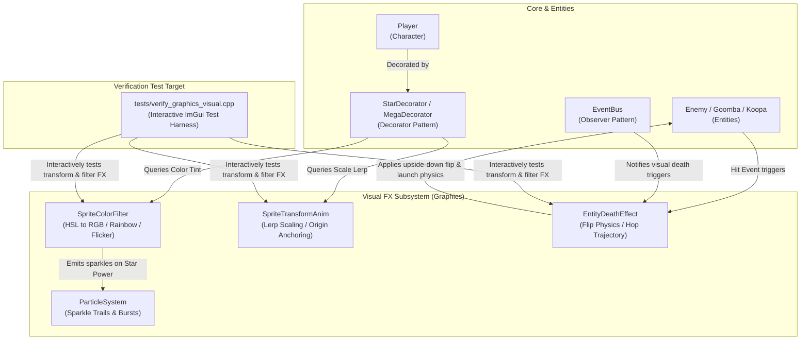

# Super Mario Game — Tasks 5.8 & 5.9: Transformation & Color Filter Animations Implementation Plan

---

## 1. Executive Summary & Overview

Tasks 5.8 (**Entity Death Animations**) and 5.9 (**Invincibility & Transformation Visual FX**) enhance the engine's dynamic visual feedback through non-sprite transformation physics, scaling lerps, and dynamic SFML color filter modulations. 

### Core Architectural Constraint
> **Rule**: Pre-existing sprite frame keys (such as `goomba_brown_squished` or `mario_death`) are preserved and reused for frame selection. Sprite animations will **NOT** be created when an atlas frame already exists. Transformation physics (trajectory launches, upside-down flips, rotational spins, smooth lerp scaling) and color filtering (dynamic HSL rainbow hue shifts, hurt flicker alpha modulation, hit red tint) are processed dynamically on the active `sf::Sprite`.

---

## 2. Catalog of Non-Sprite Transformation & Color Filter Animations

| # | Visual Animation Effect | Category | Primary Trigger | Trajectory / Mathematical / Visual Logic |
|---|---|---|---|---|
| **1** | **Enemy Flip Death Trajectory** | Transformation | Fireball hit, Koopa shell collision, Tail attack, Block bump from below, POW block | • **Transform**: Upside-down flip (180° rotation or negated vertical scale `scale.y = -abs(scale.y)` with centered origin).<br>• **Trajectory**: Upward physics launch impulse \(v_0 = (\pm 100, -380)\text{ px/s}\), gravity acceleration \(g = +1800\text{ px/s}^2\).<br>• **Collision**: Bounding box disabled (\(\text{AABB}(0,0,0,0)\)), falls off-screen through tiles.<br>• **Lifecycle**: Despawns when \(y > \text{camera.bottom} + 100\text{px}\). |
| **2** | **Star Kill Launch & Spin** | Transformation + Particle FX | Enemy collision with Star Power Player | • **Transform**: High-velocity upward spin launch (\(v_0 = (\pm 150, -480)\text{ px/s}\)), continuous rotation spin \(\omega = 720^\circ/\text{s}\) around center.<br>• **Particles**: Spawns impact sparkle burst (`ParticleType::CoinSparkle`).<br>• **Note**: No rainbow color flash on the enemy sprite. |
| **3** | **Player Death Hop & Fall** | Transformation | Player loss of all health / hazard hit | • **Sprite**: Reuses existing static frame `mario_death` (or active character death frame).<br>• **Phase 1 (Freeze)**: 0.5s pause at death coordinate (\(v = (0,0)\)).<br>• **Phase 2 (Hop)**: Vertical launch impulse \(v_y = -450\text{ px/s}\).<br>• **Phase 3 (Fall)**: Downward gravity \(g = +1800\text{ px/s}^2\), floor collision bypassed until off-screen (\(y > \text{camera.bottom} + 100\text{px}\)). |
| **4** | **Star Power Rainbow Color Cycling** | Color Filter + Particle Trail | Super Star item collection (`StarDecorator` active) | • **Color Filter**: HSL-to-RGB rainbow hue cycle stepping through classic 6-color spectrum (Red, Yellow, Green, Cyan, Blue, Magenta) at 12Hz rate.<br>• **Particle Trail**: Emits sparkle particles (`ParticleType::CoinSparkle`) from player trailing bounding box every 0.05s. |
| **5** | **Hit Invincibility / Hurt Flicker** | Color Filter | Post-damage invincibility (2.0s duration) | • **Hurt Flash (0.0s–0.15s)**: Red damage tint `sf::Color(255, 80, 80, alpha)` on hit.<br>• **Flicker Modulation (0.15s–2.0s)**: Alpha channel alternates/sinusoidally modulates between 50% opacity (\(\alpha = 128\)) and 100% opacity (\(\alpha = 255\)) at 15Hz frequency. |
| **6** | **Mega / Mini Form Sprite Flickering & Scaling** | Transformation + Form Flicker | Powerup / Powerdown form transitions (Small↔Super, Small↔Mega, Small↔Mini) | • **Sprite Flickering**: Alternates rapidly between the source form sprite and target form sprite at 12Hz for 0.6s.<br>• **Transform & Easing**: Smooth scale interpolation anchored at feet bottom-center \((width/2, height)\).<br>• **Input Pause**: Player movement and physics integrated pause during transformation sequence before settling into final form. |

---

## 3. System Architecture & Applied Design Patterns



### Applied Design Patterns
1. **Decorator Pattern**: `StarDecorator` and `MegaDecorator` wrap existing `IPlayerState` implementations. `StarDecorator` applies `SpriteColorFilter` rainbow hue cycling and spawns sparkle particles; `MegaDecorator` configures `SpriteTransformAnim` for 3.0x scale lerping.
2. **Strategy / Parameterized Visual Effect Pattern**: `SpriteColorFilter`, `SpriteTransformAnim`, and `EntityDeathEffect` decouple rendering arithmetic from entity update logic, ensuring modular reusable FX across enemies, items, and player states.
3. **Observer Pattern**: `EntityDeathEffect` subscribes to `EventBus` events (`EnemyDefeated`, `PlayerDied`) to automatically launch floating death instances.
4. **State / Template Method Pattern**: `EntityDeathEffect` manages multi-stage death transitions (e.g. Player Death: Freeze \(\to\) Hop \(\to\) Fall).

---

## 4. Class Designs & Technical Specifications

### 4.1 `SpriteColorFilter` (`include/Graphics/SpriteColorFilter.hpp` & `src/Graphics/SpriteColorFilter.cpp`)

```cpp
#pragma once

#include <SFML/Graphics.hpp>
#include <cstdint>

class SpriteColorFilter {
public:
    // HSL (Hue: 0..360, Saturation: 0..1, Lightness: 0..1) to SFML sf::Color
    static sf::Color hslToRgb(float hue, float saturation, float lightness, uint8_t alpha = 255);

    // Dynamic rainbow color generation for Star Power and Star Kill FX
    static sf::Color getRainbowColor(float elapsedTime, float cycleSpeed = 600.0f);

    // Classic 6-stage Mario invincibility palette selector
    static sf::Color getMarioStarPaletteColor(float elapsedTime, float stepInterval = 0.08f);

    // Hit invincibility alpha flicker & red hurt tint overlay
    static sf::Color getHurtFlickerColor(float invincibilityTimer, float elapsedTime, float frequency = 15.0f);

    // Helper: Apply color tint to sf::Sprite
    static void applyColorFilter(sf::Sprite& sprite, const sf::Color& color);
};
```

### 4.2 `SpriteTransformAnim` (`include/Graphics/SpriteTransformAnim.hpp` & `src/Graphics/SpriteTransformAnim.cpp`)

```cpp
#pragma once

#include <SFML/Graphics.hpp>
#include <SFML/System/Vector2.hpp>

class SpriteTransformAnim {
public:
    enum class EasingType {
        Linear,
        EaseInOut,
        ElasticPulse
    };

    SpriteTransformAnim() = default;

    // Start scale transition animation with floor anchoring origin
    void startScaleAnim(float startScale, float targetScale, float duration, EasingType easing = EasingType::EaseInOut);

    // Start continuous rotation spin animation (e.g. Star Kill spin)
    void startRotationSpin(float spinSpeedDegreesPerSec);

    // Update timer & calculate current transformations
    void update(float dt);

    // Apply scale & rotation to target sprite while preserving bottom-center origin
    void applyToSprite(sf::Sprite& sprite, bool facingRight = true);

    // Accessors
    float getCurrentScale() const { return m_currentScale; }
    float getCurrentRotation() const { return m_currentRotation; }
    bool isFinished() const { return !m_active; }

private:
    float m_startScale = 1.0f;
    float m_targetScale = 1.0f;
    float m_currentScale = 1.0f;
    float m_duration = 0.0f;
    float m_elapsedTime = 0.0f;
    EasingType m_easing = EasingType::EaseInOut;
    bool m_active = false;

    float m_spinSpeed = 0.0f;
    float m_currentRotation = 0.0f;
};
```

### 4.3 `EntityDeathEffect` (`include/Graphics/EntityDeathEffect.hpp` & `src/Graphics/EntityDeathEffect.cpp`)

```cpp
#pragma once

#include <SFML/Graphics.hpp>
#include <vector>
#include "Graphics/SpriteTransformAnim.hpp"
#include "Graphics/SpriteColorFilter.hpp"

enum class DeathEffectType {
    EnemyFlip,       // 180° Y-flip + arc launch upward + fall off-screen
    StarKillSpin,    // Continuous 720° spin launch + HSL rainbow FX + sparkles
    PlayerDeathHop   // Freeze (0.5s) -> Hop upward -> Fall through terrain off-screen
};

struct FloatingDeathInstance {
    sf::Vector2f position;
    sf::Vector2f velocity;
    sf::Sprite sprite;
    DeathEffectType type;
    float elapsedTime = 0.0f;
    float freezeTimer = 0.5f; // Used for Player Death Freeze phase
    float rotation = 0.0f;
    bool active = true;
};

class EntityDeathEffect {
public:
    static EntityDeathEffect& getInstance();

    // Spawn a floating death visual instance
    void spawnDeathEffect(sf::Vector2f startPosition, sf::Sprite spriteFrame, DeathEffectType type, sf::Vector2f launchVelocity = {0.0f, -380.0f});

    void update(float dt, float cameraBottomY);
    void render(sf::RenderTarget& target);
    void clear();

private:
    EntityDeathEffect() = default;
    std::vector<FloatingDeathInstance> m_instances;
};
```

---

## 5. Updates to Interactive Test Harness (`tests/verify_graphics_visual.cpp`)

The interactive verification application will be upgraded with a dedicated **"Transform & Color Filter Visualizer"** tab in ImGui:

1. **Enemy Flip Death Controls**:
   - Trigger buttons to launch Goomba, Koopa, and Flying enemies with upside-down Y-scale flip physics.
   - Sliders to adjust launch velocity (\(v_x, v_y\)) and gravity.
2. **Star Kill Launch & Rainbow FX**:
   - Trigger button for Star Kill launch. Displays high-speed rotation spin (720°/s), HSL rainbow hue cycle, and particle sparkle bursts.
3. **Player Death Hop & Fall**:
   - Trigger button for Player Death. Displays 0.5s freeze state at origin, upward hop impulse, and fall-through gravity off-screen.
4. **Star Power Rainbow & Sparkles**:
   - Toggle switch to activate Star Power mode on active player preview.
   - Adjust cycle speed slider (100°/s to 1200°/s) and sparkle emission rate.
5. **Hit Invincibility & Hurt Flicker**:
   - Trigger button for Player Hurt effect. Shows initial 0.15s red hit flash, followed by 15Hz alpha modulation flicker between 50% and 100% opacity.
6. **Mega / Mini Mushroom Scaling**:
   - Presets for **Mini (0.5x)**, **Normal (1.0x)**, **Super (1.5x)**, and **Mega (3.0x)** scale transitions.
   - Renders ground boundary line to visually verify that origin anchoring keeps entity feet anchored to the floor during lerping.

---

## 7. Verification & Testing Plan

1. **Visual Verification**: Run `verify_graphics_visual` to interactively verify smooth lerp scaling (anchored at feet), 15Hz hurt flicker, HSL rainbow cycling, and death trajectory physics.
2. **Unit & Logic Verification**: Verify bounding box invalidation during death states so dead entities do not trigger player damage.
