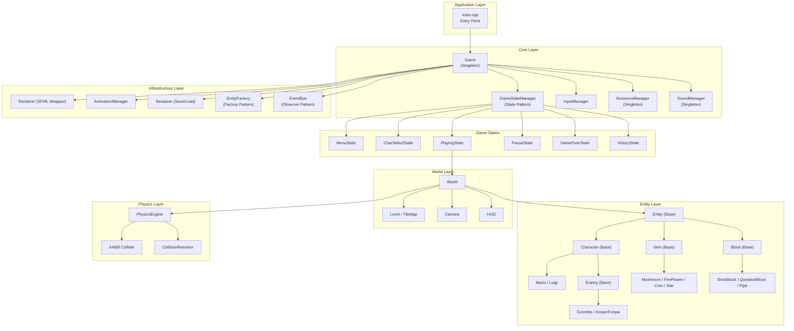
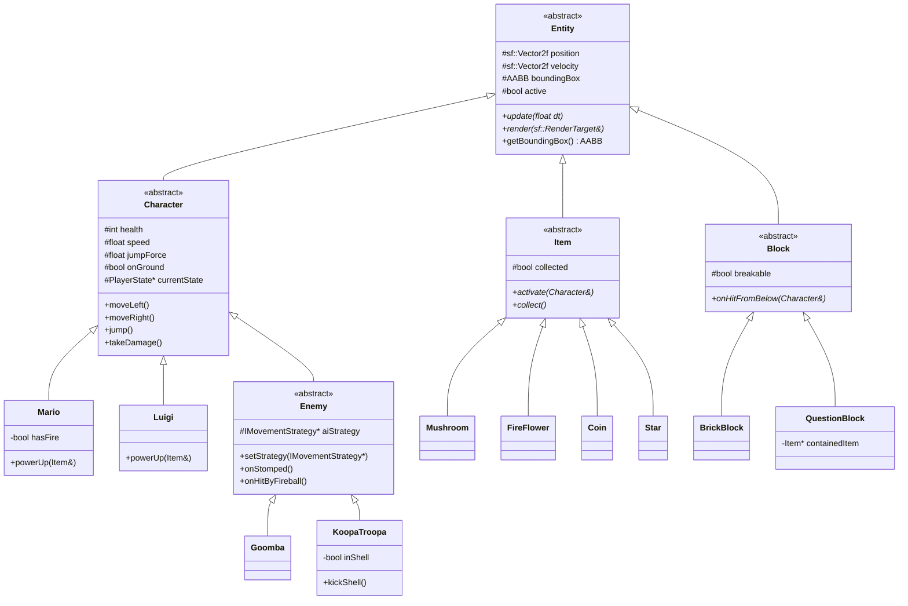

# Super Mario Game — Architecture, System Design & Spec Questionnaire

---

## 1. Game Engine Recommendation: SFML 3.0.2

> [!IMPORTANT]
> **Recommendation: SFML 3.0.2** — already configured and compiled in our workspace.

| Criteria | SFML 3.0.2 | SDL2/SDL3 | Raylib |
| :--- | :--- | :--- | :--- |
| **Language** | Native C++ (OOP) | C (procedural) | C (procedural) |
| **OOP Fit** | ★★★★★ Natural | ★★☆☆☆ Requires wrappers | ★★☆☆☆ Requires wrappers |
| **Prior Experience** | ✅ Team used SFML in CS163 project | ❌ None | ❌ None |
| **Modules** | Graphics, Window, Audio, Network, System | Render, Audio, Input | All-in-one |
| **ImGui Integration** | ✅ Official ImGui-SFML binding | Requires manual setup | Requires manual setup |
| **2D Platformer Fit** | Excellent sprite batching, texture atlases, views/cameras | Excellent but verbose | Good but less control |
| **Build System** | CMake FetchContent (already working) | CMake (more setup) | CMake (simple) |

**Why SFML?**
1. **OOP-native**: SFML's classes (`sf::Sprite`, `sf::Texture`, `sf::Sound`) map naturally to our C++ OOP architecture — no C-to-C++ wrapper boilerplate.
2. **Team familiarity**: The team has shipped a full SFML project (DataStructureVisualizer) with this exact version.
3. **Already compiled**: Our `build/` already produces a working SFML 3.0.2 + ImGui binary in <5 minutes.
4. **ImGui-SFML**: Gives us free developer tools (entity inspector, level editor UI) with zero additional setup.

---

## 2. System Architecture Overview

We use a **Layered Architecture** with clear dependency boundaries. Higher layers depend on lower layers, never the reverse.



---

## 3. Design Patterns Mapping (5 Required + 1 Bonus)

Each pattern is mapped to a concrete class and its rubric justification.

| # | Pattern | Class(es) | Purpose | Rubric Points |
| :--- | :--- | :--- | :--- | :--- |
| 1 | **Factory** | `EntityFactory` | Spawns enemies, items, blocks from tilemap data. `createEntity(EntityType, position)` returns `std::unique_ptr<Entity>`. | 5 pts |
| 2 | **Singleton** | `Game`, `ResourceManager`, `SoundManager` | Single instances of core managers. Lazy-init with `getInstance()`. | 5 pts |
| 3 | **State** | `GameStateManager` + `IGameState` | Game flow states (Menu→Playing→Pause→GameOver). Also `PlayerState` for Mario forms (Small/Super/Fire). | 5 pts |
| 4 | **Observer** | `EventBus` | Decoupled event system. HUD subscribes to `CoinCollected`, `EnemyDefeated`, `PlayerDied` events without direct coupling. | 5 pts |
| 5 | **Strategy** | `IMovementStrategy` | Enemy AI behaviors: `PatrolStrategy` (walk back-and-forth), `ChaseStrategy` (pursue player), `FlyStrategy` (Paratroopa). Swappable at runtime. | 5 pts |
| 6 *(bonus)* | **Command** | `ICommand` + `InputManager` | Map keyboard inputs to game commands (`JumpCommand`, `MoveLeftCommand`, `FireCommand`). Enables rebindable keys and replay recording. | — |

---

## 4. Class Hierarchy Diagram



---

## 5. Proposed Folder Tree

```text
SuperMarioGame/
├── AGENTS.md                           # AI agent guidelines
├── CS202_FinalProject_SuperMario_Spec.md # Project specification
├── CMakeLists.txt                      # Build configuration (SFML + ImGui)
├── README.md                           # Project documentation
├── .gitignore
│
├── include/                            # ── HEADER FILES ──
│   ├── Core/
│   │   ├── Game.hpp                    # Singleton game class, owns the main loop
│   │   ├── GameStateManager.hpp        # Manages stack of IGameState
│   │   ├── IGameState.hpp              # Abstract interface for game states
│   │   ├── MenuState.hpp               # Main menu screen
│   │   ├── CharSelectState.hpp         # Character selection screen
│   │   ├── PlayingState.hpp            # Active gameplay state
│   │   ├── PauseState.hpp              # Pause overlay state
│   │   ├── GameOverState.hpp           # Game over screen
│   │   ├── VictoryState.hpp            # Level/game victory screen
│   │   ├── InputManager.hpp            # Keyboard input → Command mapping
│   │   ├── ResourceManager.hpp         # Singleton: textures, fonts, sound buffers
│   │   ├── SoundManager.hpp            # Singleton: plays SFX and music
│   │   └── EventBus.hpp               # Observer pattern: publish/subscribe events
│   │
│   ├── Entities/
│   │   ├── Entity.hpp                  # Abstract base for all game objects
│   │   ├── Character.hpp               # Abstract base for players + enemies
│   │   ├── Mario.hpp                   # Mario-specific logic
│   │   ├── Luigi.hpp                   # Luigi-specific logic
│   │   ├── Enemy.hpp                   # Abstract enemy base
│   │   ├── Goomba.hpp                  # Goomba enemy
│   │   ├── KoopaTroopa.hpp             # Koopa Troopa enemy
│   │   ├── Item.hpp                    # Abstract item base
│   │   ├── Mushroom.hpp                # Super Mushroom power-up
│   │   ├── FireFlower.hpp              # Fire Flower power-up
│   │   ├── Coin.hpp                    # Coin collectible
│   │   ├── Star.hpp                    # Invincibility Star
│   │   ├── Block.hpp                   # Abstract block base
│   │   ├── BrickBlock.hpp              # Breakable brick
│   │   ├── QuestionBlock.hpp           # Item-containing ? block
│   │   ├── Pipe.hpp                    # Warp pipe
│   │   ├── EntityFactory.hpp           # Factory pattern: creates entities by type
│   │   ├── IMovementStrategy.hpp       # Strategy pattern interface
│   │   ├── PatrolStrategy.hpp          # Walk back-and-forth AI
│   │   └── ChaseStrategy.hpp           # Chase player AI
│   │
│   ├── Graphics/
│   │   ├── Renderer.hpp                # SFML rendering wrapper
│   │   ├── Animation.hpp               # Sprite animation (frame-based)
│   │   ├── AnimationManager.hpp        # Manages animation definitions
│   │   ├── Camera.hpp                  # Side-scrolling camera (sf::View)
│   │   ├── HUD.hpp                     # Score, coins, lives, time display
│   │   ├── SpriteSheet.hpp             # Texture atlas / spritesheet handler
│   │   └── ParticleSystem.hpp          # Coin sparkles, brick fragments, etc.
│   │
│   ├── Physics/
│   │   ├── AABB.hpp                    # Axis-Aligned Bounding Box struct
│   │   ├── PhysicsEngine.hpp           # Gravity, velocity integration
│   │   ├── CollisionDetector.hpp       # Broad + narrow phase detection
│   │   └── CollisionResolver.hpp       # Response: push-out, bounce, damage
│   │
│   └── Utils/
│       ├── Constants.hpp               # Game-wide constants (gravity, tile size, etc.)
│       ├── TileMap.hpp                  # Level tilemap loader and renderer
│       ├── LevelLoader.hpp             # Parses level files → TileMap + entities
│       ├── Serializer.hpp              # Save/Load game state to file
│       └── MathUtils.hpp               # Vector helpers, clamping, lerp
│
├── src/                                # ── SOURCE FILES ──
│   ├── main.cpp                        # Entry point
│   ├── Core/
│   │   ├── Game.cpp
│   │   ├── GameStateManager.cpp
│   │   ├── MenuState.cpp
│   │   ├── CharSelectState.cpp
│   │   ├── PlayingState.cpp
│   │   ├── PauseState.cpp
│   │   ├── GameOverState.cpp
│   │   ├── VictoryState.cpp
│   │   ├── InputManager.cpp
│   │   ├── ResourceManager.cpp
│   │   ├── SoundManager.cpp
│   │   └── EventBus.cpp
│   ├── Entities/
│   │   ├── Entity.cpp
│   │   ├── Character.cpp
│   │   ├── Mario.cpp
│   │   ├── Luigi.cpp
│   │   ├── Enemy.cpp
│   │   ├── Goomba.cpp
│   │   ├── KoopaTroopa.cpp
│   │   ├── Item.cpp
│   │   ├── Mushroom.cpp
│   │   ├── FireFlower.cpp
│   │   ├── Coin.cpp
│   │   ├── Star.cpp
│   │   ├── Block.cpp
│   │   ├── BrickBlock.cpp
│   │   ├── QuestionBlock.cpp
│   │   ├── Pipe.cpp
│   │   ├── EntityFactory.cpp
│   │   ├── PatrolStrategy.cpp
│   │   └── ChaseStrategy.cpp
│   ├── Graphics/
│   │   ├── Renderer.cpp
│   │   ├── Animation.cpp
│   │   ├── AnimationManager.cpp
│   │   ├── Camera.cpp
│   │   ├── HUD.cpp
│   │   ├── SpriteSheet.cpp
│   │   └── ParticleSystem.cpp
│   ├── Physics/
│   │   ├── AABB.cpp
│   │   ├── PhysicsEngine.cpp
│   │   ├── CollisionDetector.cpp
│   │   └── CollisionResolver.cpp
│   └── Utils/
│       ├── Constants.cpp
│       ├── TileMap.cpp
│       ├── LevelLoader.cpp
│       ├── Serializer.cpp
│       └── MathUtils.cpp
│
├── assets/
│   ├── textures/                       # Sprite sheets, tilesets, backgrounds
│   │   ├── mario_spritesheet.png
│   │   ├── enemies_spritesheet.png
│   │   ├── items_spritesheet.png
│   │   ├── tileset.png
│   │   └── backgrounds/
│   ├── sounds/
│   │   ├── sfx/                        # Jump, coin, stomp, power-up, death
│   │   └── music/                      # Level BGM, menu BGM, game over
│   ├── fonts/
│   │   └── PressStart2P.ttf            # Retro pixel font
│   └── levels/
│       ├── level_1.json                # Level data files
│       ├── level_2.json
│       └── level_3.json
│
├── saves/                              # Saved game states
│   └── .gitkeep
│
└── logs/
    └── agent_history.log               # Agent interaction log
```

---

## 6. Spec Questionnaire — Please Fill In

Below is the questionnaire form. Please fill in your answers or preferences for each question. I will use your answers to create the final detailed specification and task breakdown.

---

### A. Architecture & Tech Stack

| # | Question | Your Answer |
| :--- | :--- | :--- |
| A1 | **C++ Standard**: Target C++17 or C++20? | C++17 |
| A2 | **Confirm Engine**: SFML 3.0.2 (recommended, already set up). Accept? | Accept |
| A3 | **ImGui**: Keep ImGui-SFML for dev tools / level editor UI? | Accept |
| A4 | **Save/Load Format**: JSON (human-readable) or binary (compact)? | JSON |
| A5 | **Save Data Scope**: What must be persisted? (e.g., current level, score, lives, coins, player form, time remaining, exact position?) | All of those |

---

### B. Gameplay Mechanics & Physics

| # | Question | Your Answer |
| :--- | :--- | :--- |
| B1 | **Tile Size**: 16×16 pixels (classic NES) or 32×32 (scaled)? | 32x32 |
| B2 | **Window Resolution**: 1024×768, 1280×720, or other? | 1280x720 |
| B3 | **Physics Style**: Custom AABB physics (our implementation) or integrate Box2D as a physics engine? | Custom AABB |
| B4 | **Fixed Timestep**: Use a fixed physics timestep (e.g., 1/60s) with interpolated rendering? | Yes |
| B5 | **Gravity Value**: Use NES-authentic ~0.4 px/frame² or custom? If custom, specify. | Custom, expose this to ImGUI, start with initial value: 0.5px/frame² |
| B6 | **Mario Speed**: Max walking speed and max running speed (pixels/sec)? Leave blank for NES-authentic defaults. | Custom, expose this to ImGUI, start with initial value, of about 150px/s and 300px/s |
| B7 | **Jump Height**: How high should Mario jump in tiles? (NES Mario jumps ~4 tiles high) | Custom, expose this to ImGUI, start with initial value, of about 4 tiles high |
| B8 | **Luigi Differences**: Exact multipliers? (Default proposal: jump_force ×1.2, speed ×0.85, slightly floatier = lower gravity while airborne ×0.9) | Accept, maybe introduce double jump |
| B9 | **Fireball Mechanics**: How far do fireballs travel? Bounce on ground? Max active at once? | Bounces on the ground, destroyed on wall impact. Max 2 active at once |

---

### C. Characters & Enemies

| # | Question | Your Answer |
| :--- | :--- | :--- |
| C1 | **Player Characters**: Mario + Luigi only, or add more? | Just those currently |
| C2 | **Character Switching**: Switch during gameplay (hotkey) or only at character select screen? | Both |
| C3 | **Player States**: Small → Super (Mushroom) → Fire (Fire Flower). Add Star (invincible, timed)? Others? | Small, Super, Fire, and Star (temporary timer overlay) |
| C4 | **Enemy Roster (MVP)**: Which enemies for the first build? Proposal: Goomba, Koopa Troopa, Koopa Paratroopa (flying). Add/remove? | Accept |
| C5 | **Goomba AI**: Walk in one direction, reverse on wall collision, fall off ledges? | Accept |
| C6 | **Koopa AI**: Same as Goomba but retreats into shell when stomped? Can shell be kicked? | Accept |
| C7 | **Proximity AI**: Should any enemy actively chase Mario when within a certain pixel range? If so, which enemies and what range? | Create a "Boo" (Ghost) enemy or a Swooping Paratroopa that stays idle until Mario is within ~250 pixels, then moves toward him. |
| C8 | **Boss Enemies**: Include a boss at end of Level 3? (e.g., Bowser-like character) | Accept |

---

### D. Items & Power-ups

| # | Question | Your Answer |
| :--- | :--- | :--- |
| D1 | **Item Roster (MVP)**: Super Mushroom, Fire Flower, Coin, Star. Add 1-UP Mushroom? Others? | Accept |
| D2 | **Coin Goal**: Collecting 100 coins = 1 extra life? | Yes |
| D3 | **Star Duration**: How many seconds does invincibility last? (NES: ~10 seconds) | Yes |
| D4 | **Item Spawning**: Items pop out of QuestionBlocks only, or also from hidden blocks / brick blocks? | Items pop out of QuestionBlocks only |
| D5 | **Power-down Rule**: Fire Mario hit → becomes Small Mario directly, or steps down to Super Mario first? | Fire -> Super -> Small |

---

### E. Levels & World Design

| # | Question | Your Answer |
| :--- | :--- | :--- |
| E1 | **Number of Levels**: 3 (as required). Each level = 1 continuous stage, or sub-stages? | 3 continuos stages with checkpoints |
| E2 | **Level Themes**: Proposal — Level 1: Overworld/Grassland, Level 2: Underground/Cave, Level 3: Castle/Lava. Accept or change? | Overworld, Underground, Castle |
| E3 | **Level Width**: How wide should levels be? (NES World 1-1 ≈ 210 tiles wide, ~3360px at 16px/tile). Approximate length? | 200 tiles wide |
| E4 | **Level Height**: Visible screen height in tiles? (NES = 15 tiles of 16px = 240px visible, but our window is bigger) | 22.5 tiles |
| E5 | **Difficulty Progression**: What makes each level harder? Proposal — L1: few enemies, flat terrain; L2: gaps/pits, more enemies, moving platforms; L3: lava pits, high enemy density, timed sections. | Accept |
| E6 | **Level End**: Flagpole (classic Mario) or reaching a specific door/point? | Flagpole |
| E7 | **Warp Pipes**: Include pipes that teleport the player to bonus areas or between sections? | Yes, include warp pipes that teleport the player to bonus areas or between sections. |
| E8 | **Level File Format**: Store levels as JSON (easy to edit/debug), TMX (Tiled editor), or custom text format? | JSON |
| E9 | **Level Editor (Bonus)**: Include in scope for MVP or defer to post-MVP? If included, ImGui-based or standalone? | Defer to Bonus/Post-MVP |

---

### F. UI, Screens & Game Flow

| # | Question | Your Answer |
| :--- | :--- | :--- |
| F1 | **Screen Flow**: Proposal — `Main Menu → Character Select → Level X → (Pause) → Level Complete → (next level or Victory) → Game Over`. Accept or modify? | Accept |
| F2 | **HUD Elements**: Score, Coins (×counter), World/Level name, Time countdown, Lives remaining. Add/remove? | Accept |
| F3 | **Time Limit**: Should each level have a countdown timer? (NES: 300–400 game seconds). How long? | 300 game seconds |
| F4 | **Lives System**: Start with 3 lives? Game Over when lives = 0? Continue from checkpoint or restart level? | Start with 3. Game Over = return to Main Menu, if die, respawn at the checkpoint |
| F5 | **Pause Menu Options**: Resume, Restart Level, Return to Main Menu, Quit? | Accept |
| F6 | **Main Menu Options**: New Game, Load Game, Options (volume/controls), Quit? | Accept |
| F7 | **Score Display**: Show high scores on main menu? Persist high scores across sessions? | Accept |

---

### G. Graphics & Assets

| # | Question | Your Answer |
| :--- | :--- | :--- |
| G1 | **Art Style**: NES pixel-art (retro 8-bit), or more modern/polished sprites (16-bit SNES style)? | 16-bit SNES |
| G2 | **Sprite Source**: Use open-source Mario-style sprites (e.g., from OpenGameArt), or create custom? | Open source |
| G3 | **Sprite Dimensions**: Base tile/sprite size in pixels? (16×16, 32×32, or other) | 32x32 |
| G4 | **Scrolling**: Horizontal only (classic Mario), or also vertical scrolling in some sections? | Horizontal only |
| G5 | **Background Layers**: Parallax scrolling with multiple background layers (clouds, mountains, etc.)? | Accept |
| G6 | **Particle Effects**: Brick breaking particles, coin sparkles, death poof animations? | Accept |
| G7 | **Screen Transitions**: Fade-in/fade-out between levels, or instant cut? | Accept |

---

### H. Audio

| # | Question | Your Answer |
| :--- | :--- | :--- |
| H1 | **Sound Effects Needed**: Jump, coin, stomp, power-up, power-down, fireball, 1-UP, death, flagpole, pipe. Add/remove? | Accept |
| H2 | **Background Music**: Separate BGM per level theme? Menu BGM? Game Over jingle? | Accept |
| H3 | **Audio Source**: Use royalty-free retro-style sounds, or source from open game audio libraries? | Open source |
| H4 | **Volume Controls**: In-game volume slider for SFX and Music separately? | Accept |

---

### I. Advanced & Bonus Scope

| # | Question | Your Answer |
| :--- | :--- | :--- |
| I1 | **3D Game (5 bonus pts)**: Is the team targeting the 3D bonus points, or staying strictly 2D? If 3D, what approach? (e.g., 2.5D with depth layers) | 2D |
| I2 | **Multiplayer**: Two players on same keyboard (co-op or versus), or single-player with character select only? | Two players on same keyboard, versus |
| I3 | **Level Editor Priority**: Must-have for submission, or nice-to-have if time allows? | Nice-to-have |
| I4 | **Controller Support**: Keyboard only, or also gamepad/controller support? | Keyboard only, abstraction for later gamepad/controller |

---

## 7. Proposed Development Phases

Once specs are finalized, the implementation will be organized into phases on feature branches off `dev`:

| Phase | Branch | Deliverables | Est. Duration |
| :--- | :--- | :--- | :--- |
| **Phase 0** | `dev` | ✅ Done — Environment setup, SFML + ImGui compiled | Complete |
| **Phase 1** | `feature/core-engine` | Game loop, GameStateManager, InputManager, ResourceManager, SoundManager, EventBus | 1 week |
| **Phase 2** | `feature/physics` | AABB, PhysicsEngine, CollisionDetector, CollisionResolver, gravity/velocity | 1 week |
| **Phase 3** | `feature/entities` | Entity hierarchy, Mario, Luigi, Goomba, KoopaTroopa, Items, Blocks, EntityFactory | 1–2 weeks |
| **Phase 4** | `feature/tilemap-levels` | TileMap, LevelLoader, Camera scrolling, 3 level files | 1 week |
| **Phase 5** | `feature/graphics` | Animation system, SpriteSheet, HUD, ParticleSystem, asset integration | 1 week |
| **Phase 6** | `feature/audio` | SoundManager wiring, SFX + BGM loading, volume controls | 3 days |
| **Phase 7** | `feature/game-states` | Menu, CharSelect, Playing, Pause, GameOver, Victory screens | 1 week |
| **Phase 8** | `feature/save-load` | Serializer (JSON), save/load game progress | 3 days |
| **Phase 9** | `feature/enemy-ai` | Strategy pattern AI, proximity chase, difficulty tuning | 1 week |
| **Phase 10** | `feature/polish` | Bug fixes, balancing, transitions, particles, edge cases | 1 week |
| **Bonus** | `feature/level-editor` | ImGui-based level editor | If time permits |

---

> [!IMPORTANT]
> **Please fill in Section 6 (the questionnaire) above.** Your answers will determine the final detailed specification, physics constants, asset pipeline, and task granularity for each development phase. I will not proceed with implementation until specs are locked down.
